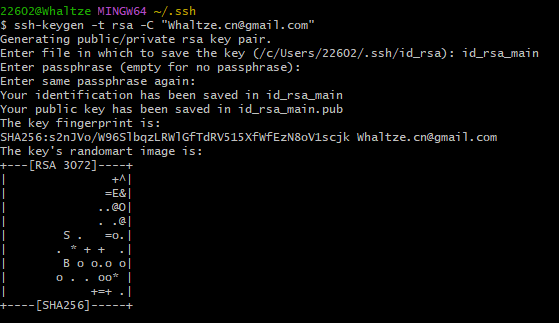
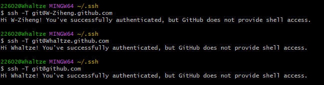

> 前置学习连接 [通过Git上传本地项目至GitHub](https://whaltze.github.io/2024/09/15/%E9%80%9A%E8%BF%87Git%E4%B8%8A%E4%BC%A0%E6%9C%AC%E5%9C%B0%E9%A1%B9%E7%9B%AE%E8%87%B3Github/)

## 一台电脑配置多GitHub账户

### 创建新账号ssh密钥

找到C盘路径下的.ssh文件

C:\Users\Administrator\.ssh\

右键bash here
输入注册账户的邮箱
```shell
ssh-keygen -t rsa -C "Whaltze.cn@gmail.com"
```
在末尾添加名称id_rsa_main(和原来 的名称不同即可)

```shell
Generating public/private rsa key pair.
Enter file in which to save the key (/c/Users/22602/.ssh/id_rsa): id_rsa_main
```
后续可以直接敲回车即可,最后结果如下



### 建立config文件

在.ssh文件下新建config文件(注意直接以config命名即可,没有其他后缀名字)

在config内写入以下内容
```shell
Host Whaltze.github.com
#Host Whaltze.github.com 此处为GitHub地址,如果有些服务器做的ip端口转发，这里不要带上端口号
HostName github.com
#HostName 是远程仓库的地址，同样如果做的端口转发也不应带端口号
#HostName 主机名可用ip也可以是域名(如:github.com或者bitbucket.org)

#Port 端口号，如果有做转发需要在这里填写端口号，没有就不必要填
#Port 服务器open-ssh端口（默认：22,默认时一般不写此行
#Port 8800
PreferredAuthentications publickey

#用户
#User 登录用户名(如：git)
User git

#识别key的文件
#IdentityFile 证书文件路径（如~/.ssh/id_rsa_*)
IdentityFile ~/.ssh/id_rsa
 
#都指向同一个平台的话，下面的Host需要做个处理，因为我们在用这个key的时候根据Host从上到下进行查找，不做修改肯定会先查找到第一个key,依旧无效，随便改就好了，其他参数不做特殊处理
Host W-Ziheng.github.com
HostName github.com
PreferredAuthentications publickey
#Port 8800
User git
IdentityFile ~/.ssh/id_rsa_main

```

后续git相关内容时候就应该改成 

```shell
git clone git@Whaltze.github.com:W-Ziheng/RM_CLASS.git  
git clone git@W-Ziheng.github.com:W-Ziheng/RM_CLASS.git
```

其中 **W-Ziheng/RM_CLASS.git** 为项目名字

```shell
git remote add origin git@Whaltze.github:xxx/example.git 
git remote add origin git@W-Ziheng.github:xxx/example.git 
```

此时在bash中输入 检测是否连接成功

```shell
ssh -T git@Whaltze.github.com

ssh -T git@W-Ziheng.github.com
```

正常应该显示如下



细心的你可能发现最后一个指令为什么也会输出 **Success**
在windows的 User/目录下,我们能发现有一个文件 **.gitconfig** 这个全局变量,里面包含了我们第一次配置github时候的用户信息,现在我们删除他

```shell
git config --global --unset user.name
git config --global --unset user.email
```
注意,此处不用修改什么,直接COPY即可

**此处需要注意删除全局变量后需要进入项目文件夹单独设置一般都保存在.git文件夹中**

## 常用命令

### 设置用户邮箱

```shell
git config user.name "Whaltze"
git config user.email "2260274457@qq.com"
```

### 删除远程仓库分支

```shell
git remote prune origin # 使用 Git 命令删除远程仓库中已经不存在的分支
git fetch --prune # 从远程仓库获取最新的更新，并删除本地已不存在的远程分支
git remote update origin --prune # 更新远程仓库的引用信息，并删除本地已不存在的远程分支
```

### 转换分支

```shell
git checkout <branch-name>
```
要转换到另一个分支后才能删除

### 创建新分支并切换

```shell
git checkout -b <new-branch-name>
```

### 删除本地仓库分支

```shell
git branch -d <branch-name>
git branch -D <branch-name>
```

使用-D选项时,Git会无条件地删除指定的分支,即使它包含未合并的更改。因此，使用-D选项时要特别小心,确保不会丢失重要的代码更改。

### 克隆某个分支

```shell
git clone -b <分支名称> https://gitee.com/项目(仓库地址).git
```
### 删除远程仓库连接

```shell
git remote remove origin
git remote add origin git@W-Ziheng.github.com:W-Ziheng/RM_CLASS.git
# 重新建立连接
```

### 正常推送程序

```shell
git add . 
git commit -m "commit"  
git remote add origin https://自己的仓库url地址 
git push -u origin master
```


