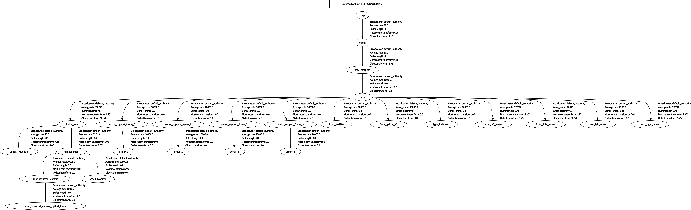
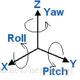
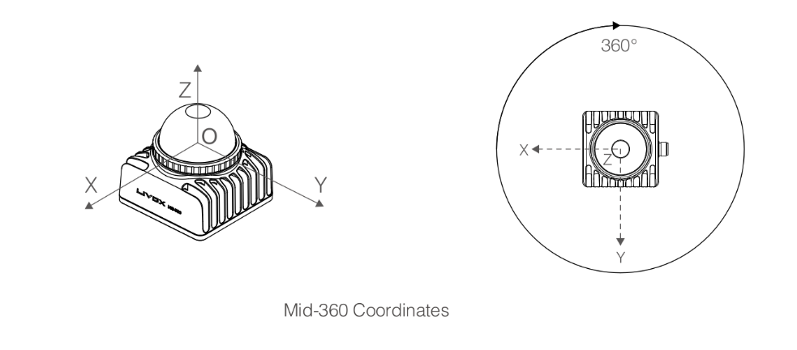

> 本博客记录调试过程,方便后续排查错误
基于 深北莫 陈佬开源
[pb2025_sentry_nav](https://github.com/SMBU-PolarBear-Robotics-Team/pb2025_sentry_nav)
[rmu_gazebo_simulator](https://github.com/SMBU-PolarBear-Robotics-Team/rmu_gazebo_simulator)

# 仿真

## 下载 Ignition: Fortress

下载对应Gazebo仿真版本

[官网教程](https://gazebosim.org/docs/fortress/install_ubuntu/)

```shell
sudo apt-get update
sudo apt-get install lsb-release gnupg
sudo curl https://packages.osrfoundation.org/gazebo.gpg --output /usr/share/keyrings/pkgs-osrf-archive-keyring.gpg
echo "deb [arch=$(dpkg --print-architecture) signed-by=/usr/share/keyrings/pkgs-osrf-archive-keyring.gpg] http://packages.osrfoundation.org/gazebo/ubuntu-stable $(lsb_release -cs) main" | sudo tee /etc/apt/sources.list.d/gazebo-stable.list > /dev/null
sudo apt-get update
sudo apt-get install ignition-fortress
```

删除

```shell
sudo apt remove ignition-fortress && sudo apt autoremove
```

## 安装 small_icp

```shell
sudo apt install -y libeigen3-dev libomp-dev

git clone https://github.com/koide3/small_gicp.git
cd small_gicp
mkdir build && cd build
cmake .. -DCMAKE_BUILD_TYPE=Release && make -j
sudo make install
```

## 克隆 pb2025_sentry_nav


```shell
git clone --recursive https://github.com/SMBU-PolarBear-Robotics-Team/pb2025_sentry_nav.git src/pb2025_sentry_nav
```

## 下载先验点云

[FlowUS](https://flowus.cn/lihanchen/share/87f81771-fc0c-4e09-a768-db01f4c136f4?code=4PP1RS)

放到 目录下
```shell
/home/whale/RM2025/src/pb2025_sentry_nav/pb2025_nav_bringup/pcd/simulation/
```
## 安装依赖 build

```shell
sudo apt-get update
sudo apt-get install python3-rosdep
sudo rosdep init #最好挂梯子
rosdep update #最好挂梯子
rosdep install -r --from-paths src --ignore-src --rosdistro $ROS_DISTRO -y
colcon build --symlink-install --cmake-args -DCMAKE_BUILD_TYPE=Release
```
> rosdep的主要用途是安装工作空间中ros包的依赖，首先切换到工作空间下，然后运行下述命令即可安装该工作空间的所有依赖：

```shell
rosdep install --from-paths src --ignore-src -r -y
```

> 推荐使用 --symlink-install 选项来构建你的工作空间，因为 pb2025_sentry_nav 广泛使用了 launch.py 文件和 YAML 文件。这个构建参数会为那些非编译的源文件使用符号链接，这意味着当你调整参数文件时，不需要反复重建，只需要重新启动即可。(摘自陈佬)

## clone rmu_gazebo_simulator

```shell
cd ~/RM2025/src/
sudo apt install python3-pip

git clone https://github.com/gezp/sdformat_tools.git
git clone https://github.com/SMBU-PolarBear-Robotics-Team/rmoss_interfaces.git
git clone https://github.com/SMBU-PolarBear-Robotics-Team/rmoss_core.git
git clone https://github.com/SMBU-PolarBear-Robotics-Team/rmoss_gazebo.git
git clone https://github.com/SMBU-PolarBear-Robotics-Team/rmoss_gz_resources.git --depth=1
git clone https://github.com/SMBU-PolarBear-Robotics-Team/rmu_gazebo_simulator.git
git clone https://github.com/SMBU-PolarBear-Robotics-Team/pb2025_robot_description.git

pip install xmacro
```

`pip install xmacro`警告
```shell
whale@UP:~/RM2025/src$ pip install xmacro
Defaulting to user installation because normal site-packages is not writeable
Collecting xmacro
  Downloading xmacro-1.2.1-py3-none-any.whl (10 kB)
Installing collected packages: xmacro
  WARNING: The scripts xmacro, xmacro4sdf and xmacro4urdf are installed in '/home/whale/.local/bin' which is not on PATH.
  Consider adding this directory to PATH or, if you prefer to suppress this warning, use --no-warn-script-location.
Successfully installed xmacro-1.2.1
```

`colcon build`警告

```shell
--- stderr: rmoss_base                                                       
In file included from /home/whale/RM2025/src/rmoss_core/rmoss_base/test/test_fixed_packet_tool.cpp:21:
/home/whale/RM2025/src/rmoss_core/rmoss_base/test/dummy_transporter.hpp: In constructor ‘TransporterFactory::TransporterFactory()’:
/home/whale/RM2025/src/rmoss_core/rmoss_base/test/dummy_transporter.hpp:68:9: warning: ignoring return value of ‘int pipe(int*)’ declared with attribute ‘warn_unused_result’ [-Wunused-result]
   68 |     pipe(fds1);
      |     ~~~~^~~~~~
/home/whale/RM2025/src/rmoss_core/rmoss_base/test/dummy_transporter.hpp:69:9: warning: ignoring return value of ‘int pipe(int*)’ declared with attribute ‘warn_unused_result’ [-Wunused-result]
   69 |     pipe(fds2);
      |     ~~~~^~~~~~
---
```


## 运行指令 启动仿真

### 查看tf树 

```shell
sudo apt-get update
sudo apt-get install ros-humble-rqt-tf-tree

ros2 run rqt_tf_tree rqt_tf_tree --ros-args -r /tf:=tf -r /tf_static:=tf_static -r  __ns:=/red_standard_robot1
```

具体自行探索

[SMBU-PolarBear-Robotics-Team](https://github.com/SMBU-PolarBear-Robotics-Team/rmu_gazebo_simulator)

### 单机器人导航

```shell
ros2 launch pb2025_nav_bringup rm_sentry_simulation_launch.py \
world:=rmul_2025 \
slam:=False
```

### 开启Gazebo仿真

```shell
ros2 launch rmu_gazebo_simulator bringup_sim.launch.py
```

需要点击Gazebo左下角按钮启动仿真


> 控制机器人移动

```shell
ros2 run rmoss_gz_base test_chassis_cmd.py --ros-args -r __ns:=/red_standard_robot1/robot_base -p v:=0.3 -p w:=0.3
#根据提示进行输入，支持平移与自旋
```

- 键盘控制：

- 机器人云台
```shell
ros2 run rmoss_gz_base test_gimbal_cmd.py --ros-args -r __ns:=/red_standard_robot1/robot_base
#根据提示进行输入，支持绝对角度控制
```
- 机器人射击
```shell
ros2 run rmoss_gz_base test_shoot_cmd.py --ros-args -r __ns:=/red_standard_robot1/robot_base
#根据提示进行输入
```

能够正常仿真 输出 tf 树

```shell
# sudo apt-get update
# sudo apt-get install ros-humble-rqt-tf-tree

ros2 run rqt_tf_tree rqt_tf_tree --ros-args -r /tf:=tf -r /tf_static:=tf_static -r  __ns:=/red_standard_robot1
```




## 仿真调参

> 记录修改内容

### description 

工作包改为 `fzsd2025_robot_description`

机器人名字改为 `fzsd2025_sentry_rebot`

```py
# robot_description_launch.py
import os

from ament_index_python.packages import get_package_share_directory
from launch import LaunchContext, LaunchDescription
from launch.actions import DeclareLaunchArgument, OpaqueFunction, SetEnvironmentVariable
from launch.conditions import IfCondition
from launch.substitutions import LaunchConfiguration, TextSubstitution
from launch_ros.actions import Node
from sdformat_tools.urdf_generator import UrdfGenerator
from xmacro.xmacro4sdf import XMLMacro4sdf


def launch_setup(context: LaunchContext) -> list:
    """
    NOTE: Using OpaqueFunction in order to get the context in string format...
    But it is too hacky and not recommended.
    """

    use_sim_time = LaunchConfiguration("use_sim_time")
    source_list = LaunchConfiguration("source_list")
    rviz_config_file = LaunchConfiguration("rviz_config_file")
    use_rviz = LaunchConfiguration("use_rviz")
    use_respawn = LaunchConfiguration("use_respawn")
    log_level = LaunchConfiguration("log_level")

    # Map fully qualified names to relative ones so the node's namespace can be prepended.
    # In case of the transforms (tf), currently, there doesn't seem to be a better alternative
    # https://github.com/ros/geometry2/issues/32
    # https://github.com/ros/robot_state_publisher/pull/30
    # TODO(orduno) Substitute with `PushNodeRemapping`
    #              https://github.com/ros2/launch_ros/issues/56
    remappings = [("/tf", "tf"), ("/tf_static", "tf_static")]

    # Load the robot xmacro file from the launch configuration
    xmacro = XMLMacro4sdf()
    xmacro.set_xml_file(context.launch_configurations["robot_xmacro_file"])

    # Generate SDF from xmacro
    xmacro.generate()
    robot_xml = xmacro.to_string()

    # Generate URDF from SDF
    urdf_generator = UrdfGenerator()
    urdf_generator.parse_from_sdf_string(robot_xml)
    robot_urdf_xml = urdf_generator.to_string()

    stdout_linebuf_envvar = SetEnvironmentVariable(
        "RCUTILS_LOGGING_BUFFERED_STREAM", "1"
    )

    colorized_output_envvar = SetEnvironmentVariable("RCUTILS_COLORIZED_OUTPUT", "1")

    start_joint_state_publisher_node = Node(
        package="joint_state_publisher",
        executable="joint_state_publisher",
        name="joint_state_publisher",
        output="screen",
        respawn=use_respawn,
        respawn_delay=2.0,
        parameters=[
            {
                "use_sim_time": use_sim_time,
                "rate": 200,
                "source_list": source_list,
            }
        ],
        arguments=["--ros-args", "--log-level", log_level],
        remappings=remappings,
    )

    start_robot_state_publisher_node = Node(
        package="robot_state_publisher",
        executable="robot_state_publisher",
        output="screen",
        respawn=use_respawn,
        respawn_delay=2.0,
        parameters=[
            {
                "use_sim_time": use_sim_time,
                "publish_frequency": 200.0,
                "robot_description": robot_urdf_xml,
            }
        ],
        arguments=["--ros-args", "--log-level", log_level],
        remappings=remappings,
    )

    start_rviz_node = Node(
        condition=IfCondition(use_rviz),
        package="rviz2",
        executable="rviz2",
        arguments=["-d", rviz_config_file],
        output="screen",
        remappings=remappings,
    )

    return [
        stdout_linebuf_envvar,
        colorized_output_envvar,
        start_joint_state_publisher_node,
        start_robot_state_publisher_node,
        start_rviz_node,
    ]


def generate_launch_description():
    # Get the launch directory
    bringup_dir = get_package_share_directory("fzsd2025_robot_description")   #     get_package_share_directory("fzsd2025_robot_description")

    declare_use_sim_time_cmd = DeclareLaunchArgument(
        "use_sim_time",
        default_value="False",
        description="Use simulation (Gazebo) clock if true",
    )

    declare_robot_name_cmd = DeclareLaunchArgument(
        "robot_name",
        default_value="fzsd2025_sentry_robot",   #  # default_value="fzsd2025_sentry_robot",
        description="The file name of the robot xmacro to be used",
    )

    declare_robot_xmacro_file_cmd = DeclareLaunchArgument(
        "robot_xmacro_file",
        default_value=[
            # Use TextSubstitution to concatenate strings
            TextSubstitution(text=os.path.join(bringup_dir, "resource", "xmacro", "")),
            LaunchConfiguration("robot_name"),
            TextSubstitution(text=".sdf.xmacro"),
        ],
        description="The file path of the robot xmacro to be used",
    )

    declare_source_list_cmd = DeclareLaunchArgument(
        "source_list",
        default_value="['serial/gimbal_joint_state']",
        description="Array of topic names for subscriptions to sensor_msgs/msg/JointStates. Defaults to ['serial/gimbal_joint_state']",
    )

    declare_rviz_config_file_cmd = DeclareLaunchArgument(
        "rviz_config_file",
        default_value=os.path.join(bringup_dir, "rviz", "visualize_robot.rviz"),
        description="Full path to the RViz config file to use",
    )

    declare_use_rviz_cmd = DeclareLaunchArgument(
        "use_rviz", default_value="True", description="Whether to start RViz"
    )

    declare_use_respawn_cmd = DeclareLaunchArgument(
        "use_respawn",
        default_value="False",
        description="Whether to respawn if a node crashes. Applied when composition is disabled.",
    )

    declare_log_level_cmd = DeclareLaunchArgument(
        "log_level", default_value="info", description="log level"
    )

    # Create the launch description and populate
    ld = LaunchDescription()

    # Declare the launch options
    ld.add_action(declare_use_sim_time_cmd)
    ld.add_action(declare_robot_name_cmd)
    ld.add_action(declare_robot_xmacro_file_cmd)
    ld.add_action(declare_source_list_cmd)
    ld.add_action(declare_rviz_config_file_cmd)
    ld.add_action(declare_use_rviz_cmd)
    ld.add_action(declare_use_respawn_cmd)
    ld.add_action(declare_log_level_cmd)

    # Add the actions to launch all of the nodes
    ld.add_action(OpaqueFunction(function=launch_setup))

    return ld
```

`CMakeList.txt`

```cmake
cmake_minimum_required(VERSION 3.5)
project(fzsd2025_robot_description)

find_package(ament_cmake REQUIRED)

install(DIRECTORY
    launch
    resource
    rviz

    DESTINATION share/${PROJECT_NAME}/
)

#environment
ament_environment_hooks("${CMAKE_CURRENT_SOURCE_DIR}/env-hooks/gazebo.dsv.in")

ament_package()

```

rviz查看机器人 `ros2 launch fzsd2025_robot_description robot_description_launch.py`
报错
```shell
package 'joint_state_publisher' not found, 
```

原因 目前 没有部署实际的机器人，所以注释[joint_state_publisher](https://github.com/SMBU-PolarBear-Robotics-Team/pb2025_robot_description/blob/2543d91e1b5bc70fd2d6cfb259f651642d8c1f73/launch/robot_description_launch.py#L71
) 

> standard_robot_pp_ros2获取电控发送的gimbal_yaw和gimbal_pitch姿态，以JointState的数据类型发布到topic /gimbal_joint_state [详见Github](https://github.com/SMBU-PolarBear-Robotics-Team/standard_robot_pp_ros2/blob/e5fa63f1489038559c59c190bc9616e41ff637ff/launch/standard_robot_pp_ros2.launch.py#L142)


> 而后pb_robot_description的launch文件中启动了joint_state_publisher，他会订阅/gimbal_joint_state，然后整合发布到/joint_state [Github](https://github.com/SMBU-PolarBear-Robotics-Team/pb2025_robot_description/blob/2543d91e1b5bc70fd2d6cfb259f651642d8c1f73/launch/robot_description_launch.py#L64
)


> 最后[robot_state_publisher](https://github.com/SMBU-PolarBear-Robotics-Team/pb2025_robot_description/blob/2543d91e1b5bc70fd2d6cfb259f651642d8c1f73/launch/robot_description_launch.py#L71
) 会订阅 /joint_state，然后转化成tf信息和robot_description，建立整车tf tree


重新输入指令 成功在rviz显示

#### 修改 雷达坐标系

`/home/whale/RM2025/src/fzsd2025_robot_description/resource/xmacro/fzsd2025_sentry_robot.sdf.xmacro`

雷达在云台上直接修改坐标 如果在底盘 需要手动维护底盘到云台的tf

这里在云台上 直接修改坐标

找到 `livox`

修改

```xml
<!--livox-->
        <xmacro_block name="livox" prefix="front_" parent="chassis" pose="0.16 0.0 0.18 ${pi/6} 0.0 ${pi/2}" update_rate="20" samples="1875"/>
```
为
```xml
<!--livox-->
        <xmacro_block name="livox" prefix="front_" parent="chassis" pose="0.16 0.0 0.18 ${pi/6} 0.0 ${pi/2}" update_rate="20" samples="1875"/>
```

- update_rate：雷达的更新频率，以赫兹为单位。这参数决定了雷达发送数据的频率。
- samples：雷达的采样数，即每个每次发送的数据点数。

> xmacro_block 元素的 pose 属性。这个属性定义了雷达相对于父级（parent）坐标系的位姿。pose 属性的格式是 x y z roll pitch yaw，其中 x、y 和 z 是雷达相对于父级坐标系的位置，roll、pitch 和 yaw 是雷达相对于父级坐标系的旋转角度。

> 注意 xyz以米为单位, roll、pitch 和 yaw 的单位是弧度，如果你使用的是度数，你需要将它们转换为弧度。例如，45 度转换为弧度是 0.785398，15 度转换为弧度是 0.261799，135 度转换为弧度是 2.35619, 也可以像我一样用pi表示 [ROS中的单位标准_ REP-0103 ](https://www.ros.org/reps/rep-0103.html)





查看tf

```shell
ros2 run rqt_tf_tree rqt_tf_tree --ros-args -r /tf:=tf -r /tf_static:=tf_static 
```


# [通信standard_robot_pp_ros2](https://github.com/SMBU-PolarBear-Robotics-Team/standard_robot_pp_ros2.git)

```shell
git clone https://github.com/SMBU-PolarBear-Robotics-Team/standard_robot_pp_ros2.git
sudo apt install python3-vcstool

vcs import --input standard_robot_pp_ros2/.github/dependency.repos
# 请查看 vcs 导入的子仓库的 README，并按照其说明 递进地安装子仓库的依赖项。
rosdep install -r --from-paths src --ignore-src --rosdistro $ROS_DISTRO -y

./script/create_udev_rules.sh

colcon build --symlink-install

# 如需开启 RViz 可视化，请添加 use_rviz:=True 参数。
ros2 launch standard_robot_pp_ros2 standard_robot_pp_ros2.launch.py

```
