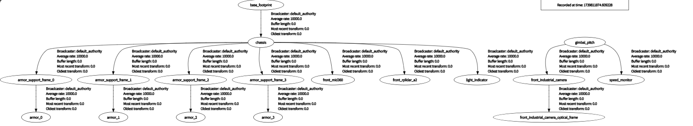
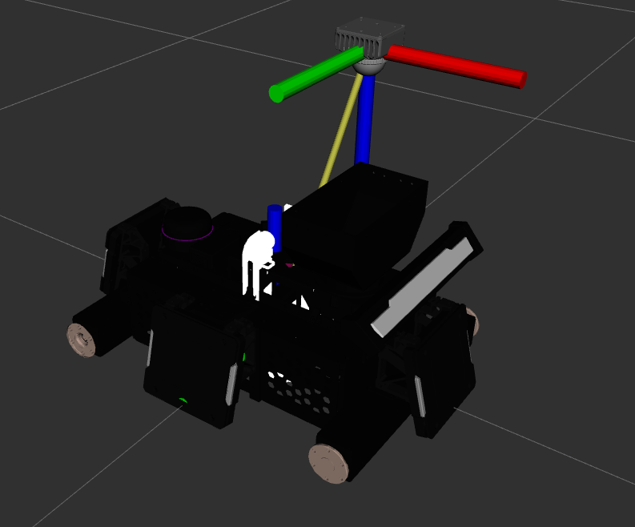
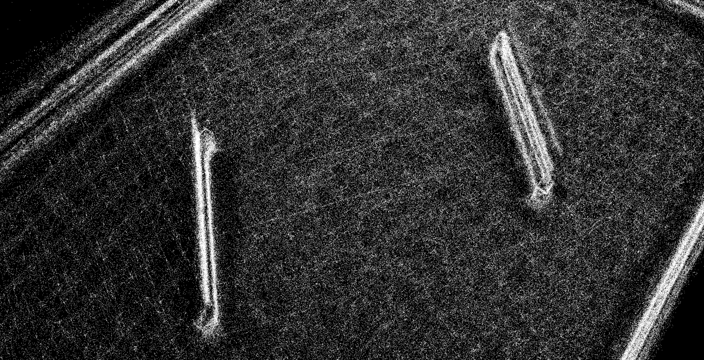

> 本博客记录调试过程,方便后续排查错误
基于 深北莫 陈佬开源
[pb2025_sentry_nav](https://github.com/SMBU-PolarBear-Robotics-Team/pb2025_sentry_nav)
[rmu_gazebo_simulator](https://github.com/SMBU-PolarBear-Robotics-Team/rmu_gazebo_simulator)

# 仿真

## 下载 Ignition: Fortress

下载对应Gazebo仿真版本

[官网教程](https://gazebosim.org/docs/fortress/install_ubuntu/)

```shell
sudo apt-get update
sudo apt-get install lsb-release gnupg
sudo curl https://packages.osrfoundation.org/gazebo.gpg --output /usr/share/keyrings/pkgs-osrf-archive-keyring.gpg
echo "deb [arch=$(dpkg --print-architecture) signed-by=/usr/share/keyrings/pkgs-osrf-archive-keyring.gpg] http://packages.osrfoundation.org/gazebo/ubuntu-stable $(lsb_release -cs) main" | sudo tee /etc/apt/sources.list.d/gazebo-stable.list > /dev/null
sudo apt-get update
sudo apt-get install ignition-fortress
```

删除

```shell
sudo apt remove ignition-fortress && sudo apt autoremove
```

## 安装 small_icp

```shell
sudo apt install -y libeigen3-dev libomp-dev

git clone https://github.com/koide3/small_gicp.git
cd small_gicp
mkdir build && cd build
cmake .. -DCMAKE_BUILD_TYPE=Release && make -j
sudo make install
```

## 克隆 pb2025_sentry_nav


```shell
git clone --recursive https://github.com/SMBU-PolarBear-Robotics-Team/pb2025_sentry_nav.git src/pb2025_sentry_nav
```

## 下载先验点云

[FlowUS](https://flowus.cn/lihanchen/share/87f81771-fc0c-4e09-a768-db01f4c136f4?code=4PP1RS)

放到 目录下
```shell
/home/whale/RM2025/src/pb2025_sentry_nav/pb2025_nav_bringup/pcd/simulation/
```
## 安装依赖 build

```shell
sudo apt-get update
sudo apt-get install python3-rosdep
sudo rosdep init #最好挂梯子
rosdep update #最好挂梯子
rosdep install -r --from-paths src --ignore-src --rosdistro $ROS_DISTRO -y
colcon build --symlink-install --cmake-args -DCMAKE_BUILD_TYPE=Release
```
> rosdep的主要用途是安装工作空间中ros包的依赖，首先切换到工作空间下，然后运行下述命令即可安装该工作空间的所有依赖：

```shell
rosdep install --from-paths src --ignore-src -r -y
```

> 推荐使用 --symlink-install 选项来构建你的工作空间，因为 pb2025_sentry_nav 广泛使用了 launch.py 文件和 YAML 文件。这个构建参数会为那些非编译的源文件使用符号链接，这意味着当你调整参数文件时，不需要反复重建，只需要重新启动即可。(摘自陈佬)

## clone rmu_gazebo_simulator

```shell
cd ~/RM2025/src/
sudo apt install python3-pip

git clone https://github.com/gezp/sdformat_tools.git
git clone https://github.com/SMBU-PolarBear-Robotics-Team/rmoss_interfaces.git
git clone https://github.com/SMBU-PolarBear-Robotics-Team/rmoss_core.git
git clone https://github.com/SMBU-PolarBear-Robotics-Team/rmoss_gazebo.git
git clone https://github.com/SMBU-PolarBear-Robotics-Team/rmoss_gz_resources.git --depth=1
git clone https://github.com/SMBU-PolarBear-Robotics-Team/rmu_gazebo_simulator.git
git clone https://github.com/SMBU-PolarBear-Robotics-Team/pb2025_robot_description.git

pip install xmacro
```

`pip install xmacro`警告
```shell
whale@UP:~/RM2025/src$ pip install xmacro
Defaulting to user installation because normal site-packages is not writeable
Collecting xmacro
  Downloading xmacro-1.2.1-py3-none-any.whl (10 kB)
Installing collected packages: xmacro
  WARNING: The scripts xmacro, xmacro4sdf and xmacro4urdf are installed in '/home/whale/.local/bin' which is not on PATH.
  Consider adding this directory to PATH or, if you prefer to suppress this warning, use --no-warn-script-location.
Successfully installed xmacro-1.2.1
```

`colcon build`警告

```shell
--- stderr: rmoss_base                                                       
In file included from /home/whale/RM2025/src/rmoss_core/rmoss_base/test/test_fixed_packet_tool.cpp:21:
/home/whale/RM2025/src/rmoss_core/rmoss_base/test/dummy_transporter.hpp: In constructor ‘TransporterFactory::TransporterFactory()’:
/home/whale/RM2025/src/rmoss_core/rmoss_base/test/dummy_transporter.hpp:68:9: warning: ignoring return value of ‘int pipe(int*)’ declared with attribute ‘warn_unused_result’ [-Wunused-result]
   68 |     pipe(fds1);
      |     ~~~~^~~~~~
/home/whale/RM2025/src/rmoss_core/rmoss_base/test/dummy_transporter.hpp:69:9: warning: ignoring return value of ‘int pipe(int*)’ declared with attribute ‘warn_unused_result’ [-Wunused-result]
   69 |     pipe(fds2);
      |     ~~~~^~~~~~
---
```


## 运行指令 启动仿真

### 查看tf树 

```shell
sudo apt-get update
sudo apt-get install ros-humble-rqt-tf-tree

ros2 run rqt_tf_tree rqt_tf_tree --ros-args -r /tf:=tf -r /tf_static:=tf_static -r  __ns:=/red_standard_robot1
```

具体自行探索

[SMBU-PolarBear-Robotics-Team](https://github.com/SMBU-PolarBear-Robotics-Team/rmu_gazebo_simulator)

### 单机器人导航

```shell
ros2 launch pb2025_nav_bringup rm_sentry_simulation_launch.py \
world:=rmul_2025 \
slam:=False
```

### 开启Gazebo仿真

```shell
ros2 launch rmu_gazebo_simulator bringup_sim.launch.py
```

需要点击Gazebo左下角按钮启动仿真


> 控制机器人移动

```shell
ros2 run rmoss_gz_base test_chassis_cmd.py --ros-args -r __ns:=/red_standard_robot1/robot_base -p v:=0.3 -p w:=0.3
#根据提示进行输入，支持平移与自旋
```

- 键盘控制：

- 机器人云台
```shell
ros2 run rmoss_gz_base test_gimbal_cmd.py --ros-args -r __ns:=/red_standard_robot1/robot_base
#根据提示进行输入，支持绝对角度控制
```
- 机器人射击
```shell
ros2 run rmoss_gz_base test_shoot_cmd.py --ros-args -r __ns:=/red_standard_robot1/robot_base
#根据提示进行输入
```

能够正常仿真 输出 tf 树

```shell
# sudo apt-get update
# sudo apt-get install ros-humble-rqt-tf-tree

ros2 run rqt_tf_tree rqt_tf_tree --ros-args -r /tf:=tf -r /tf_static:=tf_static -r  __ns:=/red_standard_robot1
```


## 仿真调参

> 记录修改内容

### description 

工作包改为 `fzsd2025_robot_description`

机器人名字改为 `fzsd2025_sentry_rebot`

```py
# robot_description_launch.py
import os

from ament_index_python.packages import get_package_share_directory
from launch import LaunchContext, LaunchDescription
from launch.actions import DeclareLaunchArgument, OpaqueFunction, SetEnvironmentVariable
from launch.conditions import IfCondition
from launch.substitutions import LaunchConfiguration, TextSubstitution
from launch_ros.actions import Node
from sdformat_tools.urdf_generator import UrdfGenerator
from xmacro.xmacro4sdf import XMLMacro4sdf


def launch_setup(context: LaunchContext) -> list:
    """
    NOTE: Using OpaqueFunction in order to get the context in string format...
    But it is too hacky and not recommended.
    """

    use_sim_time = LaunchConfiguration("use_sim_time")
    source_list = LaunchConfiguration("source_list")
    rviz_config_file = LaunchConfiguration("rviz_config_file")
    use_rviz = LaunchConfiguration("use_rviz")
    use_respawn = LaunchConfiguration("use_respawn")
    log_level = LaunchConfiguration("log_level")

    # Map fully qualified names to relative ones so the node's namespace can be prepended.
    # In case of the transforms (tf), currently, there doesn't seem to be a better alternative
    # https://github.com/ros/geometry2/issues/32
    # https://github.com/ros/robot_state_publisher/pull/30
    # TODO(orduno) Substitute with `PushNodeRemapping`
    #              https://github.com/ros2/launch_ros/issues/56
    remappings = [("/tf", "tf"), ("/tf_static", "tf_static")]

    # Load the robot xmacro file from the launch configuration
    xmacro = XMLMacro4sdf()
    xmacro.set_xml_file(context.launch_configurations["robot_xmacro_file"])

    # Generate SDF from xmacro
    xmacro.generate()
    robot_xml = xmacro.to_string()

    # Generate URDF from SDF
    urdf_generator = UrdfGenerator()
    urdf_generator.parse_from_sdf_string(robot_xml)
    robot_urdf_xml = urdf_generator.to_string()

    stdout_linebuf_envvar = SetEnvironmentVariable(
        "RCUTILS_LOGGING_BUFFERED_STREAM", "1"
    )

    colorized_output_envvar = SetEnvironmentVariable("RCUTILS_COLORIZED_OUTPUT", "1")

    start_joint_state_publisher_node = Node(
        package="joint_state_publisher",
        executable="joint_state_publisher",
        name="joint_state_publisher",
        output="screen",
        respawn=use_respawn,
        respawn_delay=2.0,
        parameters=[
            {
                "use_sim_time": use_sim_time,
                "rate": 200,
                "source_list": source_list,
            }
        ],
        arguments=["--ros-args", "--log-level", log_level],
        remappings=remappings,
    )

    start_robot_state_publisher_node = Node(
        package="robot_state_publisher",
        executable="robot_state_publisher",
        output="screen",
        respawn=use_respawn,
        respawn_delay=2.0,
        parameters=[
            {
                "use_sim_time": use_sim_time,
                "publish_frequency": 200.0,
                "robot_description": robot_urdf_xml,
            }
        ],
        arguments=["--ros-args", "--log-level", log_level],
        remappings=remappings,
    )

    start_rviz_node = Node(
        condition=IfCondition(use_rviz),
        package="rviz2",
        executable="rviz2",
        arguments=["-d", rviz_config_file],
        output="screen",
        remappings=remappings,
    )

    return [
        stdout_linebuf_envvar,
        colorized_output_envvar,
        start_joint_state_publisher_node,
        start_robot_state_publisher_node,
        start_rviz_node,
    ]


def generate_launch_description():
    # Get the launch directory
    bringup_dir = get_package_share_directory("fzsd2025_robot_description")   #     get_package_share_directory("fzsd2025_robot_description")

    declare_use_sim_time_cmd = DeclareLaunchArgument(
        "use_sim_time",
        default_value="False",
        description="Use simulation (Gazebo) clock if true",
    )

    declare_robot_name_cmd = DeclareLaunchArgument(
        "robot_name",
        default_value="fzsd2025_sentry_robot",   #  # default_value="fzsd2025_sentry_robot",
        description="The file name of the robot xmacro to be used",
    )

    declare_robot_xmacro_file_cmd = DeclareLaunchArgument(
        "robot_xmacro_file",
        default_value=[
            # Use TextSubstitution to concatenate strings
            TextSubstitution(text=os.path.join(bringup_dir, "resource", "xmacro", "")),
            LaunchConfiguration("robot_name"),
            TextSubstitution(text=".sdf.xmacro"),
        ],
        description="The file path of the robot xmacro to be used",
    )

    declare_source_list_cmd = DeclareLaunchArgument(
        "source_list",
        default_value="['serial/gimbal_joint_state']",
        description="Array of topic names for subscriptions to sensor_msgs/msg/JointStates. Defaults to ['serial/gimbal_joint_state']",
    )

    declare_rviz_config_file_cmd = DeclareLaunchArgument(
        "rviz_config_file",
        default_value=os.path.join(bringup_dir, "rviz", "visualize_robot.rviz"),
        description="Full path to the RViz config file to use",
    )

    declare_use_rviz_cmd = DeclareLaunchArgument(
        "use_rviz", default_value="True", description="Whether to start RViz"
    )

    declare_use_respawn_cmd = DeclareLaunchArgument(
        "use_respawn",
        default_value="False",
        description="Whether to respawn if a node crashes. Applied when composition is disabled.",
    )

    declare_log_level_cmd = DeclareLaunchArgument(
        "log_level", default_value="info", description="log level"
    )

    # Create the launch description and populate
    ld = LaunchDescription()

    # Declare the launch options
    ld.add_action(declare_use_sim_time_cmd)
    ld.add_action(declare_robot_name_cmd)
    ld.add_action(declare_robot_xmacro_file_cmd)
    ld.add_action(declare_source_list_cmd)
    ld.add_action(declare_rviz_config_file_cmd)
    ld.add_action(declare_use_rviz_cmd)
    ld.add_action(declare_use_respawn_cmd)
    ld.add_action(declare_log_level_cmd)

    # Add the actions to launch all of the nodes
    ld.add_action(OpaqueFunction(function=launch_setup))

    return ld
```

`CMakeList.txt`

```cmake
cmake_minimum_required(VERSION 3.5)
project(fzsd2025_robot_description)

find_package(ament_cmake REQUIRED)

install(DIRECTORY
    launch
    resource
    rviz

    DESTINATION share/${PROJECT_NAME}/
)

#environment
ament_environment_hooks("${CMAKE_CURRENT_SOURCE_DIR}/env-hooks/gazebo.dsv.in")

ament_package()

```

rviz查看机器人 `ros2 launch fzsd2025_robot_description robot_description_launch.py`
报错
```shell
package 'joint_state_publisher' not found, 
```

原因 目前 没有部署实际的机器人，所以注释[joint_state_publisher](https://github.com/SMBU-PolarBear-Robotics-Team/pb2025_robot_description/blob/2543d91e1b5bc70fd2d6cfb259f651642d8c1f73/launch/robot_description_launch.py#L71
) 

> standard_robot_pp_ros2获取电控发送的gimbal_yaw和gimbal_pitch姿态，以JointState的数据类型发布到topic /gimbal_joint_state [详见Github](https://github.com/SMBU-PolarBear-Robotics-Team/standard_robot_pp_ros2/blob/e5fa63f1489038559c59c190bc9616e41ff637ff/launch/standard_robot_pp_ros2.launch.py#L142)


> 而后pb_robot_description的launch文件中启动了joint_state_publisher，他会订阅/gimbal_joint_state，然后整合发布到/joint_state [Github](https://github.com/SMBU-PolarBear-Robotics-Team/pb2025_robot_description/blob/2543d91e1b5bc70fd2d6cfb259f651642d8c1f73/launch/robot_description_launch.py#L64
)


> 最后[robot_state_publisher](https://github.com/SMBU-PolarBear-Robotics-Team/pb2025_robot_description/blob/2543d91e1b5bc70fd2d6cfb259f651642d8c1f73/launch/robot_description_launch.py#L71
) 会订阅 /joint_state，然后转化成tf信息和robot_description，建立整车tf tree


重新输入指令 成功在rviz显示

#### 修改 雷达坐标系

`/home/whale/RM2025/src/fzsd2025_robot_description/resource/xmacro/fzsd2025_sentry_robot.sdf.xmacro`

雷达在云台上直接修改坐标 如果在底盘 需要手动维护底盘到云台的tf

这里在云台上 直接修改坐标

找到 `livox`

修改

```xml
<!--livox-->
        <xmacro_block name="livox" prefix="front_" parent="chassis" pose="0.16 0.0 0.18 ${pi/6} 0.0 ${pi/2}" update_rate="20" samples="1875"/>
```
为
```xml
<!-- livox // chassis  gimbal_pitch  gimbal_yaw    -->
        <xmacro_block name="livox" prefix="front_" parent="gimbal_yaw" pose="-0.066 -0.1065 0.399 ${pi} 0.0 ${pi}" update_rate="10" samples="400" visualize="true"/>
```

- update_rate：雷达的更新频率，以赫兹为单位。这参数决定了雷达发送数据的频率。
- samples：雷达的采样数，即每个每次发送的数据点数。

> xmacro_block 元素的 pose 属性。这个属性定义了雷达相对于父级（parent）坐标系的位姿。pose 属性的格式是 x y z roll pitch yaw，其中 x、y 和 z 是雷达相对于父级坐标系的位置，roll、pitch 和 yaw 是雷达相对于父级坐标系的旋转角度。

> 注意 xyz以米为单位, roll、pitch 和 yaw 的单位是弧度，如果你使用的是度数，你需要将它们转换为弧度。例如，45 度转换为弧度是 0.785398，15 度转换为弧度是 0.261799，135 度转换为弧度是 2.35619, 也可以像我一样用pi表示 [ROS中的单位标准_ REP-0103 ](https://www.ros.org/reps/rep-0103.html)


查看tf

```shell
ros2 run rqt_tf_tree rqt_tf_tree --ros-args -r /tf:=tf -r /tf_static:=tf_static 
```




查看实车

```shell
ros2 launch fzsd2025_robot_description robot_description.launch.py
```



### 重新建图

> 此时需要重新建图定位 修改部分参数 否则车子是歪的

修改 `pb2025_nav_bringup/config/`中的`nav2`文件 重力加速度设为正的

```yaml
gravity: [ 0.0, 0.0 , 9.8 ]     # 倒装设置为 +9.8    
    gravity_init: [ 0.0, 0.0 , 9.8 ]   #mid3360单位为'g' 后期有问题得修改
    # gravity: [0.0, -4.9, -8.487]                   # gravity to be aligned # rpy = [0, pi/6, 0]
    # gravity_init: [0.0, -4.9, -8.487]              # preknown gravity in the first IMU body frame, use when imu_en is False or start from a non-stationary state
```


运行指令

```shell
ros2 launch pb2025_nav_bringup rm_sentry__launch.py \
slam:=True \
use_robot_state_pub:=True
```

键盘控制机器人 平移 旋转
```shell
ros2 run rmoss_gz_base test_chassis_cmd.py --ros-args -r __ns:=/red_standard_robot1/robot_base -p v:=0.3 -p w:=0.3
```

绝对角度控制
```shell
ros2 run rmoss_gz_base test_gimbal_cmd.py --ros-args -r __ns:=/red_standard_robot1/robot_base
```

射击
```shell
ros2 run rmoss_gz_base test_shoot_cmd.py --ros-args -r __ns:=/red_standard_robot1/robot_base
```

结束运行会自动保存到 `pointlio/PCD/`目录下 默认名字为`scans` 

查看点云图

```shell
sudo apt install pcl-tools
pcl_viewer -fc 255,255,255 -ax 3 scans.pcd
```




### pcd2pgm

新建工作空间

```shell
git clone https://github.com/LihanChen2004/pcd2pgm.git
```

安装依赖 构建程序
```shell
rosdep install -r --from-paths src --ignore-src --rosdistro $ROS_DISTRO -y
colcon build --symlink-install --cmake-args -DCMAKE_BUILD_TYPE=release
```


pcd2pgm.yml参数解读和修改

```yaml
pcd2pgm:
  ros__parameters:
    pcd_file: /home/whale/ros_ws/pcd2pgm/src/PCD/rmul_2025.pcd
    # odom_to_lidar_odom: [0.0, 0.0, 0.0, 0.0, 0.0, 0.0]
    # odom_to_lidar_odom: [-0.16, 0.0, -0.18, -0.523599, 0.0, -1.5707963] # PB数据
    odom_to_lidar_odom: [ -0.066 , -0.106 , 0.399 , 3.1415926 , 0.0 , 3.1415926 ] # FZSD数据到激光雷达的坐标变换（用于变换点云）
    flag_pass_through: false                                        # 是否使用 Pass Through 滤波器
    map_resolution: 0.05                                            # 地图分辨率
    map_topic_name: map                                             # 发布地图的 ROS 话题名
    thre_radius: 0.1                                                # Radius Outlier 滤波器半径
    thre_z_max: 2.0                                                 # Z轴最大值（用于 Pass Through 滤波器）
    thre_z_min: 0.1                                                 # Z轴最小值（用于 Pass Through 滤波器）
    thres_point_count: 10                                           # 最小点数阈值（用于 Radius Outlier 滤波器）
```

> 修改PCD目录 和 `odom_to_lidar_odom` nav2_param 中的 robot_base_frame 机器人速度参考系到激光雷达的变换关系。 这里是 `gimbal_yaw` 变换值  


运行程序

```shell
ros2 run pcd2pgm pcd2pgm_launch.py
```

保存栅格地图

```shell
ros2 run nav2_map_server map_saver_cli -f <YOUR_MAP_NAME>
```


### 安装 GIMP 修图

进入 [GIMP官网](https://www.gimp.org/downloads/) 安装

使用 flatpak 包管理器安装

```shell
  778  flatpak install org.gimp.GIMP.flatpakref 
  779  sudo apt install flatpak
  780  flatpak install org.gimp.GIMP.flatpakref 
  781  flatpak remove  org.gimp.GIMP.flatpakref 
  782  flatpak uninstall  org.gimp.GIMP.flatpakref 
```

感觉比较麻烦 没用过这个 搜索一番后决定直接apt安装

```shell
sudo apt install gimp
```

成功 ！

> 有一个注意的点 直接另存为导出没有`.pgm` 选项 需要使用左上角文件 ->  `export` 选项(导出为) 才可选择多种格式 也可以快捷键 `Shift+Ctrl+E` 导出

### 重新编译

将`rmul_2025.pcd` 放到 pb2025_nav_bringup/pcd 的 reality 或 simulation 文件夹内

将`rmul_2025.pgm` 和 `rmul_2025.yaml` 文件移动到 pb2025_nav_bringup/map 中的 reality 或 simulation 文件夹内

> `rmul_2025.yaml` 文件中的 image 字段名称需要修改为 `rmul_2025.pgm`

编译

```shell
colcon build --symlink-install --cmake-args -DCMAKE_BUILD_TYPE=Release
```


## 局域网对战

[操作手端口](http://localhost:5000/) http://localhost:5000/  修改为对应端口即可

```shell
python3 src/rmu_gazebo_simulator/scripts/player_web/main_no_vision.py
```

可能遇到报错安装依赖

```shell
pip3 install python-engineio
pip3 install python-socketio flask-socketio
pip3 install flask-cors
```

重新运行即可


# 实车部署


## 指令集

### 手动输出速度

```shell
ros2 topic pub /cmd_vel geometry_msgs/msg/Twist "{linear: {x: 0.5, y: 0.0, z: 0.0}, angular: {x: 0.0, y: 0.0, z: 0.2}}"
```

### 监控串口输出

```shell
sudo cat /dev/ttyUSB0 | hexdump -C
```


### 查看具体订阅关系

```shell
ros2 topic info /red_standard_robot1/cmd_vel
```

## 串口通信 cutecom

```shell
sudo apt-get install cutecom
```


# [通信standard_robot_pp_ros2](https://github.com/SMBU-PolarBear-Robotics-Team/standard_robot_pp_ros2.git)

```shell
git clone https://github.com/SMBU-PolarBear-Robotics-Team/standard_robot_pp_ros2.git
sudo apt install python3-vcstool

vcs import --input standard_robot_pp_ros2/.github/dependency.repos
# 请查看 vcs 导入的子仓库的 README，并按照其说明 递进地安装子仓库的依赖项。
rosdep install -r --from-paths src --ignore-src --rosdistro $ROS_DISTRO -y

./script/create_udev_rules.sh

colcon build --symlink-install

# 如需开启 RViz 可视化，请添加 use_rviz:=True 参数。
ros2 launch standard_robot_pp_ros2 standard_robot_pp_ros2.launch.py

```

# 通信 Vision serial driver

## 程序

`vision serial driver node`

```cpp
#include "../include/vision_serial_driver/vision_serial_driver_node.hpp"

serial_driver_node::serial_driver_node(std::string device_name, std::string node_name)
    // : rclcpp::Node(node_name), vArray{new visionArray}, rArray{new robotArray},
    : rclcpp::Node(node_name), rArray{new robotArray}, nArray{new navArray},
      dev_name{new std::string(device_name)},
      portConfig{new SerialPortConfig(115200, FlowControl::NONE, Parity::NONE, StopBits::ONE)}, ctx{IoContext(2)}
{
  RCLCPP_INFO(get_logger(), "节点:/%s启动", node_name.c_str());
  muzzleSpeedFilter.Size=10;
  // 清零
  // memset(vArray->array, 0, sizeof(visionArray));
  memset(rArray->array, 0, sizeof(robotArray));
  memset(nArray->array, 0, sizeof(navArray));

  // 设置重启计时器1hz.
  reopenTimer = create_wall_timer(
      1s, std::bind(&serial_driver_node::serial_reopen_callback, this));

  // 设置发布计时器500hz.
  publishTimer = create_wall_timer(
      2ms, std::bind(&serial_driver_node::robot_callback, this));

  // TF broadcaster
  timestamp_offset_ = this->declare_parameter("timestamp_offset", 0.006);
  tf_broadcaster_ = std::make_unique<tf2_ros::TransformBroadcaster>(*this);

  // Detect parameter client
  // detector_param_client_ = std::make_shared<rclcpp::AsyncParametersClient>(this, "armor_detector");

  // 发布Robot信息.
  publisher = create_publisher<vision_interfaces::msg::Robot>(
      "/serial_driver/robot", rclcpp::SensorDataQoS());

  // // 订阅AutoAim信息.
  // autoAimSub = create_subscription<vision_interfaces::msg::AutoAim>(
  //     "/serial_driver/aim_target", rclcpp::SensorDataQoS(), std::bind(&serial_driver_node::auto_aim_callback, this, std::placeholders::_1));

  //订阅导航信息.
  navSub = create_subscription<geometry_msgs::msg::Twist>(
    // "/red_standard_robot1/cmd_vel",  // 确保话题名称与实际一致

    "/red_standard_robot1/cmd_vel",
    // "/cmd_vel",
    rclcpp::SensorDataQoS(),
    std::bind(&serial_driver_node::nav_callback, this, std::placeholders::_1)
  );
  // 设置串口读取线程.
  serialReadThread = std::thread(&serial_driver_node::serial_read_thread, this);
  serialReadThread.detach();
}

serial_driver_node::~serial_driver_node()
{
  if (serialDriver.port()->is_open())
  {
    serialDriver.port()->close();
  }
}

void serial_driver_node::serial_reopen_callback()
{
  // 串口失效时尝试重启
  if (!isOpen)
  {
    try
    {
      RCLCPP_WARN(get_logger(), "重启串口:%s...", dev_name->c_str());
      serialDriver.init_port(*dev_name, *portConfig);
      serialDriver.port()->open();
      isOpen = serialDriver.port()->is_open();
    }
    catch (const std::system_error &error)
    {
      RCLCPP_ERROR(get_logger(), "打开串口:%s失败", dev_name->c_str());
      isOpen = false;
    }
    if (isOpen)
      RCLCPP_INFO(get_logger(), "打开串口:%s成功", dev_name->c_str());
  }
}

void serial_driver_node::serial_read_thread()
{
  while (rclcpp::ok())
  {
    std::vector<uint8_t> head(2);
    std::vector<uint8_t> robotData(sizeof(rArray->array) - 2);
    if (isOpen)
    {
      try
      {
        serialDriver.port()->receive(head);
        if (head[0] == 0xA5 && head[1] == 0x00)
        { // 包头为0xA5
          serialDriver.port()->receive(robotData);
          robotData.resize(sizeof(rArray->array));
          robotData.insert(robotData.begin(), head[1]);
          robotData.insert(robotData.begin(), head[0]);
          float lastSpeed = rArray->msg.muzzleSpeed;
          memcpy(rArray->array, robotData.data(), sizeof(rArray->array));
          rArray->msg.muzzleSpeed = rArray->msg.muzzleSpeed > 15 ? rArray->msg.muzzleSpeed : 15.0;
          if(rArray->msg.muzzleSpeed != lastSpeed)muzzleSpeedFilter.update(rArray->msg.muzzleSpeed);
          // RCLCPP_INFO(get_logger(), "读取串口.");
        }
      }
      catch (const std::exception &error)
      {
        RCLCPP_ERROR(get_logger(), "读取串口时发生错误.");
        isOpen = false;
      }
    }
  }
}

void serial_driver_node::serial_write(uint8_t *data, size_t len)
{
  std::vector<uint8_t> tempData(data, data + len);
  try
  {
    serialDriver.port()->send(tempData);
    // RCLCPP_INFO(get_logger(), "写入串口.");
  }
  catch (const std::exception &error)
  {
    RCLCPP_ERROR(get_logger(), "写入串口时发生错误.");
    isOpen = false;
  }
}

void serial_driver_node::nav_callback(const geometry_msgs::msg::Twist::SharedPtr vMsg) {
  if (isOpen)
  {
    // 假设 nArray->msg 是一个结构体，包含 vx、vy 和 wz 成员
    nArray->msg.vx = vMsg->linear.x;
    nArray->msg.vy = vMsg->linear.y;
    nArray->msg.wz = vMsg->angular.z;

    // 构建指令字符串，包含vx, vy, wz
    std::string command = "Vx:" +
                          std::to_string(nArray->msg.vx) + "," +
                          "Vy:" + std::to_string(nArray->msg.vy) + "," +
                          "Wz:" + std::to_string(nArray->msg.wz) + "\n";

    // 通过串口发送指令
    serial_write(nArray->array, sizeof(nArray->array));
    // serial_write(reinterpret_cast<uint8_t*>(command.data()), command.size());
    RCLCPP_DEBUG(get_logger(), "Sent nav: %s", command.c_str());

  }
}

// void serial_driver_node::auto_aim_callback(const vision_interfaces::msg::AutoAim vMsg)
// {
//  if (isOpen)
//   {

//     vArray->msg.head = 0xA5;
//     vArray->msg.fire = vMsg.fire;
//     vArray->msg.aimPitch = vMsg.aim_pitch;
//     vArray->msg.aimYaw = vMsg.aim_yaw;
//     vArray->msg.tracking = vMsg.tracking;
//     RCLCPP_INFO(get_logger(), "aimYaw_111:%05.2f/aimPitch_111:%05.2f", vArray->msg.aimYaw, vArray->msg.aimPitch);


//     serial_write(vArray->array, sizeof(vArray->array));
 
//    /*
//     inf_visionMsg packet;
//     packet.msg.head = 0xA5;
//     packet.msg.tracking = vMsg.tracking;
//     packet.msg.fire = vMsg.fire;
//     packet.msg.aimPitch = vMsg.aim_pitch;
//     packet.msg.aimYaw = vMsg.aim_yaw;
//     std::vector<uint8_t> data = toVector(packet);
//     serial_driver_->port()->send(data);
//     */

//   }
// }

void serial_driver_node::robot_callback()
{
  if (isOpen)
  {
    try
    {
      auto msg = vision_interfaces::msg::Robot();
      // msg.foe_color=rArray->msg.foeColor==1?1:0;
      msg.mode = rArray->msg.mode;
      // msg.foe_color = rArray->msg.foeColor;
      msg.self_yaw = rArray->msg.robotYaw;
      msg.self_pitch = rArray->msg.robotPitch;
      // double muzzle_speed = 15.0;
      // muzzleSpeedFilter.get_avg(muzzle_speed);
      // msg.muzzle_speed = muzzle_speed;
      publisher->publish(msg);

      geometry_msgs::msg::TransformStamped t;
      timestamp_offset_ = this->get_parameter("timestamp_offset").as_double();
      t.header.stamp = this->now() + rclcpp::Duration::from_seconds(timestamp_offset_);
      t.header.frame_id = "odom";
      t.child_frame_id = "gimbal_link";
      tf2::Quaternion q;
      q.setRPY(0, -rArray->msg.robotPitch*3.1415926535/180.0, rArray->msg.robotYaw*3.1415926535/180.0);
      t.transform.rotation = tf2::toMsg(q);
      tf_broadcaster_->sendTransform(t);
      RCLCPP_INFO(get_logger(), "self_yaw:%05.2f/self_pitch:%05.2f", msg.self_yaw, msg.self_pitch);

  //     if (!initial_set_param_ || msg.foe_color != previous_receive_color_) {
          
  //       auto param = rclcpp::Parameter("detect_color", msg.foe_color);

  //       if (!detector_param_client_->service_is_ready()) {
  //         RCLCPP_WARN(get_logger(), "Service not ready, skipping parameter set");
  //         return;
  //       }

  //       if (
  //         !set_param_future_.valid() ||
  //         set_param_future_.wait_for(std::chrono::seconds(0)) == std::future_status::ready) {
  //         RCLCPP_INFO(get_logger(), "Setting detect_color to %ld...", param.as_int());
  //         set_param_future_ = detector_param_client_->set_parameters(
  //           {param}, [this, param](const ResultFuturePtr & results) {
  //             for (const auto & result : results.get()) {
  //               if (!result.successful) {
  //                 RCLCPP_ERROR(get_logger(), "Failed to set parameter: %s", result.reason.c_str());
  //                 return;
  //               }
  //             }
  //             RCLCPP_INFO(get_logger(), "Successfully set detect_color to %ld!", param.as_int());
  //             initial_set_param_ = true;
  //           });
  //       }
  //       previous_receive_color_ = msg.foe_color;
	// //RCLCPP_INFO(get_logger(), "foe_color:%u", msg.foe_color);
  //     }
  //     RCLCPP_INFO(get_logger(), "foe_color:%u", msg.foe_color);
    }
    catch (const std::exception &ex)
    {
      RCLCPP_ERROR_THROTTLE(
          get_logger(), *get_clock(), 20, "处理串口数据时发生错误: %s", ex.what());
    }
  }
}

int main(int argc, char *argv[])
{
  rclcpp::init(argc, argv);
  // std::string dev_name = "/dev/ttyUSB0";
  // std::string dev_name = "/dev/pts/7";
  std::string dev_name = "/dev/ttyACM0";
  std::shared_ptr<serial_driver_node> node = std::make_shared<serial_driver_node>(dev_name, "vision_serial_driver");
  rclcpp::spin(node);
  rclcpp::shutdown();
  return 0;
}
```

include 内部添加 

`packet.h`

```h
#ifndef SERIAL_PACKET_H
#define SERIAL_PACKET_H

#include <cstdint>
#include <algorithm>

#pragma pack(2)

#define visionMsg inf_visionMsg
#define robotMsg inf_robotMsg
#define navMsg inf_navMsg

struct inf_navMsg
{
    uint16_t head;
    float vx;  
    float vy;  
    float wz;  

};

// struct sentry_visionMsg
// {
//     uint8_t head;
//     uint8_t fire;   // 开火标志
//     float aimYaw;   // 目标Yaw
//     float aimPitch; // 目标Pitch
//     float linearX;  // 线速度x
//     float linearY;  // 线速度y
//     float angularZ; // 角速度z
// };

// struct sentry_robotMsg
// {
//     uint8_t head;
//     uint8_t foeColor;  // 敌方颜色 0-blue 1-red
//     float robotYaw;    // 自身Yaw
//     float robotPitch;  // 自身Pitch
//     float muzzleSpeed; // 弹速
// };

struct inf_visionMsg
{
    uint16_t head;
    uint8_t fire;     // 开火标志
    uint8_t tracking; // 跟踪标志
    float aimYaw;     // 目标Yaw
    float aimPitch;   // 目标Pitch
};

struct inf_robotMsg
{
    uint16_t head;
    uint8_t mode;
    uint8_t foeColor;  // 敌方颜色 0-blue 1-red
    float robotYaw;    // 自身Yaw
    float robotPitch;  // 自身Pitch
    float muzzleSpeed; // 弹速
};

struct hero_visionMsg
{
    uint16_t head;
    uint8_t fire;     // 开火标志
    uint8_t tracking; // 跟踪标志
    float aimYaw;     // 目标Yaw
    float aimPitch;   // 目标Pitch
};

struct hero_robotMsg
{
    uint16_t head;
    uint8_t foeColor;  // 敌方颜色 0-blue 1-red
    float robotYaw;    // 自身Yaw
    float robotPitch;  // 自身Pitch
    float muzzleSpeed; // 弹速
};

union navArray
{
    struct navMsg msg;
    uint8_t array[sizeof(struct navMsg)];
};

union visionArray
{
    struct visionMsg msg;
    uint8_t array[sizeof(struct visionMsg)];
};

union robotArray
{
    struct robotMsg msg;
    uint8_t array[sizeof(struct robotMsg)];
};

#pragma pack()

#endif // SERIAL_PACKET_H
```


`vision serial driver node`

```h
#ifndef VISION_SERIAL_DRIVER_HPP
#define VISION_SERIAL_DRIVER_HPP

#include <rclcpp/rclcpp.hpp>
#include <serial_driver/serial_driver.hpp>
#include <vision_interfaces/msg/auto_aim.hpp>
#include <vision_interfaces/msg/robot.hpp>
#include <tf2_ros/transform_broadcaster.h>
#include <tf2/LinearMath/Quaternion.h>
#include <tf2_geometry_msgs/tf2_geometry_msgs.hpp>
#include "avgFilter.hpp"
#include "packet.h"

using namespace drivers::serial_driver;
using namespace std::chrono_literals;

class serial_driver_node : public rclcpp::Node
{
public:
    /*
    @brief 串口驱动节点构造函数
    @param[in] device_name 串口名称
    @param[in] node_name 节点名称
    */
    serial_driver_node(std::string device_name, std::string node_name);

    /*@brief 串口驱动节点析构函数*/
    ~serial_driver_node();

private:
    /*@brief 串口重启回调函数*/
    void serial_reopen_callback();

    /*@brief 串口读取线程函数*/
    void serial_read_thread();

    /*@brief 串口写入函数*/
    void serial_write(uint8_t *data, size_t len);

    /*
    @brief 自瞄回调函数
    @param vMsg 自瞄信息
    */
    void auto_aim_callback(const vision_interfaces::msg::AutoAim vMsg);

    /*@brief 导航回调函数 */
    void nav_callback(const geometry_msgs::msg::Twist::SharedPtr msg);


    /*@brief 机器人状态回调函数*/
    void robot_callback();

    visionArray *vArray;
    robotArray *rArray;
    navArray *nArray;
    avgFilter muzzleSpeedFilter;
    bool isOpen = false;
    std::string *dev_name;
    std::thread serialReadThread;
    SerialPortConfig *portConfig;
    IoContext ctx;
    SerialDriver serialDriver = SerialDriver(ctx);

    // Param client to set detect_color
    using ResultFuturePtr = std::shared_future<std::vector<rcl_interfaces::msg::SetParametersResult>>;
    bool initial_set_param_ = false;
    uint8_t previous_receive_color_ = 0;
    rclcpp::AsyncParametersClient::SharedPtr detector_param_client_;
    ResultFuturePtr set_param_future_;


    // Broadcast tf from odom to gimbal_link
    double timestamp_offset_ = 0;
    std::unique_ptr<tf2_ros::TransformBroadcaster> tf_broadcaster_;
    rclcpp::TimerBase::SharedPtr reopenTimer;
    rclcpp::TimerBase::SharedPtr publishTimer;
    rclcpp::Publisher<vision_interfaces::msg::Robot>::SharedPtr publisher;
    rclcpp::Subscription<vision_interfaces::msg::AutoAim>::SharedPtr autoAimSub;
    rclcpp::Subscription<geometry_msgs::msg::Twist>::SharedPtr navSub;

};

#endif // VISION_SERIAL_DRIVER_HPP
```

`avgFilter.hpp`

```h
#ifndef RM_CPP_AVGFILTER_HPP
#define RM_CPP_AVGFILTER_HPP
#include <vector>

class avgFilter {
private:
    std::vector<double> buffer;
    double avg=0;
public:
    size_t Size;
    void update(double data) {
        if(buffer.size()==Size){
            buffer.erase(buffer.begin());
            buffer.emplace_back(data);
            avg=avg-buffer[0]/Size;
            avg=avg+buffer[Size-1]/Size;
        }
        else{
            buffer.emplace_back(data);
            avg=avg*(int)(buffer.size()-1)/(int)buffer.size()+buffer[buffer.size()-1]/(int)buffer.size();
        }
    }
    void get_avg(double &data) const {
        data = avg;
    }
};


#endif //RM_CPP_AVGFILTER_HPP
```

## 指令

### 虚拟串口 socat

```shell
pip install pyserial
socat -d -d pty,b115200 pty,b115200
```


### 手动发速度

```shell
ros2 topic pub /red_standard_robot1/cmd_vel geometry_msgs/msg/Twist "{'linear': {'x': 0.6}, 'angular': {'z': 0.1}}"
```

### 串口权限

```shell
sudo chmod 666 /dev/ttyACM0
```

查看输出

```shell
cat -v /dev/pts/8
```

启用通讯节点

```shell
ros2 run vision_serial_driver vision_serial_driver_node /dev/ttyACM0
```

查看串口

```
ls /dev/tty*
```