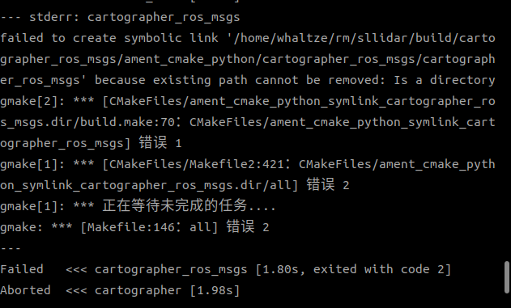
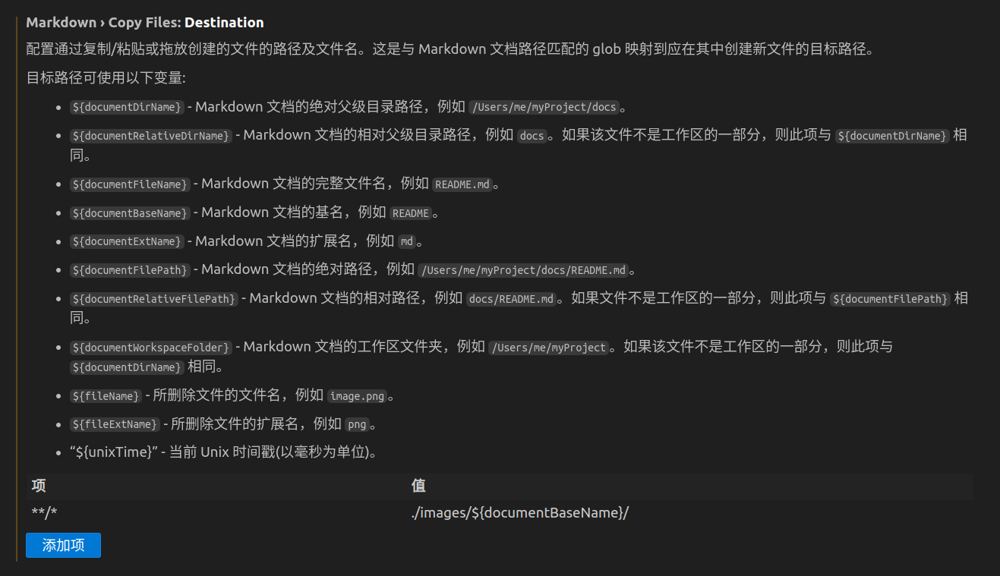
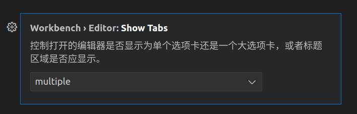

> 此文章记载零碎知识,报错，供查阅

## .sh文件权限不够

```shell
chmod +x <filename>.sh
# chmod +x start.sh
```

## 中英文符号切换

windows自带输入法,进入设置开启中英文标点符号切换功能,默认为 **ctrl+.** ctrl加句号,便可实现中文输入法状态下,输出英文字符

## source /setup.bash

> [CSDN-ROS中的setup.bash](https://blog.csdn.net/qq_28087491/article/details/109179151)

在创建了ROS的workspace后，需要将workspace中的setup.bash文件写入~/.bashrc 文件中，让其启动，就像这个样子

```shell
source /opt/ros/melodic/setup.bash
```

写入和打开方式（vim打开也阔以）
```shell
sudo gedit ~/.bashrc
```
这句话的目的就是在开新的terminal的时候，运行这个setup.bash，而这个setup.bash的作用是让一些ROS* 开头的命令可以使用。

在工作空间的devel文件夹中存在几个setup.*sh形式的环境变量设置脚本。使用source命令运行这些脚本文件，则工作空间的环境变量设置可以生效（如可以找到该工作空间内的项目）。
```shell
source devel/setup.bash
```
为了确保环境变量已经生效，可以使用如下命令进行检查：
```shell
echo $ROS_PACKAGE_PATH
```
如果打印的路径中已经包含当前工作空间的路径，则说明环境变量设置成功

```shell
/home/yinji/catkin_ws/src:/opt/ros/melodic/share
```

没有用source运行该脚本时，打印的路径为

```shell
/opt/ros/melodic/share
```

有时候可通过命令行添加
```shell
export ROS_PACKAGE_PATH=$ROS_PACKAGE_PATH:~/rm/rplidar_c1/install
```

在终端中使用source命令设置的环境变量只能在当前终端中生效，如果希望环境变量在所有终端中有效，则需要在终端的配置文件中加入环境变量的设置
```shell
echo “source /WORKSPACE/devel/setup.bash”>>~/.bashrc
```
请使用工作空间路径替代 WORKSPACE。（将source /catkin_ws/devel/setup.bash命令放入.bashrc文件内）

## 功能包的构建

> [[ROS] 手把手教你如何从无到有构建一个ROS软件包](https://blog.csdn.net/wangmj_hdu/article/details/119985553)

## 查看/杀死进程ps

```shell
ps -ef #查看所有进程(不限制此终端)
```
> 选项-r表示只显示正在运行的程序
> 选项-a表示显示当前终端下的所有程序

查看所有进程
```shell
ps aux | less
```

查看特定进程
```shell
ps aux | grey rviz2 #用rviz2进程举例
```

找到对应进程的PID,用kill指令杀死进程
```shell
kill <PID>
```
```shell
kill -9 <PID> #强制杀死
```

# 报错


## rviz2-x11-wayland不兼容
> rviz2不兼容wayland,rviz和gazebo必须在X11/Xorg才能启动（原因为Wayland只支持GLES并且rviz和gazebo用的库不支持GLES）。因此必须要用XWayland才能启动,博主不知道为什么有一天更新软件包后就不能使用rviz2了,出现如下报错
```shell
(rm) whaltze@Ubuntu:~/rm/sllidar$ ros2 launch sllidar_ros2 view_sllidar_c1_launch.py 
[INFO] [launch]: All log files can be found below /home/whaltze/.ros/log/2024-10-12-17-29-29-395549-Ubuntu-437180
[INFO] [launch]: Default logging verbosity is set to INFO
[INFO] [sllidar_node-1]: process started with pid [437181]
[INFO] [rviz2-2]: process started with pid [437183]
[rviz2-2] Warning: Ignoring XDG_SESSION_TYPE=wayland on Gnome. Use QT_QPA_PLATFORM=wayland to run on Wayland anyway.
```
经查询,当前会话类型
```shell
echo $XDG_SESSION_TYPE
```
发现输出wayland,查询GPT,我安装了wayland QT插件
```shell
sudo apt-get install qtwayland5
```
发现没什么用处

之后我又在~/.bashrc中加入x11
```shell
export QT_QPA_PLATFORM=xcb >> ~/.bashrc
source ~/.bashrc
```
成功解决,但在后来学习中了解到用 export QT_QPA_PLATFORM=xcb，这样会导致本来支持Wayland的App强制使用XWayland导致性能或者效果出现异常,所以我更改了~/.bashrc中的配置
```shell
QT_QPA_PLATFORM=xcb gazebo
QT_QPA_PLATFORM=xcb rviz2
```
这样大概率就可以了,博主本人修改后运行carto功能包再运行雷达功能包打开rviz2时候会warning,一直不行,找不到原因,最后是重启解决了(笑),但是开启后雷达终端仍然有warning,但不影响后面调试了

## cartographer_ros_msgs 符号连接创建失败

colcon build后出现如下报错



进入相关工作空间文件/build下
把ament_cmake_python整个文件夹删除后再colcon build
就可以啦


## VMware虚拟机 网络不显示有线连接

```shell
sudo service NetworkManager stop
sudo rm /var/lib/NetworkManager/NetworkManager.state
sudo service NetworkManager start
```

## 在ubuntu安装edge

[如何在 Ubuntu 上安装 Microsoft Edge 浏览器](https://www.sysgeek.cn/ubuntu-install-microsoft-edge/)

从 Ubuntu 中卸载 Microsoft Edge 浏览器

执行命令卸载 Edge

```shell
sudo apt remove microsoft-edge-stable
```

删除 GPG 密钥：

```shell
sudo rm -rf /usr/share/keyrings/microsoft-edge.gpg
```

从系统中移除 Microsoft Edge 的软件源：

```shell
sudo rm /etc/apt/sources.list.d/microsoft-edge.list
```

## 使用 代理 Clone Github

[北极熊-陈佬博客-使用代理Clone Github](https://flowus.cn/lihanchen/share/c2e8bab3-4be9-437b-ab2a-50bc11971c6d)


## VScode 折叠所有代码块

```shell
crtl + K + 0
```

展开 
`ctrl + K + J`

## 在VScode直接粘贴图片 编写markdown

[如何设置VS Code 中 Markdown粘贴图片的位置](https://blog.csdn.net/seek97/article/details/139220331#:~:text=%E5%9C%A8VS%20Code%E4%B8%AD%EF%BC%8C%E6%8C%89%E4%B8%8B%20Ctrl%20%2B%20%2C%EF%BC%8C%E6%89%93%E5%BC%80%E8%AE%BE%E7%BD%AE%E7%95%8C%E9%9D%A2%E3%80%82%20%E6%96%B0%E5%A2%9E%E9%85%8D%E7%BD%AE%E9%A1%B9%20key%20%E4%B8%BA,%E4%BD%A0%E7%9A%84%E7%9B%AE%E6%A0%87%E8%B7%AF%E5%BE%84%E3%80%82%20%E6%AF%94%E5%A6%82%E6%88%91%E6%83%B3%E5%B0%86%E5%9B%BE%E7%89%87%E6%94%BE%E5%9C%A8%20photo%E7%9B%AE%E5%BD%95%E4%B8%8B%20markdown%E6%96%87%E4%BB%B6%E5%90%8C%E5%90%8D%E7%9A%84%E7%9B%AE%E5%BD%95%E4%B8%8B%EF%BC%8C%E9%82%A3%E4%B9%88%E6%88%91%E5%B0%B1%E5%8F%AF%E4%BB%A5%E8%AE%BE%E7%BD%AE%E4%B8%BAphoto%E3%80%82%20%E4%BF%9D%E5%AD%98%E8%AE%BE%E7%BD%AE%E5%8D%B3%E5%8F%AF%E3%80%82%20%EF%BC%881%EF%BC%89%E6%B3%A8%E6%84%8F%E4%B8%8D%E8%A6%81%E5%8A%A0%22%22%20%EF%BC%882%EF%BC%89%E4%B8%8D%E7%94%A8%E9%87%8D%E5%90%AF%E4%B9%9F%E4%BC%9A%E7%94%9F%E6%95%88%E3%80%82%20%E6%96%87%E7%AB%A0%E6%B5%8F%E8%A7%88%E9%98%85%E8%AF%BB1.4k%E6%AC%A1%EF%BC%8C%E7%82%B9%E8%B5%9E5%E6%AC%A1%EF%BC%8C%E6%94%B6%E8%97%8F8%E6%AC%A1%E3%80%82)

设置搜索 `maekdown.copy`

修改如下



## VScode 只能打开单个选项卡页面




## 


