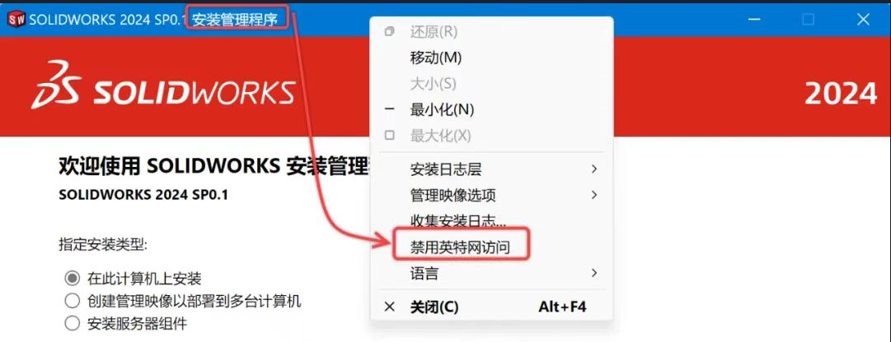
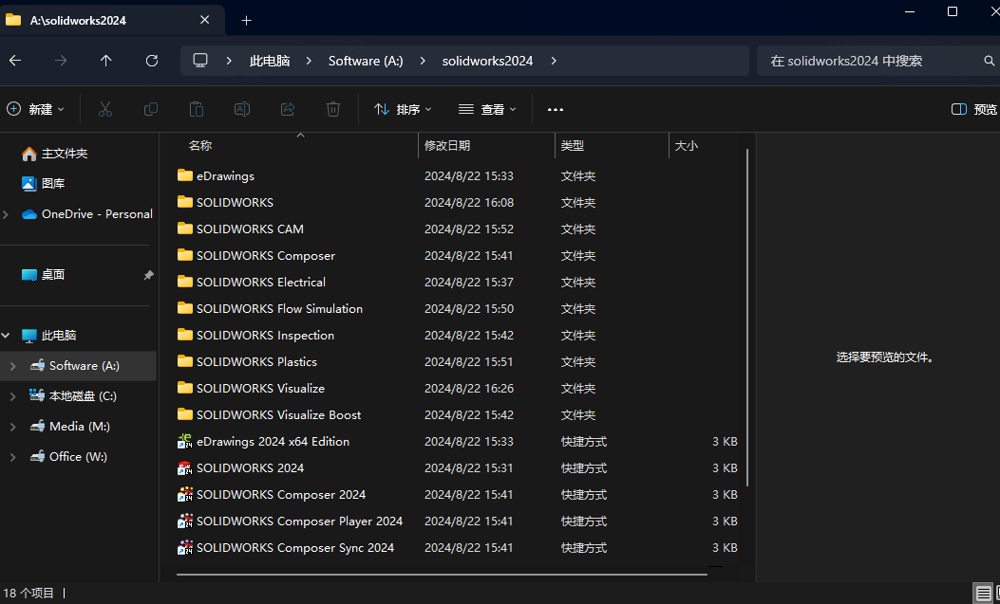

# 删除 SOLIDWORKS
> 首先完成设置内卸载Solidworks->弹出Solidworks自带删除程序->修改高级选项，全部删除


## 删除SolidWorks_Flexnet_Server
### 删除 server_remove
找到 C盘内 SolidWorks_Flexnet_Server 文件夹，进入找到server_remove 右键管理员身份运行，显示如下说明成功
```shell
SolidWorks Flexnet Server 服务正在停止.
SolidWorks Flexnet Server 服务已成功停止。

[SC] DeleteService 成功
请按任意键继续. . .
```
若未安装此服务返回服务名无效，服务未安装

### 删除server_install

继续右键管理员身份运行server_install.bat

```shell

FLEXnet License Manager is successfully installed
as one of your Windows Services.  Some handy tips:


        * The FLEXnet License Manager will be automatically started
          every time your system is booted.

        * The FLEXnet service log file is lmgrd.log in your NT system
          directory.

        * To remove FLEXnet License Manager, type 'installs -r'


********************************************************
 The permissions of one of the files that you just installed seems
 to have the correct settings.
SolidWorks Flexnet Server 服务正在启动 .
SolidWorks Flexnet Server 服务已经启动成功。

请按任意键继续. . .

```

## 删除依赖sql软件包
进入设置->应用卸载，找到以下软件包并卸载
> micrsoft sql server ··· 

这里后续和sql有关的我都给删除了

## 停止Imgrd.exe 进程
> Ctrl+Shift+Esc 打开任务管理器
> 结束Imgrd.exe进程
## 删除残留注册表
> win+R
> regedit
> 找到HKEY_LOCAL_MACHINE\SOFTWARE\ 和 HKEY_CURRENT_USER\Software\ 目录下SOLIDWORDKS有关文件 删除

## 删除solidworks残余的文件
删除以下文件
> C:\Documents and Settings\【登录用户名】\Application Data\【所有相关Soli	dWorks的文件夹 】
> C:\Documents and Settings\【登录用户名】\Local Settings\Application Data\【所有相关SolidWorks的文件夹 】
> C:\SolidWorks Data （这是toolbox文件，如果有定制内容，请不要删除，安装时根据选项使用现有数据）
> C:\Documents and Settings\Administrator\Local Settings\Temp 该目录清空
> X:\Program Files\SolidWorks Corp ，X就是安装SolidWorks所在的盘符

卸载完成之后建议在C盘搜索一下是否还有与SolidWorks相关的文件（Ctrl+f搜索），如有，并进行删除。

## 下载Windows Installer Clean Up
选择solidworks相关，点击remove

# 下载SOLIDWORKS

右键解压缩软件管家->SOLIDWORKS2024（U盘） ，打开
右键点击 **Crack** 选择解压到**Crack**

> 解压Crack前需关闭所有杀毒软件，否则可能被杀毒软件误杀清除程序导致无法正常运行

双击打开Crack 运行 sw2024_network_··· -> 是 -> 确定

鼠标右键点击 SolidWorks_Flexnet_Server 选择复制 进入C盘粘贴(C盘主目录即可) -> 双击打开 -> 鼠标右击管理员身份运行server_install

显示如下说明成功
```shell
FLEXnet License Manager is successfully installed
as one of your Windows Services.  Some handy tips:


        * The FLEXnet License Manager will be automatically started
          every time your system is booted.

        * The FLEXnet service log file is lmgrd.log in your NT system
          directory.

        * To remove FLEXnet License Manager, type 'installs -r'


********************************************************
 The permissions of one of the files that you just installed seems
 to have the correct settings.
SolidWorks Flexnet Server 服务正在启动 .
SolidWorks Flexnet Server 服务已经启动成功。

请按任意键继续. . .


```
> 回到安装包文件夹 双击打开Setup文件夹 管理员身份运行setup鼠标右键**安装管理程序** 选择 **禁用因特尔网访问**
> 
点击下一步 勾选自己需要的产品 更改安装位置

返回摘要
点击Toolbox后方的更改
修改安装路径到A盘
点击Electrical（若没有购买此产品就不用）修改路径到A
返回摘要 勾选接受条款 点击现在安装 -> 确定 -> 确定

等待安装···
安装成功 -> 取消候选**为我显示···新增功能** -> 选择 **不，谢谢** -> 点击完成 -> 以后重新启动

## 破解
回到下载的Solidworks 2024 （64bit）安装包文件夹 -> 双击打开Crack下的SolidSQUADLoaderEnabler -> 点击 是 -> 确定

鼠标右键复制Crack下的Program Files文件夹 -> 打开之前设置的solidworks2024的安装路径 粘贴替换之前的文件(正常应该替换4个文件)

双击桌面 SOLIDWORKS 2024 图标 即可启动成功 进入后点击接受条款 开启建模之旅

> 你可能会遇到一些错误
> 自定义安装路径下没有Program Files文件 无法替换
> 进入Crack内的Files文件 把里面内容一键复制，到你的Solidworks安装目录内粘贴即可，成功后如下图所示(底部为桌面移植的快捷方式)



# 资源
[SolidWorks下载链接（无限速）](https://www.123pan.com/s/PyfZjv-ERwZh.html)

## 一些注意事项

向下兼容低版本失败显示 *保存到先前版本需要SLIDWORKS 订阅服务*
**解决办法**
用记事本打开破解时候的 "C:\SolidWorks_Flexnet_Server\sw_d_SSQ.lic" 文件，如下


将 sd=10-16-2019 替换为 10-16-2030 
ctrl+s保存
重启电脑即可生效

