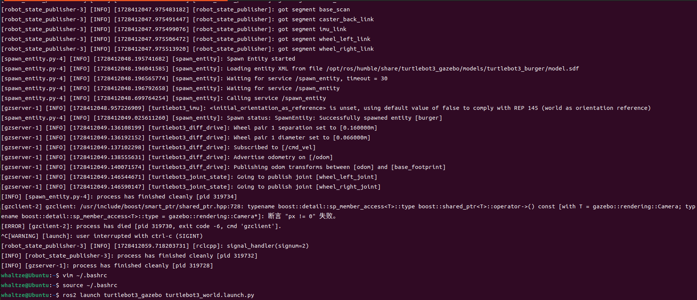
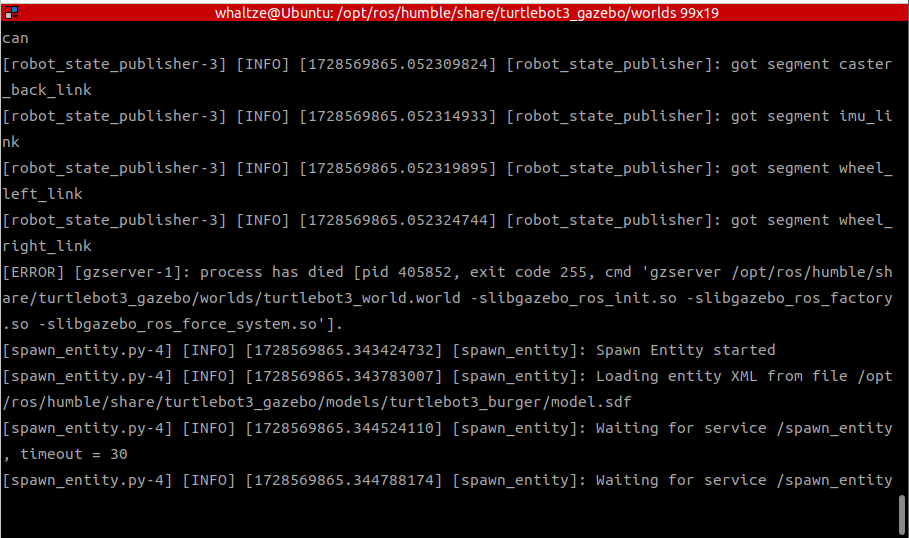
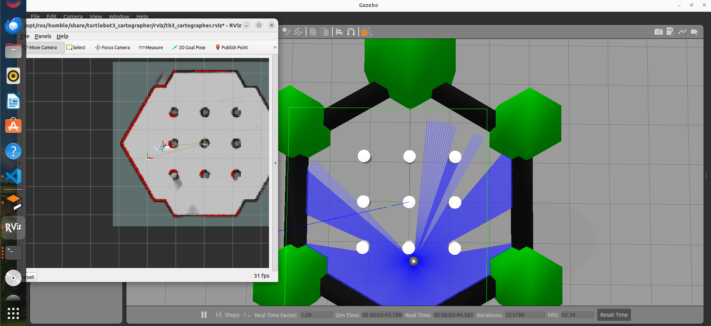
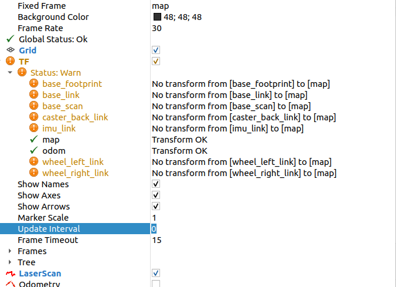

> TurtleBot3 是一个基于ros的小型可编程开源机器人,广泛用于教育和研究领域,本文将介绍Turtlebot3的一些基本玩法,基于gazebo仿真系统(他也是基于ros系统的)进行仿真导航建图等操作
> [TurtleBot3官方文档](https://emanual.robotis.com/docs/en/platform/turtlebot3/simulation/#gazebo-simulation)
> [CSDN:ROS2+TurtleBot3+Cartographer+Nav2实现slam建图和导航](https://blog.csdn.net/leo0308/article/details/138868282)
> [古月居-Gazebo进阶配置教程](https://book.guyuehome.com/ROS2/3.%E5%B8%B8%E7%94%A8%E5%B7%A5%E5%85%B7/3.4_Gazebo/)

# TurtleBOt3安装

```shell
sudo apt install ros-humble-turtlebot3*
sudo apt install ros-humble-gazebo*
sudo apt install ros-humble-cartogarpher
sudo apt install ros-humble-cartographer_ros
# sudo apt install ros-humble-cartographer*
sudo apt install ros-humble-navigation2
sudo apt install ros-humble-nav2-bringup
sudo apt install ros-humble-releop-twist-keyboard #键盘控制程序包安装
```

# carto导航
## 加载gazebo仿真地图

> 你可以创建一个新的工作空间存放源码进行虚拟仿真导航实验,也可以直接用sudo apt install安装的包直接运行,新手最好先直接用sudo的包最有保障,在/opt/ros/humble/share/目录下,若git的包和apt的包不兼容,后期调试可能会有奇怪的报错,若两者兼容,则会将你工作空间的包覆盖apt的包

```shell
mkdir ~/turtlebot_ws/src/
cd ~/turtlebot3_ws/src/
git clone https://github.com/ROBOTIS-GIT/turtlebot3_simulations.git
cd ~/turtlebot3_ws && colcon build --symlink-install #symlink是创建链接符号,保障在修改工作空间代码后会直接生效,不用再source install/setup.bash
```
在~/.bashrc中加入turtlebot的机器人的相关环境变量

```shell
echo 'export TURTLEBOT3_MODEL=burger' >> ~/.bashrc
# echo是打印出后面的字符串, >> 表示把他追加到.bashrc文件中
# echo 'export TURTLEBOT3_MODEL=burger' > ~/.bashrc
# 注意只有一个 > 的表示将内容覆盖.bashrc文件,不要输错啦

```
⚠️ 此处要注意添加进入.bashrc中就是永久更改,后续要替换其他model要删除此条命令然后再换其他的,如果不想永久更改,可以使用如下命令,只在此终端生效,之后再打开另一个终端就要再输入一遍(.bashrc本质上就是打开终端后自动执行一些指令)
```shell
export TURTLEBOT3_MODEL=burger
```

因为不同的turtlebot可能有不同的机器人参数,我们这里选择burger的model模型,当然你也可以选择其他模型,如waffle
```shell
export TURTLEBOT3_MODEL=waffle
```

添加完成后记得source环境
```shell
source ~/.bashrc
```

也可以选择不同的文本编辑器进入~/.bashrc直接修改
```shell
nano ~/.bahsrc
gedit ~/.bashrc 
vim ~/.bashrc
```
同样修改完成后需要在终端source一下

运行仿真地图
```shell
ros2 launch turtlebot3_gazebo turtlebot3_world.launch.py
```
如果成功,大概率可以看到如图所示地图


> <strong style="color: red ; font-family:'仿宋';">报错0:</strong>gazebo无法打开
> 
> 一般下载完gazebo后自动加入自启动到环境变量,如果没加入,需要自行source,加入到.bashrc
> 检查是否是setup.bash问题
> 终端输入 source /usr/share/gazebo/setup.bash
> 重新运行gazebo ,如果成功了,继续下面步骤添加source到.bashrc
> 在终端输入 echo "source /usr/share/gazebo/setup.bash" >> ~/.bashrc
> source ~/.bashrc即可

> <strong style="color: red ; font-family:'仿宋';">报错1:</strong>gazebo加载地图失败,崩溃退出
> 
> 其实是gazebo后台没有完全关闭的原因
> 终端输入 killall gzserver 后重新运行指令即可

> 如果能打开gazebo但是地图出不来也可能是model没有下载或者链接不成功
> <strong style="color: red ; font-family:'仿宋';">方法一</strong>
> ```shell
> ls /opt/ros/humble/share/turtlebot3_gazebo/models
> ```
> 看看是否有models文件,如果存在,执行下面指令,确保路径链接正确
> ```shell
> export GAZEBO_MODEL_PATH=$GAZEBO_MODEL_PATH:/opt/ros/humble/share/turtlebot3_gazebo/models
> ```
> <strong style="color: red ; font-family:'仿宋';">方法二</strong>
> ```shell
> cd ~/.gazebo/
> git clone https://github.com/osrf/gazebo_models models
> ```
> 需要删除.git不然可能会出错
> ```shell
> rm -rf models/.git
> ```
>这样应该model就能链接到了


## 进行slam建图

新建一个终端
```shell 
ros2 launch turtlebot3_cartographer cartographer.launch.py use_sim_time:=True
# 在gazebo中虚拟仿真时间戳sim_time设置为true,实时建图设置为false
```

再新建一个终端,启动刚刚gazebo地图节点的功能包
```shell
ros2 launch turtlebot3_gazebo turtlebot3_world.launch.py
```

再新建一个终端,启动键盘控制节点
```shell
ros2 run turtlebot3_teleop teleop_keyboard
# 根据指令操作时候必须在终端内,不能点到其他地方
```
正常情况用键盘操控机器人走一圈地图会有如下效果


> <strong style="color: red ; font-family:'仿宋';">报错2:</strong>:tf树transform错误
> 
> 确保终端输入指令是use_sim_time = True , 重新运行
> 若还未解决,检查launch,lua文件链接到的urdf文件,确保父节点的joint链接正确,一般父节点是base_link,每个frame_id都要核对清楚

## save map

将刚刚建立的地图保存
```shell
ros2 run nav2_map_server map_saver_cli -f ~/map
```
**-f** 是一个选项,用于保存地图路径的文件名,即会在~/目录下生成map.pgm和map.yaml文件,注意可以修改为其他目录路径,但最后都应为/map的形式结尾,否则无法生成地图

# nav2导航
运行
```shell
ros2 launch turtlebot3_gazebo turtlebot3_world.launch.py
```
```shell
ros2 launch turtlebot3_cartographer cartographer.launch.py use_sim_time:=True
```
```shell
ros2 launch turtlebot3_navigation2 navigation2.launch.py use_sim_time:=True map:=~/rm/sllidar/src/turtlrbot3/map.yaml
```
确保开启第一,二个指令后开启第三个才会接收数据,地图存放位置就是前面建图保存的yaml文件


