> 本博客记录所有安装Ubuntu双系统后遇到的问题以及部分重大操作,留作备案

## Begin Start , SMART !

> ***参考文献***
> [Win11启动盘制作](https://blog.csdn.net/beaver2010/article/details/137599949)
> [Windows11 + Linux (Ubuntu22.04) 双系统最简安装详细避坑版](https://blog.csdn.net/2401_84064328/article/details/137232169)
> [双系统安装ubuntu 22.04 LTS(一步到位)](https://blog.csdn.net/kuwola/article/details/127618930)
> [Ventoy教程：创建多系统启动U盘的详细指南](https://blog.csdn.net/weixin_45167912/article/details/144653202)
> [Window+Ubuntu双系统安装及删除-陈佬](https://flowus.cn/lihanchen/share/e6735ca6-92fb-4db0-ad6c-54837d87c510)

### 准备工作

#### 确保 BIOS 是 UEFI 模式
开始菜单搜索系统信息查看
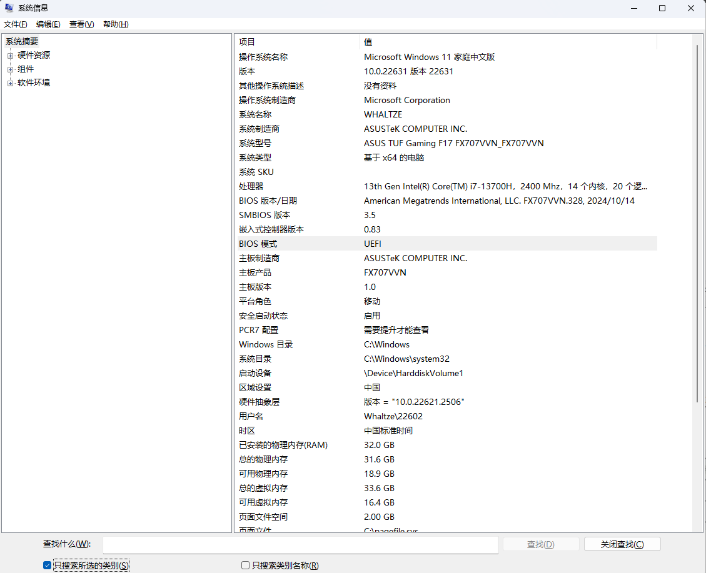

如果不是 进入BIOS系统修改(修改后记得保存)

#### 确保磁盘是GPT格式

进入磁盘管理 点击属性 卷

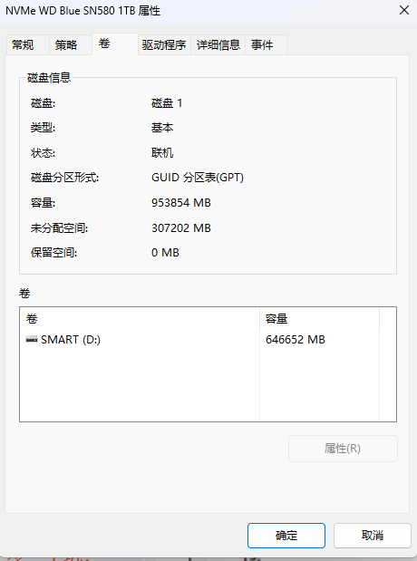

若为主启动记录(MBR),修改为GPT

进入终端输入 `diskpart`

依次输入以下命令

```shell
list disk #列出磁盘
select disk=0 #选择要转换的磁盘 这里是0
convert gpt # 转换
list disk #确认转换成功
```

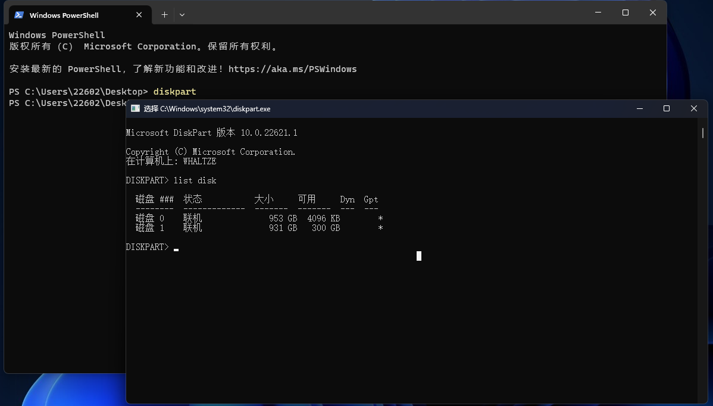

#### 关闭BitLocker加密

在磁盘管理器中查看是否有BitLocker加密
若有 在设置 隐私 安全性中关闭 (解密时间和硬盘内存储的东西有关,越多就越久)

#### 关闭独显直连

避免安装Ubuntu时候出现bug
UP这里之前进华硕 `Armoury Create` 关闭了

### 制作 Ubuntu 系统盘

#### 下载Ubuntu镜像网站

[Ubuntu官网下载地址](https://ubuntu.com/download)

[清华镜像下载网址](https://launchpad.net/ubuntu/+mirror/mirrors.tuna.tsinghua.edu.cn-release)

前者较为麻烦 这里我选择清华镜像

找到 `Mirror location information`
进入一个镜像地址

选择 `ubuntu-22.04.5-desktop-amd64.iso`

server没有图形界面

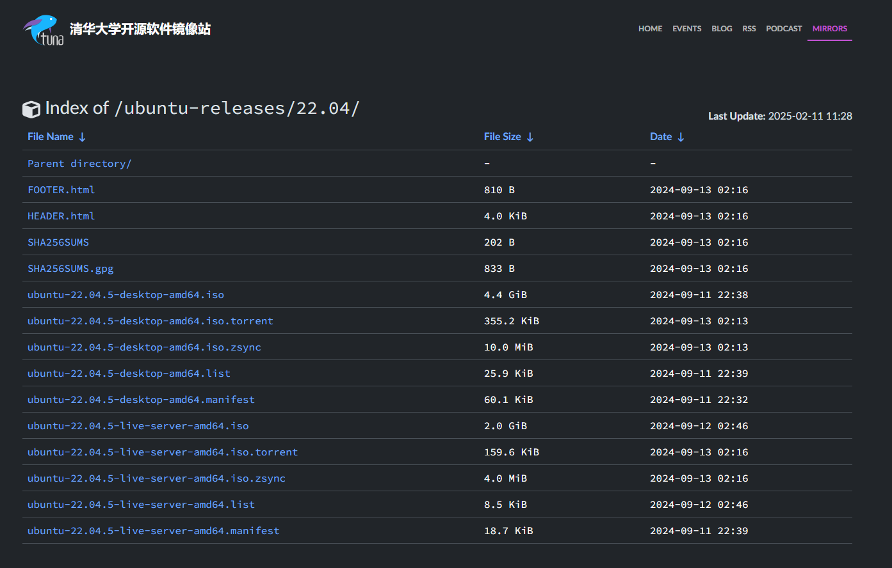

#### 下载Rufu

下载 Rufu 导入 镜像文件

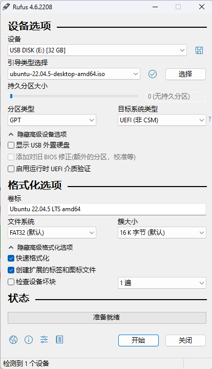

点击开始

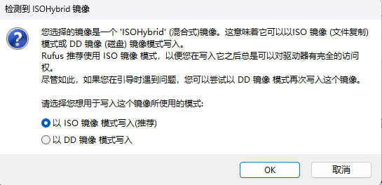

持续点击确定,需要等待一段时间

看到准备就绪绿色条满后便可点击关闭软件,之后哪台电脑需要,插入哪台电脑即可

### 安装 Ubuntu 系统盘

将刚刚做好的启动盘插入电脑

重启 狂按 F2  进入BIOS模式 (博主是华硕天选,其他机型自行百度)

> 先关闭BIOS中的安全启动,避免后续不必要的麻烦

然后关闭Intel RST,避免安装过程中出现Turn off RST

在BIOS设置界面找到Boot启动顺序列表 天选4 BIOS 在右侧U盘设置为最优先引导项,避免要进入U盘的Ubuntu安装程序时,电脑自动返回到Windows系统启动

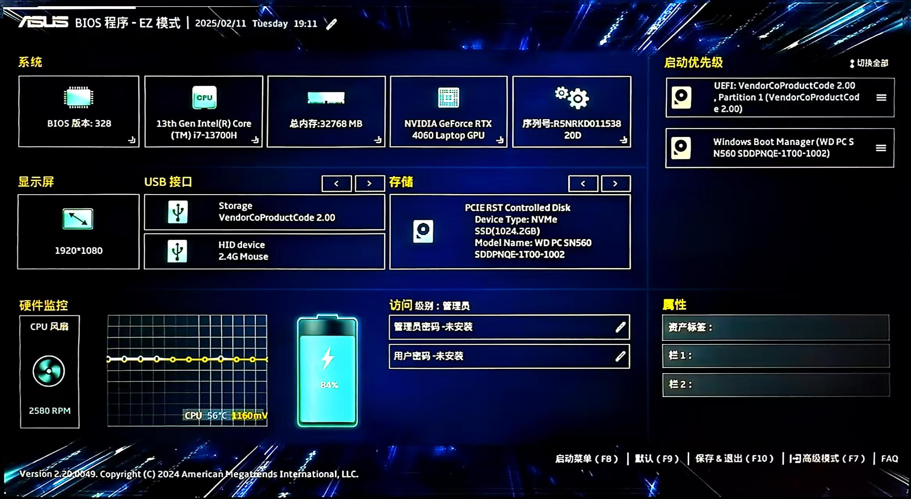

右下角启动菜单 点击U盘启动方式

进入系统 安装Ubuntu

### 安装 Ubuntu !

等待一段时间 开始安装

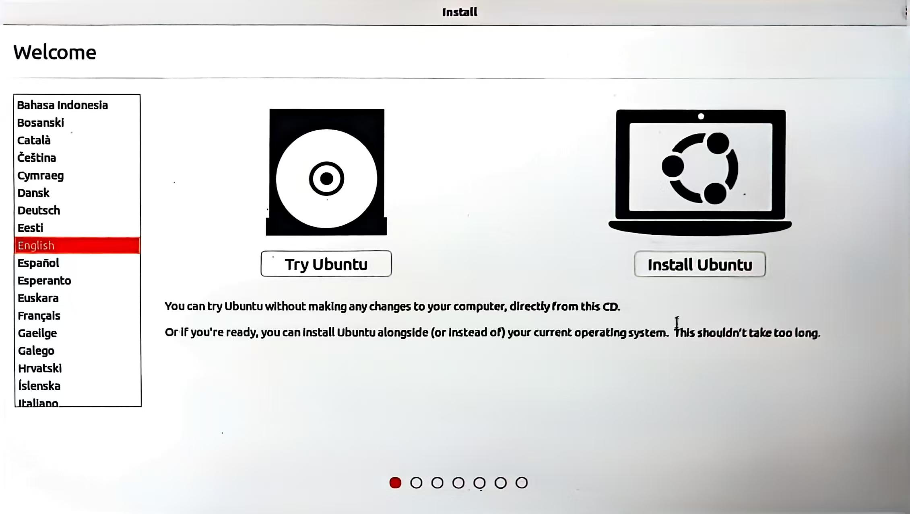

选择右边的 安装 Ubuntu

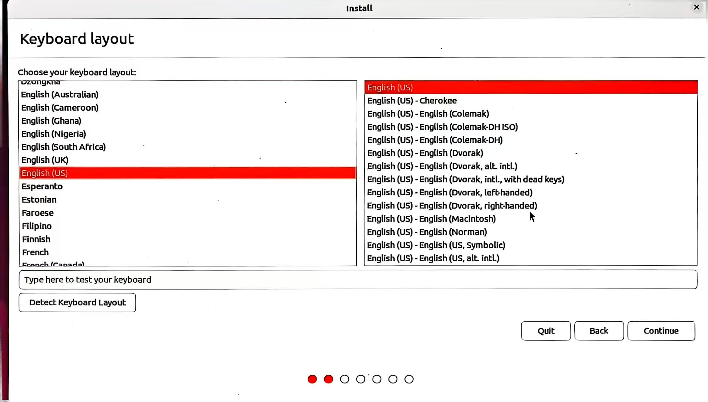

这里我选择英文安装 避免后续不必要的麻烦

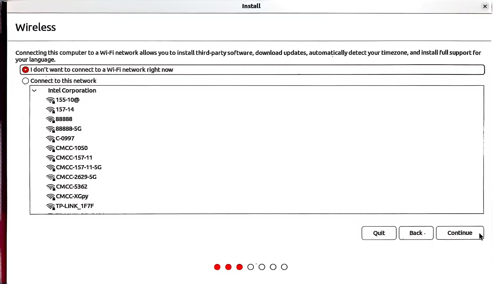

暂时不连接WIFI

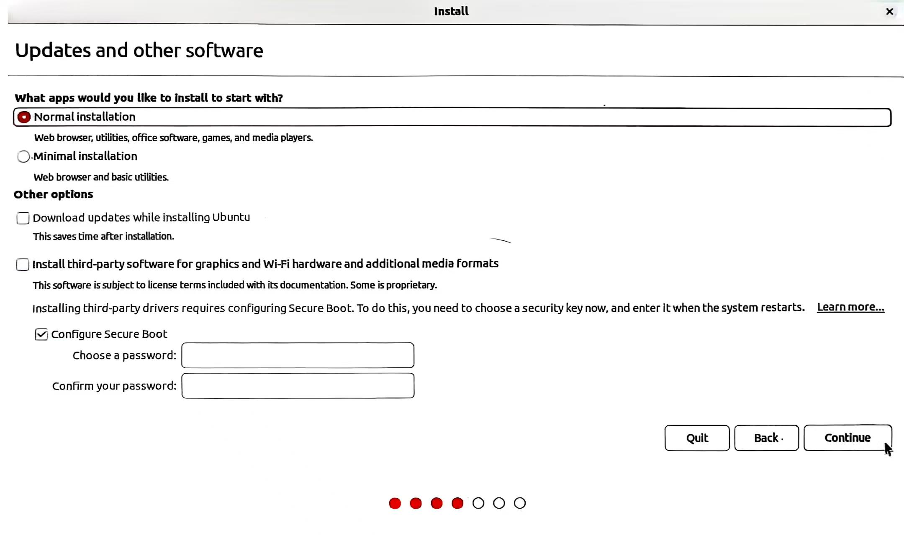

正常安装即可

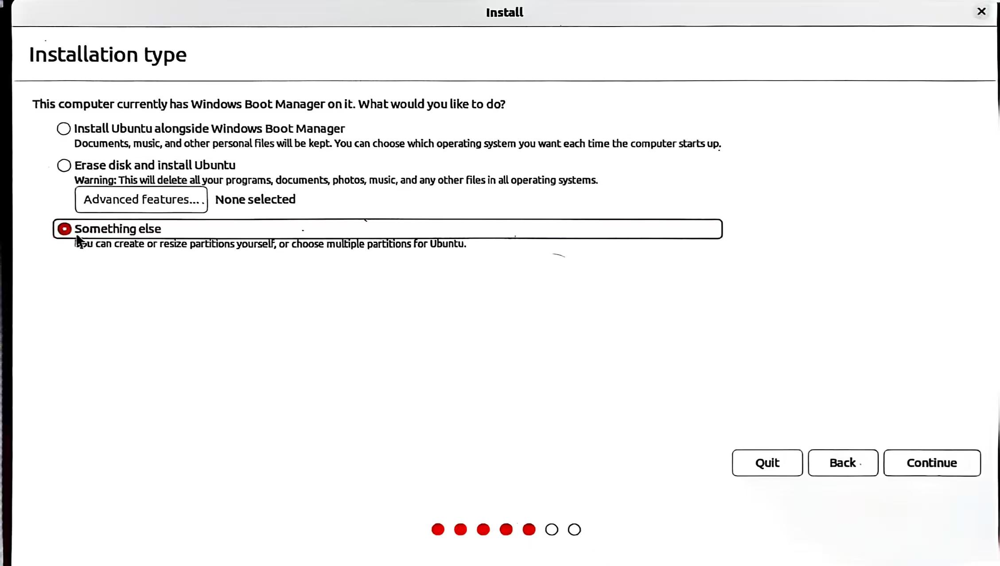

> 这里选择 `自行配置`

#### 创建系统分区

配置好的界面

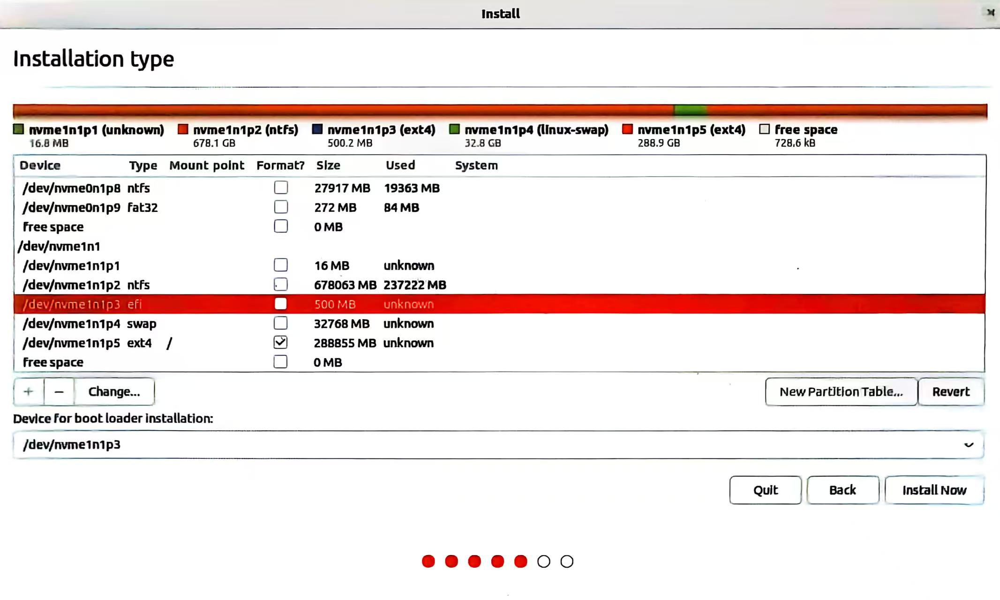

找到之前预留给Ubuntu的free分区 点击add

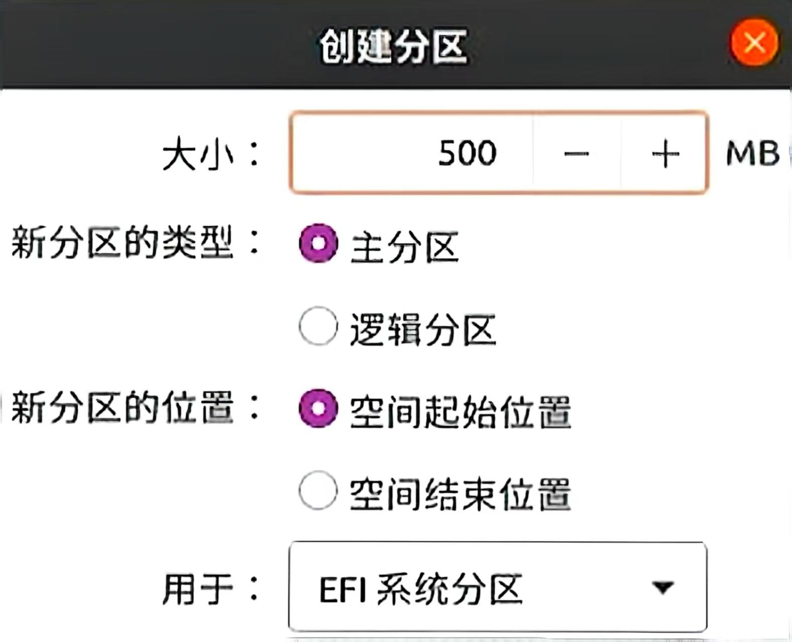

创建分区

需要有 `EFI系统分区`  `swap` 

> EFI 留 500MB 就足够了 swap主要保存一些缓存 播主内存有32GB 其实不用也没事 ,这里我分给 swap 32GB (尴尬) 一般 8 GB 内存 分 10GB 就差不多了

其他都给到根目录 `/`  

> 网上很多说给很多到 `home` 下 ,没有这个必要 到时候不够存储就麻烦了


开始安装

安装成功后会提示重启

这时候屏幕会有一行小字提醒拔出U盘 按下 ENTER 

至此 Ubuntu_22.04 安装成功 大功告成 !!!!!!

### 多IOS启动盘制作(Ventoy)

#### 下载Ventoy 

> 注意Windows还是Linux

[Ventoy官方Github仓库地址](https://github.com/ventoy/Ventoy/releases)

#### 安装到U盘

打开下载的Ventoy工具包,找到并双击运行Ventoy2Disk.exe(Windows版)
将U盘插入电脑 软件会自动识别
选择U盘设备 开始安装

> 注意 安装Ventoy会清除U盘上的所有数据

复制IOS文件到U盘

### 删除 Ubuntu 

下载 DiskGenius

进入软件后找到 Linux 分区 选择删除  

这里要右键 彻底删除分区

包括 swap EXT4等

展开 左侧系统盘下的EFI 分区找到 Ubuntu 子目录

右键彻底删除所有文件

> 千万注意 别把 Windows 删除了 !!!!!!!

完成之后记得左上角 点击 保存更改

**回收磁盘空间**

点击相邻的空闲磁盘 单击右键 选择扩容磁盘空间

博主还没删除过,这里参考陈佬博客笔记撰写

[Window+Ubuntu双系统安装及删除](https://flowus.cn/lihanchen/share/e6735ca6-92fb-4db0-ad6c-54837d87c510)


## Travel ! (配置)

> 至此 Ubuntu22.04双系统下载成功，我们来配置一些功能使得更定制化

## GNOME Tweaks

#### 安装 & 启动

```shell
sudo apt install gnome-tweaks
```

启动

```shell
gnome-tweaks
```

根据图形界面配置即可

## 安装 Clash

下载对应deb包到Download文件夹

```shell
sudo dpkg -i Clash.Verge_2.0.3_amd64.deb 
```

新装系统可能有报错

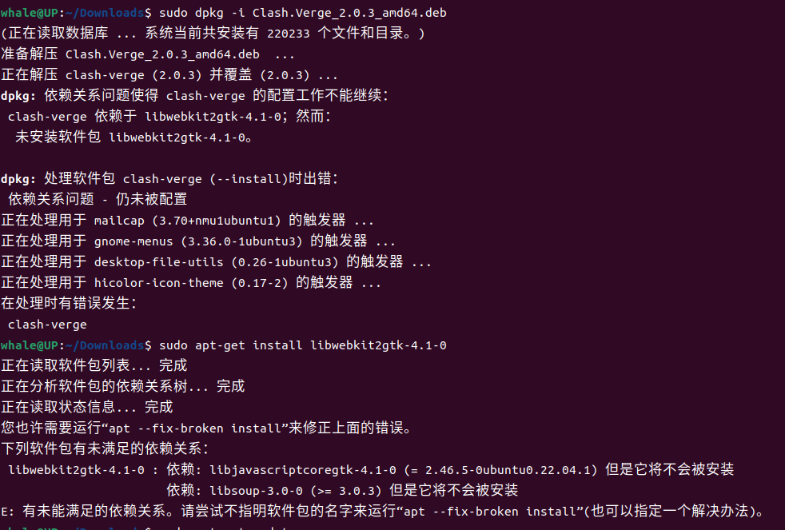

显示缺少依赖

```shell
sudo apt-get install libwebkit2gtk-4.1-0
```

安装依赖后如上图还是报错

运行下列指令补充缺少依赖

```shell
sudo apt-get update
sudo apt-get -f install
```

安装成功 
自行选择机场配置即可


## 时间同步

Ubuntu中时间是世界标准时间,上海是东八区,就是 GMT +8 切换到windows下时间会提早八小时,Windows中直接读取BIOS主板时间当本地时间,所以windows会直接显示BIOS时间,造成错乱.

解决方法

```shell
sudo apt-get install ntpdate                 
#在ubuntu下更新本地时间

sudo ntpdate time.windows.com           

sudo hwclock --localtime --systohc      
#将本地时间更新到硬件上
```

在win上再同步一下时间即可

## 双系统蓝牙共享

> 狼蛛F99 长按 Fn + 1 进入蓝牙匹配 (之前网上搜到的Fn+123匹配一直失效)
> TWS4 打开耳机仓 长按 右侧按键进入蓝牙匹配

一般在安装双系统后，切换系统总是需要重新配对蓝牙设备，虽然显示已连接，但是要先删除，遗忘该设备后重新匹配，设置共享即可把两个系统当成一个，很好避免了该问题

下面是解决方案

#### 安装chntpw

```shell
sudo apt install chntpw
```

在Ubuntu中找到 windows 的 C盘 windows system32 config文件夹

右键此处打开终端，输入指令

```shell
chntpw -e SYSTEM
```

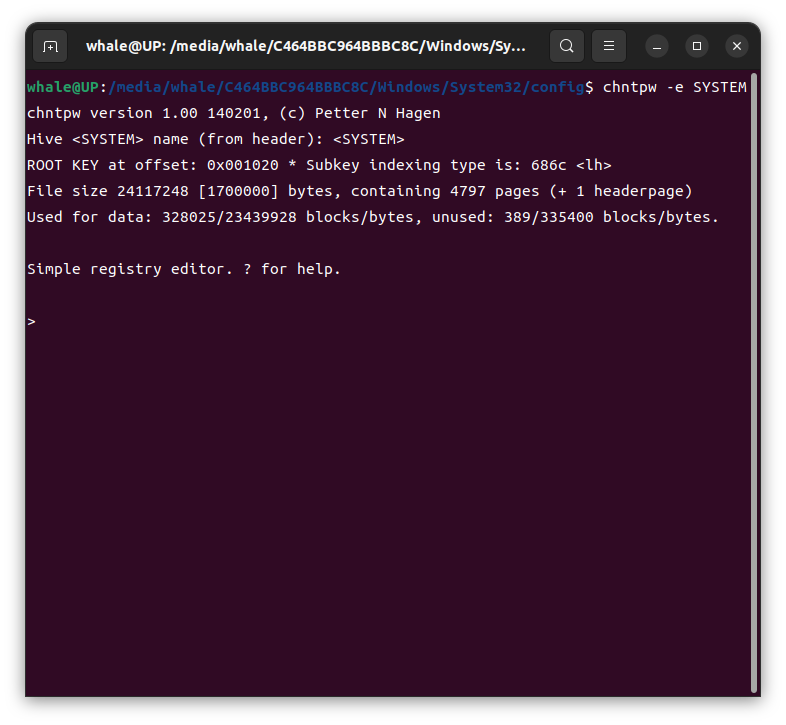

#### 查看蓝牙 MAC

输入
```shell
ls
```
接下来通过 `cd'` 找到蓝牙所在位置

```shell
cd ControlSet001\Services\BTHPORT\Parameters\Keys
```

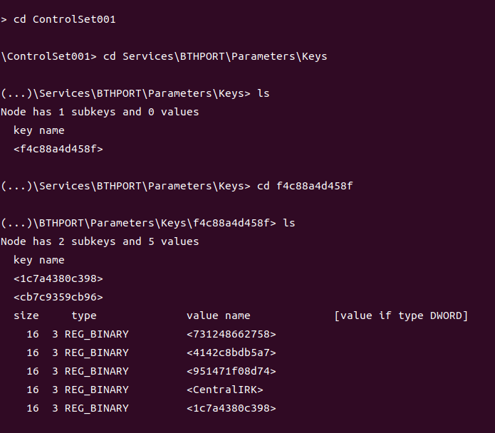


```shell
cd f4c88a4d458f
```

输入 `ls` 查看windows下曾经连接过的设备

查找 `value name` 下对应要修改的蓝牙设备,MAC地址可以通过Ubuntu下查看

最后一个 `1c7a4380c398` 是博主 TWS4 的地址 

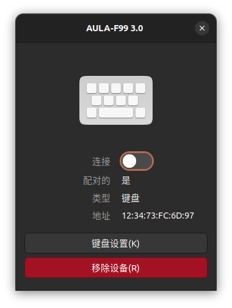

终端输入

```shell
hex 1c7a4380c398
```

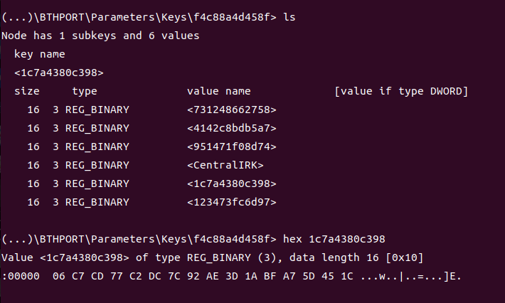

复制MAC地址 

#### 修改 `info`

打开文件夹

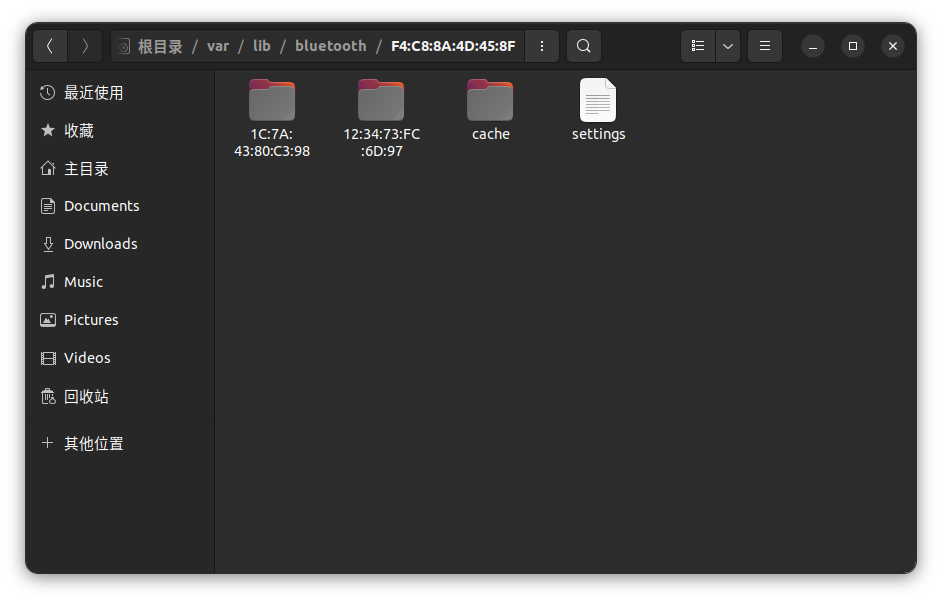

如果是cd到目录d
进入对应地址的文件夹，通过 `vim`
打开 `info` 文件

```shell
sudo vim info
```

也可直接图形化点开

修改 `LinkKey` 下的 `key` 成刚刚输出的MAC地址

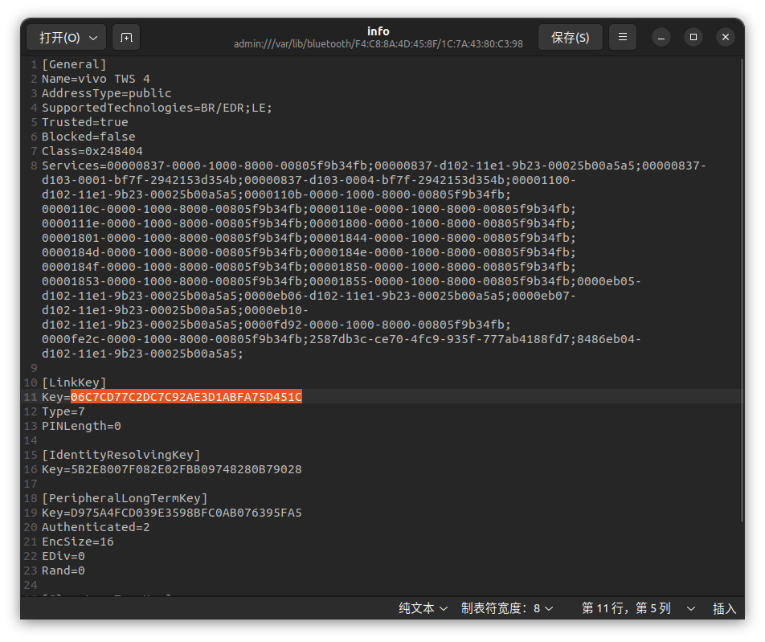

#### 重启蓝牙

```shell
sudo systemctl restart bluetooth
```


## Rime输入法

Rime输入法提供给用户高度自定义化,可实现颜文字,希腊字母的输入

#### 安装Rime

```shell
sudo apt install ibus-rime
```
此处安装`ibus`版本

也可以安装 apt-get 安装 Rime 原版


进入设置 区域与语言 在输入法系统中选择 `ibus`

在 设置 键盘 中 添加 Rime 输入源 

#### 安装 Plum


```shell
curl -fsSL https://raw.githubusercontent.com/rime/plum/master/rime-install | bash
#直接下载并运行 Rime 的配置管理工具 plum,它会自动安装 Rime 输入方案、词典和补丁。
```

- curl -fsSL: 静默下载脚本（不显示进度，忽略 SSL 证书错误）。

- bash: 将下载的脚本直接通过 Bash 执行。

该命令等同于手动克隆 plum 仓库后运行 ./rime-install,但更直接。它会根据参数安装指定的输入方案

> UP的操作

```shell
git clone --depth 1 https://github.com/rime/plum.git
cd plum

./rime-install luna-pinyin emoji zhwiki
# 安装朙月拼音、表情符号、维基拼音

./rime-install aurora-pinyin
# 安装极光拼音（Aurora）
```

> 后面发现 有些库地址更改 原先的 脚本不太行了 用Deepeek研究了一下这方面 尽管 最后成功 但是历程艰辛 配置不易 后续有时间单开一篇博客演示讲解

## 隐藏 VScode 顶部标题栏

进入设置 修改为custom

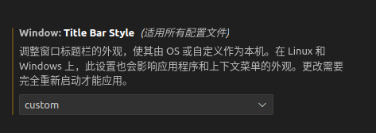


## 蓝牙耳机单边没声音

在安装完系统后,发现耳机能正常连接,却有一边没有声音输出

Sollution 打开设置 声音(sound) 修改input device 切换为耳机再切换回来

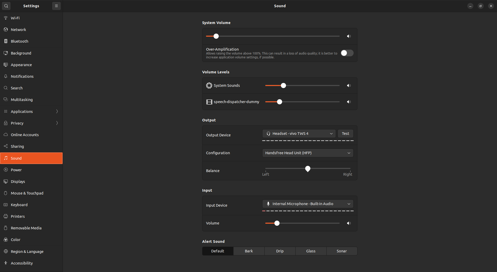

成功修复 ! (原因暂未知)


## 安装 NVIDIA 显卡驱动

```shell
ubuntu-drivers devices
```

没有输出

查询方法以下操作

安装显卡驱动工具

```shell
sudo apt-get install nvidia-cuda-toolkit
```

添加驱动源

```shell
sudo add-apt-repository ppa:graphics-drivers/ppa
sudo apt-get update
```


没有任何效果,均无输出

```shell
lspci -nn | grep -i nvidia
```

没有输出,系统无法识别到NVIDIA显卡

考虑可能PCle设备或者BIOS隐藏独立显卡 (很可能,在win中GPU是省电模式)

```shell
sudo vim /etc/default/grub
```

找到 `GRUB_CMDLINE_LINUX_DEFAULT="quiet splash` 修改如下

```shell
GRUB_CMDLINE_LINUX_DEFAULT="quiet splash pcie_port_pm=off"
```

> `i`  `:wq`

```shell
sudo update-grub
sudo reboot
```

更新重启

再次运行

```shell
lspci -nn | grep -i nvidia
```

无果，还是不行

忽然发现去windows 设置为 独显 即可

但是 Ubuntu 色调 全部变成蓝色(~~未知原因~~)

----

更新 可能更改后色彩配置出现错误 原先默认的 `LP173WFG-SPT2` 修改为 标准色彩空间

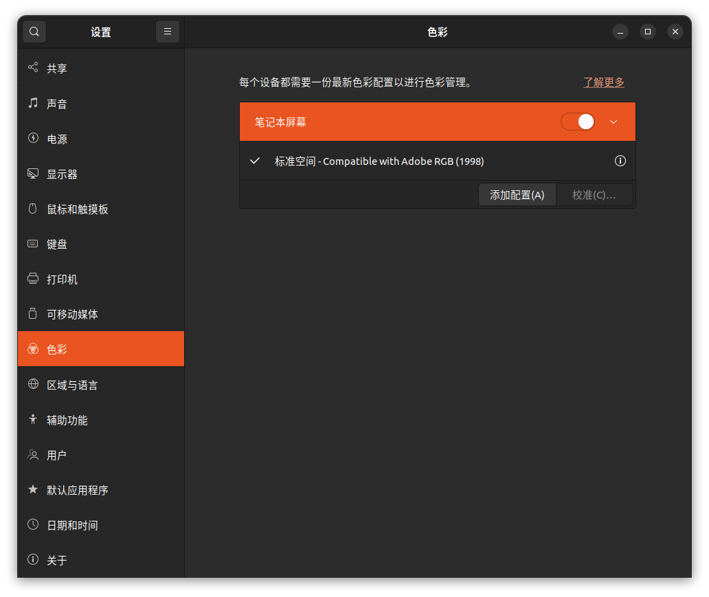

成功恢复!

----

运行

```shell
ubuntu-drivers devices
```

```shell
whale@UP:~$ ubuntu-drivers devices
== /sys/devices/pci0000:00/0000:00:01.0/0000:01:00.0 ==
modalias : pci:v000010DEd000028A0sv00001043sd000031D8bc03sc00i00
vendor   : NVIDIA Corporation
driver   : nvidia-driver-535-server-open - distro non-free
driver   : nvidia-driver-570 - third-party non-free
driver   : nvidia-driver-560 - third-party non-free recommended
driver   : nvidia-driver-535-open - distro non-free
driver   : nvidia-driver-570-open - third-party non-free
driver   : nvidia-driver-535 - distro non-free
driver   : nvidia-driver-565-open - third-party non-free
driver   : nvidia-driver-545-open - distro non-free
driver   : nvidia-driver-545 - distro non-free
driver   : nvidia-driver-550 - third-party non-free
driver   : nvidia-driver-550-open - third-party non-free
driver   : nvidia-driver-565 - third-party non-free
driver   : nvidia-driver-560-open - third-party non-free
driver   : nvidia-driver-535-server - distro non-free
driver   : xserver-xorg-video-nouveau - distro free builtin
```

```shell
sudo apt install nvidia-driver-560
```
大家选择后面有 `recommended` 

这里下载非常慢 建议有条件开一个全局代理

安装完成后重启电脑

```shell
sudo reboot now
```

成功！！

删除之前在 grub 中的修改 移除 `nvidia-cuda-toolkit`

```shell
sudo apt-get remove nvidia-cuda-toolkit
```

重启

## 安装 cuda

终端输入

```shell
nvidia-smi
```
查看GPU最高支持CUDA的版本

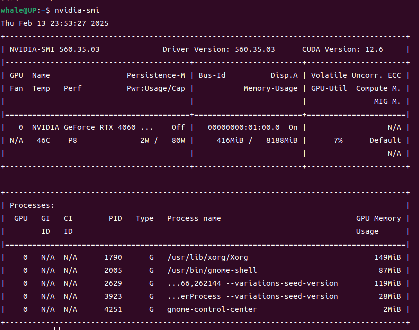

图片显示是 `CUDA Version: 12.6`

去官网查询适配版本 [NVIDIA CUDA Toolkit Release Notes](https://docs.nvidia.com/cuda/cuda-toolkit-release-notes/index.html)

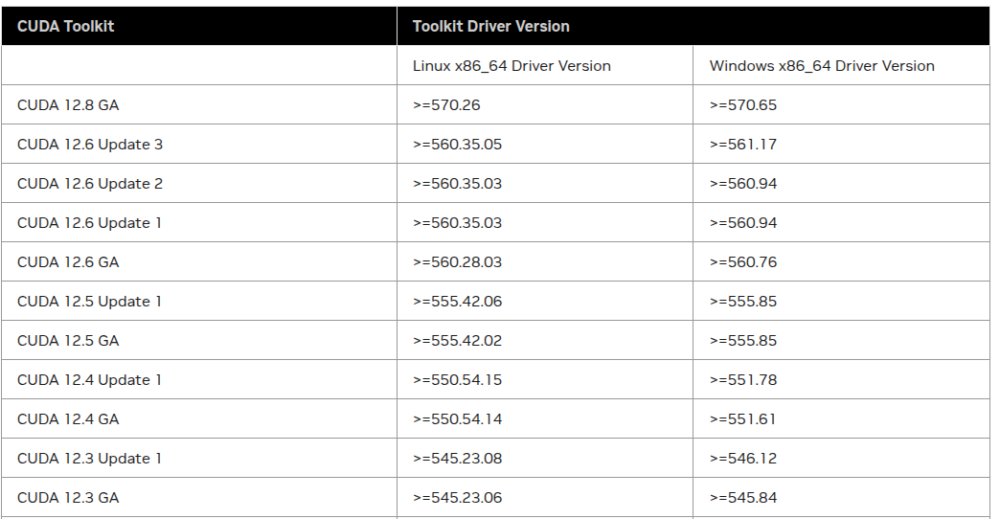

去  [NVIDIA官网-CUDA Toolkit Archive](https://developer.nvidia.com/cuda-toolkit-archive)

选择自己的型号 下载 输入指令

博主这里下载 CUDA 12.6.2
```shell
sudo apt-get update
sudo apt-get install g++
sudo apt-get install gcc
sudo apt-get install make
```
```shell
sudo apt-get install initramfs-tools
wget https://developer.download.nvidia.com/compute/cuda/12.6.2/local_installers/cuda_12.6.2_560.35.03_linux.run
```

> 这里最好不要开代理 避免不稳定 马上又要重新下载 (血的教训)(哭)

不行的试一试这个
```shell

ls -l cuda_12.6.2_560.35.03_linux.run
# 检查文件大小是否匹配（应显示4,446,677,374字节）

wget -c https://developer.download.nvidia.com/compute/cuda/12.6.2/local_installers/cuda_12.6.2_560.35.03_linux.run
# 建议重新下载（使用断点续传）
```

确保文件数据大小等均正确 `4446677374`

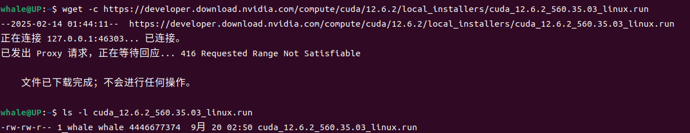

执行

```shell
sudo sh cuda_12.6.2_560.35.03_linux.run
```

选择 Continue

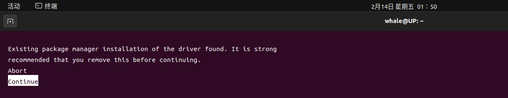
 
输入 `accept` 回车

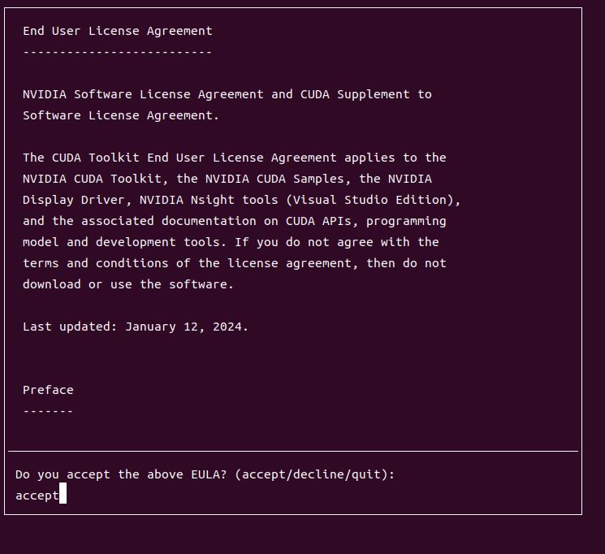

去除 `Driver` (回车 Enter用于勾选) 

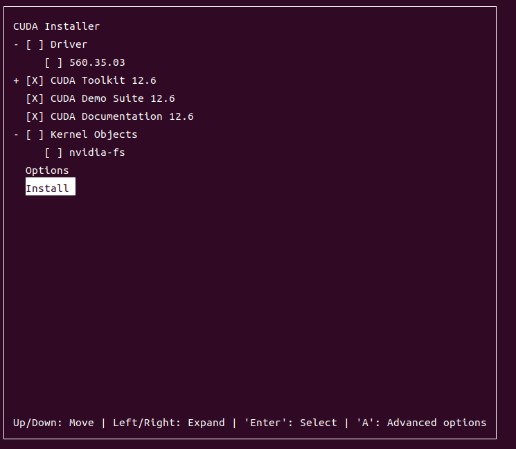

点击安装 等待

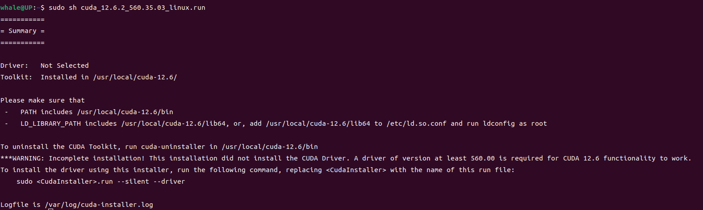

安装成功

出现警告是正常的 对安装没有影响

> **配置CUDA**

此处演示终端为 bash，若你的终端为 zsh，则应修改相应的 ~/.zshrc

```shell
sudo gedit ~/.bashrc
```

在最下方添加

```shell
export PATH=$PATH:/usr/local/cuda-12.6/bin
export LD_LIBRARY_PATH=$LD_LIBRARY_PATH:/usr/local/cuda-12.6/lib64
```

> 需要注意 根据安装版本不同 需要有不同目录改动

更新环境

```shell
source ~/.bashrc
```

测试是否安装成功

```shell
nvcc -V
```

输出如下即可

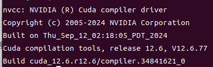

## 独显 集显 切换

输入指令 查看目前显卡使用模式

```shell
prime-select query
```

一般刚安装完都是 `on-demand` 混合模式

```shell
sudo prime-select intel
```
转换为 `intel`

关机重启

这里 `intel` 可替换 `nvidia|intel|on-demand|query` 

其中 `sudo prime-select query` 表示查询当前显卡驱动 


## 安装 ROS2

小鱼一键安装！

```shell
wget http://fishros.com/install -O fishros && . fishros
```
根据输入提示配置即可 非常快 !

## 隐藏顶部状态栏

插一下Gnome目前配置 以后有时间再优化

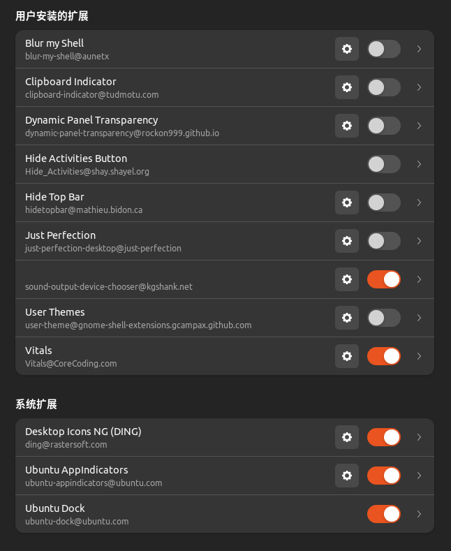

下载gnome extention拓展插件

```shell
sudo apt install gnome-shell-extension-manager
```

如果是Ubuntu22.04 或者更早的版本,需要额外安装插件

```shell
sudo apt install chrome-gnome-shell gnome-shell-extension-prefs
```

打开软件 搜索 Hide Top Bar 隐藏顶部状态栏

还能搜索其他有意思的插件使用

卸载
```shell
sudo dpkg --purge chrome-gnome-shell
```

`purge`参数会将配置文件删除 `remove`只是删除安装文件

拓展配置

## 修改Gnome CSS配置

```shell
cd ~/.config/gnome-shell/
sudo vim gnome-shell.css
```

按 `Alt + F2` 输入 `r` 重启 GNOME Shell

错误方法 已弃用


> 不想折腾了 以后再说

----

## 剪切板

### CopyQ

```shell
sudo apt install copyq
```

不是很适合我 已弃用

### Clipboard indicator

gnome拓展 

快捷键指令 待开发

已经弃用

### Diodon (使用)

```shell
sudo apt install diodon
```

在自己桌面环境配置自定义快捷键 
指令
```shell
/usr/bin/diodon
```

## 在当前文件夹打开终端


```Shell
sudo apt-get install nautilus
nautilus -q
sudo apt-get install xdotool xclip
sudo vim /usr/bin/openterminal.sh
```

写入

```sh
#!/bin/bash

#record the current ClipBoard
#clipboard_current=$(xclip -o)
pid_list=`xdotool search --class "nautilus"`

#loop for the right window
for i in $pid_list
do
name=`xdotool getwindowname "$i"`
name_lower=$(echo $name | tr [a-z] [A-Z])
if echo "$name_lower" | grep -qwi ".*desktop*";then
echo "desktop window"
elif echo "$name_lower" | grep -qwi ".*nautilus*";then
echo "nautilus window"
else
id=$i
fi
done

#get the current working directory
wait=`xdotool windowfocus $id`
sleep 0.2
wait=`xdotool key Ctrl+l`
sleep 0.2
wait=`xdotool key Ctrl+c`
sleep 0.1
path=$(xclip -o)
wait=`xdotool key Escape`
sleep 0.1
gnome-terminal --working-directory "${path}"
```

添加执行权限

```Shell
sudo chmod  +x /usr/bin/openterminal.sh
```
在设置中加入快捷键


## 屏幕亮度调节没反应

调节屏幕亮度按钮时候 一直保持最大亮度

怀疑是安装MVIDIA驱动造成的(自从安装后状况频出)


修改 `GRUB_CMDLINE_LINUX="quiet splash acpi_backlight=native"`参数 重启后成功

## 截图工具

### flameshot

```shell
sudo apt install flameshot
```

配置自定义快捷键

指令

```shell
/usr/bin/flameshot gui
```

## 录屏工具

[OBS-Open Broadcaster Software](https://obsproject.com/)

## 安装 princexml

官网下载 [Prince](https://www.princexml.com/download/15/)

```shell
sudo apt install -y gdebi
sudo apt --fix-broken install
sudo apt install -y gdebi # -y 自动选择yes
sudo dpkg -i prince_15.4.1-1_ubuntu22.04_amd64.deb 
sudo gdebi prince_15.4.1-1_ubuntu22.04_amd64.deb 

```

查看版本

```shell
prince --version
```

返回

```shell
whale@UP:~/Downloads$ prince --version
Prince 15.4.1
Copyright 2002-2023 YesLogic Pty. Ltd.
Non-commercial License
```

不好用 删除

```shell
sudo apt-get purge prince

```

## 安装 谷歌浏览器

## 安装 Terminator 终端

```shell
sudo apt install terminator
```
### 快捷键

搜索 `ctrl + shift + F`

