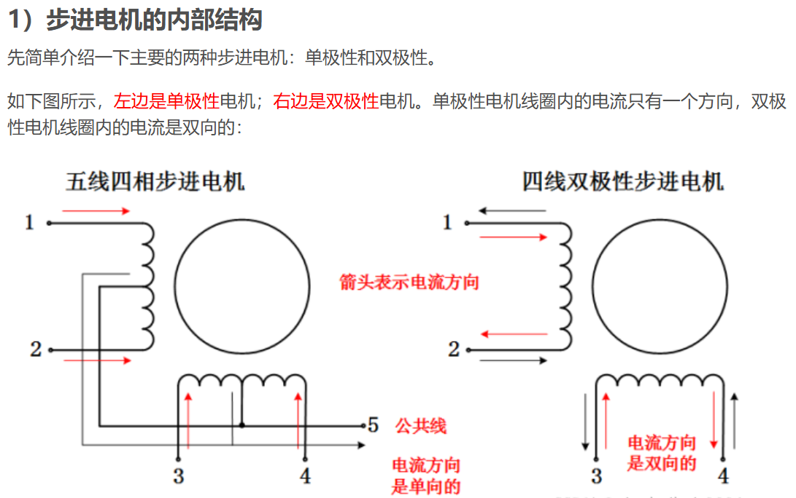
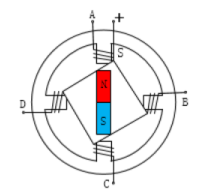
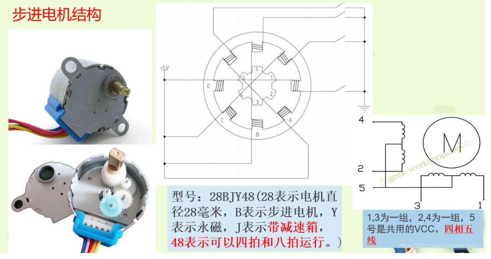
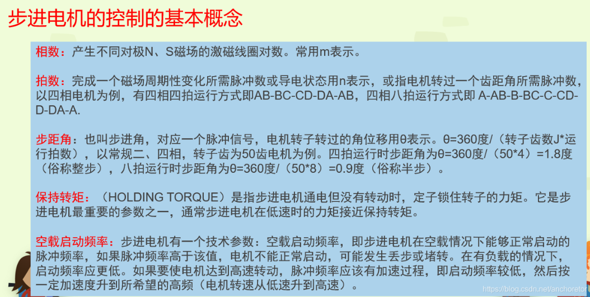

> 本文为up大二上学期寻迹小车设计记录
> 以下为基本硬件配置
> - 主控 stm32F103C8T6
> - 五线四相 步进电机(STEP MORTOR)28BYJ-48
> - 灰度传感器(简易版电子积木)

> 一些资料网站
> [基于51单片机的红外寻迹小车](https://blog.csdn.net/plmnko208/article/details/135048667)
> [基于Arduino的智能循迹小车](https://github.com/Wind-Gone/Arduino-Traced-By-Line-SuperCar)
> [基于STM32的循迹小车(直流电机)](https://blog.csdn.net/m0_51951121/article/details/122499795)
> [激光开源社区](https://www.laserblock.cn/)
> [STM32——灰度PID的使用](https://blog.csdn.net/qq_51963216/article/details/124548477)
> [基于stm32f103c8t6的五路灰度传感器循迹小车](https://blog.csdn.net/2401_83386329/article/details/140243185)
> [STM32驱动5路灰度传感器PID循迹](https://blog.csdn.net/weixin_51651698/article/details/128760449)
> [【STM32】步进电机及其驱动](https://blog.csdn.net/weixin_62179882/article/details/128568965)
> [五路模拟量灰度传感器--ADC+DMA](https://blog.csdn.net/weixin_63800470/article/details/130466162)
> [波特律动串口助手](https://serial.baud-dance.com/)

## 步进电机

步进电机不能直接使用直流或交流电源来驱动，需要使用专门的驱动器将脉冲电信号变换成相应的角位移或线位移进行驱动,角位移或线位移与脉冲数成正比,即其转速或线速度与输入控制脉冲的频率成正比。

> - 步进电机控制特点
> 1. 电机的总转动角度由输入脉冲数决定
> 2. 电机的转速由脉冲信号频率决定

步进电机的内部结构示意图,及其工作原理

我采用的是五线四相的步进电机

