> ubuntu22.04-ros2-humble
> 环境为 conda activate rm (待更新)
> 从功能包入手介绍建图过程
> 工程根目录为sllidar,下设src文件存放各种功能包,编译目录为~/rm/sllidar

> 一些好的学习资料
> [古月居-URDF讲解-机器人建模方法](https://book.guyuehome.com/ROS2/3.%E5%B8%B8%E7%94%A8%E5%B7%A5%E5%85%B7/3.3_URDF/) 
> [古月居-TF树讲解-机器人坐标系管理神器](https://book.guyuehome.com/ROS2/3.%E5%B8%B8%E7%94%A8%E5%B7%A5%E5%85%B7/3.2_TF/)
> [ROS-Wiki-导航教程](https://wiki.ros.org/navigation/Tutorials)

# sllidar_ros

> [Github-sllidar_ros](https://github.com/Slamtec/sllidar_ros2)

> [rplidar_c1官网资料](https://www.slamtec.com/cn/Support#rplidar-c1)
第一个功能包,调试雷达正常驱动运行,我使用的是思岚rplidar_c1雷达

在src中打开终端,切换rm环境后开始git

```shell
git clone https://github.com/Slamtec/sllidar_ros2.git
```

source一下
```shell
source /opt/ros/humble/setup.bash
```

接下来编译构建
```shell    
colcon build --symlink-install
```
> 启用–symlink-install后将不会把文拷贝到install目录，而是通过创建符号链接的方式,允许通过更改src下的部分文件来改变install,每次调整 python 脚本时都不必重新build了

如果构建功能包没问题,继续source
```shell
source ./install/setup.bash
```
> 如果想要添加永久工作区环境变量。 每次启动新 shell 时都会自动将 ROS2 环境变量添加到您的 bash 会话中：运行

```shell
echo "source <your_own_ros2_ws>/install/setup.bash" >> ~/.bashrc
source ~/.bashrc
```
为 rplidar 创建 udev 规则

sllidar_ros2运行需要串行设备的读写权限。 您可以使用以下命令手动修改它：
```shell
sudo chmod 777 /dev/ttyUSB0
# sudo chmod 666 /dev/ttyUSB0
# 记住每次连接雷达都要输入这个指令,不然后期报错查的很痛苦hh
```
但更好的方法是创建一个 udev 规则：
```
cd src/sllidar_ros/
source scripts/create_udev_rules.sh
```

启动sllidar_ros功能包
运行rplidar_c1 并在rviz中查看
```shell
ros2 launch sllidar_ros2 view_sllidar_c1_launch.py
```
看到下图所示点云图,即启动成功
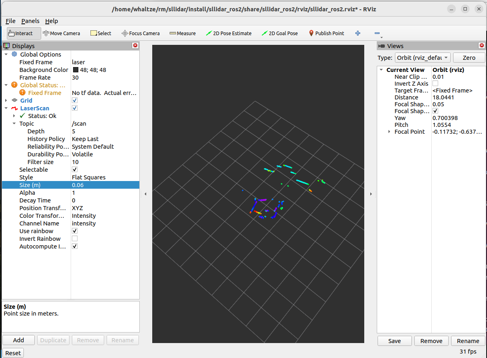

# cartographer && cartographer_ros

> 成功驱动雷达后,我们需要考虑如何构建地图,有点云的,稠密or稀疏,栅格地图occupancy_grid_map等等

确保ros和cartographer的相关依赖已经安装完成
```shell
sudo apt update
sudo apt install -y \
    build-essential cmake git wget curl unzip \
    python3-vcstool python3-pip python3-numpy \
    libceres-dev libprotobuf-dev protobuf-compiler \
    libboost-all-dev libgflags-dev libgoogle-glog-dev \
    liblua5.3-dev ninja-build stow clang \
    libeigen3-dev libopencv-dev
```

## 安装ros-humble版本的cartographer依赖
```shell
sudo apt install -y ros-humble-cartographer ros-humble-cartographer-ros ros-humble-cartographer-ros-msgs
```

也可以直接git clone 举个例子
```shell
git clone https://github.com/ros2/cartographer_ros.git
```

> 一般情况下建议有apt安装方式的直接apt install,官方整合包最方便,不容易出错,其次再考虑git clone
> 安装apt后,再在工作空间git相同的包,要事先确保两者兼容,不然可能会有冲突,两者如果兼容是可以覆盖/opt/目录内的包的

检查是否安装成功
```shell
ros2 pkg list | grep cartogrpaher
```
## backpack_2d.launch.py
找到cartographer_ros包内的backpack_2d.launch.py
```shell
cd /opt/ros/humble/share/cartographer_ros/launch/
sudo vim backpack_2d.launch
```
修改如下
```py
from launch import LaunchDescription
from launch.actions import DeclareLaunchArgument, IncludeLaunchDescription
from launch.conditions import IfCondition, UnlessCondition
from launch.substitutions import LaunchConfiguration
from launch_ros.actions import Node, SetRemap
from launch_ros.substitutions import FindPackageShare
from launch.launch_description_sources import PythonLaunchDescriptionSource
import os

def generate_launch_description():

    ## ***** Launch arguments *****
    use_sim_time_arg = DeclareLaunchArgument('use_sim_time', default_value = 'False')
    # 我们是实时建图 use_sim_time设置为false,仿真则需要时间戳

    ## ***** File paths ****** 根据自己文件路径修改
    pkg_share = FindPackageShare('cartographer_ros').find('cartographer_ros')
    urdf_dir = os.path.join(pkg_share, 'urdf')
    urdf_file = os.path.join(urdf_dir, 'backpack_2d.urdf')
    with open(urdf_file, 'r') as infp:
        robot_desc = infp.read()

    ## ***** Nodes *****
    robot_state_publisher_node = Node(
        package = 'robot_state_publisher',
        executable = 'robot_state_publisher',
        parameters=[
            {'robot_description': robot_desc},
            {'use_sim_time': LaunchConfiguration('use_sim_time')}],
        output = 'screen'
        )

    cartographer_node = Node(
        package = 'cartographer_ros',
        executable = 'cartographer_node',
        parameters = [{'use_sim_time': LaunchConfiguration('use_sim_time')}],
        arguments = [
            '-configuration_directory', FindPackageShare('cartographer_ros').find('cartographer_ros') + '/configuration_files',
            '-configuration_basename', 'carto_rpc1.lua'],
         remappings = [
             ('scan', 'scan')],

        output = 'screen'
        )

    cartographer_occupancy_grid_node = Node(
        package = 'cartographer_ros',
        executable = 'cartographer_occupancy_grid_node',
        parameters = [
            {'use_sim_time': True},
            {'resolution': 0.05}],
        )


    return LaunchDescription([
        use_sim_time_arg,
        # Nodes
        robot_state_publisher_node,
        cartographer_node,
        cartographer_occupancy_grid_node,
    ])
```
## .lua文件
修改.lua文件
我在官方backpack_2d.lua的基础上做了修改,新建carto_rpc1.lua
```lua

include "map_builder.lua"
include "trajectory_builder.lua"

options = {
  map_builder = MAP_BUILDER,
  trajectory_builder = TRAJECTORY_BUILDER,
  map_frame = "map",
  tracking_frame = "base_link",  -- 这里base_link是机器人的基础中心节点,后续会根据urdf文件配置,也可根据自己需要配置
  published_frame = "base_link", 
--  scan_topic = "scan", 
--  tracking_frame = "horizontal_laser_link",  --如果有imu填imu,没有imu则用base_link
--  published_frame = "horizontal_laser_link",   --有odom一般用odom，没有odom一般用base_link
  odom_frame = "odom",
  provide_odom_frame = true,  --底盘提供了里程计，这里不使用算法提供的里程计；如果没有底盘提供，则可以用cartographer提供的里程计，这里摄制成true
  publish_frame_projected_to_2d = false,
  use_pose_extrapolator = true,
  use_odometry = false,
  use_nav_sat = false,
  use_landmarks = false,
  num_laser_scans = 1,  -- 这要注意不要把下面的multi写成1了,博主就用rplidar_c1雷达,有需要可以自行配置
  num_multi_echo_laser_scans = 0,
  num_subdivisions_per_laser_scan = 1,
  num_point_clouds = 0,
  lookup_transform_timeout_sec = 0.2,
  submap_publish_period_sec = 0.3,
  pose_publish_period_sec = 5e-3,
  trajectory_publish_period_sec = 30e-3,
  rangefinder_sampling_ratio = 1.,
  odometry_sampling_ratio = 1.,
  fixed_frame_pose_sampling_ratio = 1.,
  imu_sampling_ratio = 1.,
  landmarks_sampling_ratio = 1.,
}
--TRAJECTORY_BUILDER_2D = {
--    laser_frame = "laser",
--    use_imu_data = false,
--  }
MAP_BUILDER.use_trajectory_builder_2d = true  -- 选择true,会将trajectory_builder_2d文件里面的false改成true进行2d建图
TRAJECTORY_BUILDER_2D.num_accumulated_range_data = 10
TRAJECTORY_BUILDER_2D.use_online_correlative_scan_matching = true
TRAJECTORY_BUILDER_2D.num_accumulated_range_data = 1

return options
```
## .urdf
修改机器人配置文件.urdf

```shell
cd /opt/ros/humble/share/cartographer_ros/urdf/
sudo vim backpack_2d.urdf
```
修改如下(主要加入了雷达scan的laser框架)
```urdf

<robot name="cartographer_backpack_2d">
  <material name="orange">
    <color rgba="1.0 0.5 0.2 1" />
  </material>
  <material name="gray">
    <color rgba="0.2 0.2 0.2 1" />
  </material>

  <link name="imu_link">
    <visual>
      <origin xyz="0 0 0" />
      <geometry>
        <box size="0.06 0.04 0.02" />
      </geometry>
      <material name="orange" />
    </visual>
  </link>

<!-- 添加雷达的坐标系 我的是laser -->

  <link name="laser">
    <visual>
      <origin xyz="0 0 0" />
      <geometry>
        <cylinder length="0.05" radius="0.03" />
      </geometry>
      <material name="gray" />
    </visual>
  </link>

  <link name="horizontal_laser_link">
    <visual>
      <origin xyz="0 0 0" />
      <geometry>
        <cylinder length="0.05" radius="0.03" />
      </geometry>
      <material name="gray" />
    </visual>
  </link>
<>
  <link name="vertical_laser_link">
    <visual>
      <origin xyz="0 0 0" />
      <geometry>
        <cylinder length="0.05" radius="0.03" />
      </geometry>
      <material name="gray" />
    </visual>
  </link>

  <link name="base_link" />

  <joint name="imu_link_joint" type="fixed">
    <parent link="base_link" />
    <child link="imu_link" />
    <origin xyz="0 0 0" />
  </joint>

  <joint name="horizontal_laser_link_joint" type="fixed">
    <parent link="base_link" />
    <child link="horizontal_laser_link" />
    <origin xyz="0.1007 0 0.0558" />
  </joint>

<!-- 主要是这部份改成自己的雷达链接与base_link链接 -->

  <joint name="laser_link_joint" type="fixed">
    <parent link="base_link" />
    <child link="laser" />
    <origin rpy="0 0 0" xyz="0.05 0 0.2" />
  </joint>

  <joint name="vertical_laser_link_joint" type="fixed">
    <parent link="base_link" />
    <child link="vertical_laser_link" />
    <origin rpy="0 -1.570796 3.141593" xyz="0.1007 0 0.1814" />
  </joint>

</robot>
```

## 开始建图

运行启动雷达
```shell
ros2 launch sllidar_ros2 view_sllidar_c1_launch.py 
```

运行启动carto建图
```shell
ros2 launch cartographer_ros backpack_2d.launch.py 
```
选择/map

## 报错征途
如果你也和我一样,没能成功运行,接下来等着你的将会是无尽的困难

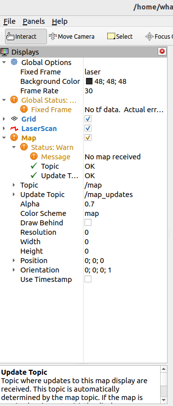

可以看到主要问题是tf树变换不到位以及map消息接收不到

对tf树变换不到位的,请返回urdf文件,认真核对修改即可

对于/map消息无法接收的情况,我主要采取了以下排查步骤

**首先** 我通过rqt_graph 确认了当前节点间的链接状态，和在仿真turtlebot3中的图片进行了对比，发现主要就是缺少/map
```shell
rqt_graph # 需要保持launch运行，另起一个终端，有时不是很灵敏，要多实验几次
```
> 这张图可以看出没有正确链接scan到cartographer_node
> 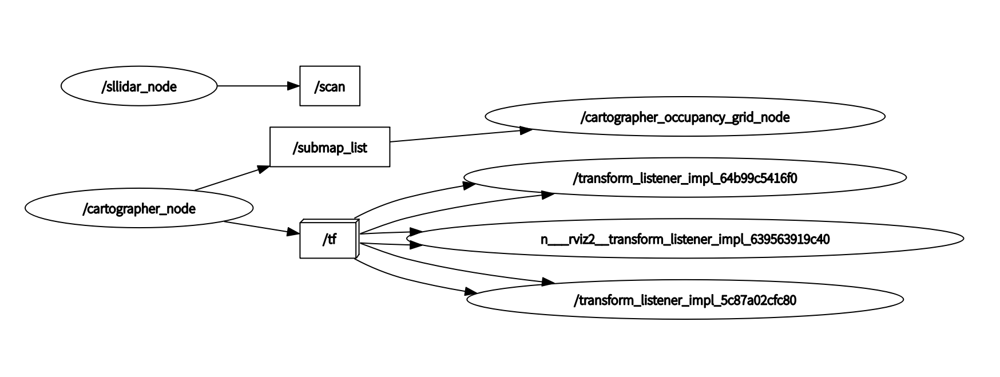

> 这张图保证雷达接收正确,但是没有正确接收map消息
> 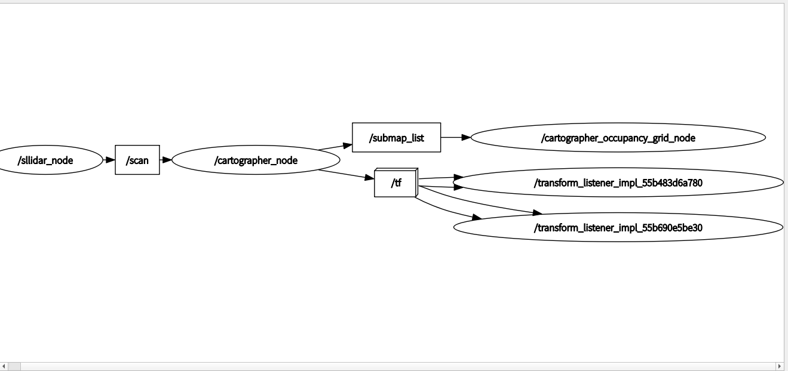

> 基于turtlebot3正确的graph
> 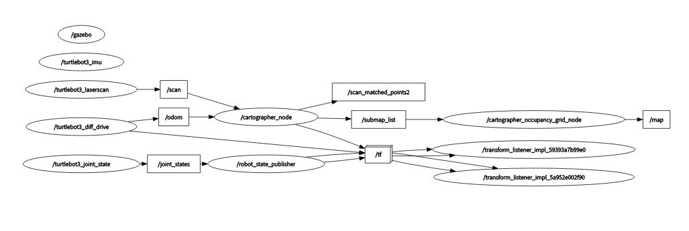

反复对照,发现不同
```shell
ros2 topic hz /map
```

```shell
ros2 topic echo /map #查看特定消息
```

发现均没有输出,
```shell
ros2 topic list
```
我发现却又存在/map

调试了非常长一段时间,灵光乍现 思考map消息message不到可能是发送频率不够
我修改了lua文件中的相应选项,提高hz
```lua
lookup_transform_timeout_sec = 0.5, --变换查找超时时间。如果转换在指定的时间内没有找到，系统将停止查找。增加至0.5
submap_publish_period_sec = 0.1,  --子图的发布周期。配置为每 0.1 秒发布一次子图 10hz
```

重新运行那两个指令,发现map的message还是接收不到,但我惊喜的发现rqt_graph中出现了/map链接

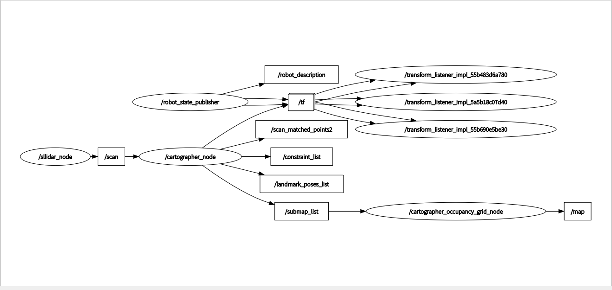

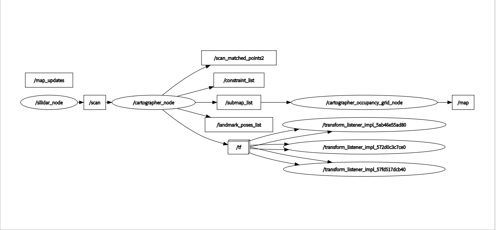

非常惊喜,有两次都有出现map的链接

在这中的过程,我还在cartographer_ros功能包的backpack_2d.launch.py配置了rviz的启动node,观察到demo_backpack_2d.launch.py中用了demo_2d.rviz文件,就借鉴过来了

在backpack_2d.launch.py中添加以下节点(已经做了修改)
```py
rviz_node = Node(
    package = 'rviz2',
    executable = 'rviz2',
    arguments = ['-d', FindPackageShare('cartographer_ros').find('cartographer_ros') + '/configuration_files/demo_2d.rviz'],
    parameters = [{'use_sim_time': False}],
)
```

最后也要加上这个节点名称
```py
return LaunchDescription([
        use_sim_time_arg,
        # Nodes
        robot_state_publisher_node,
        cartographer_node,
        cartographer_occupancy_grid_node,
        rviz_node, # 添加rviz_node节点
    ])
```

结束之后,运行backpack_2d.launch.py便会跳出rviz2界面,虽然好像没什么用哈哈,但是我发现,原来rviz中的contraints(约束)选项原本显示的是message hz at xxx,现在都不报错了,不知道是不是因为更改的原因,有大佬知道的,文章最后有联系方式,希望能一起讨论学习,(后面我把lua的相关参数改回去,也还是不报错了hhh好奇怪)

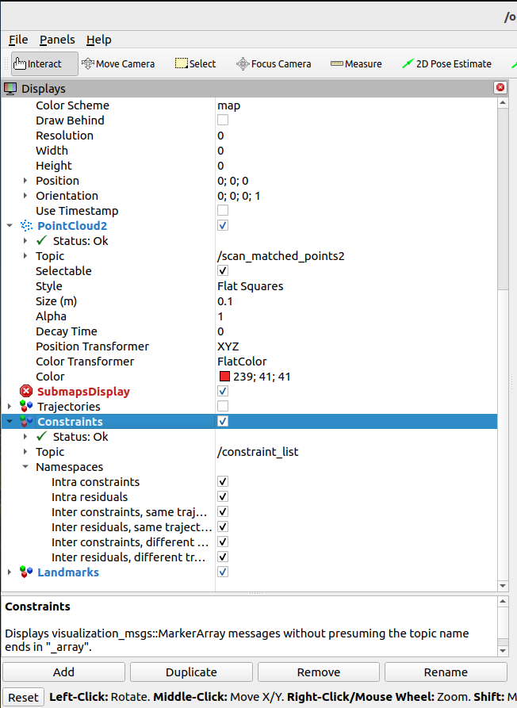

言归正传,继续排查问题
```shell
ros2 run cartographer_ros cartographer_occupancy_grid_node -resolution 0.05 -publish_period_sec 1.0 --ros-args --log-level debug
```
我开启debug模式,运行了occupancy_grid_node,发现目前地图信息已经有被正确发布并且message,基本确定就是base_link和map的连接问题

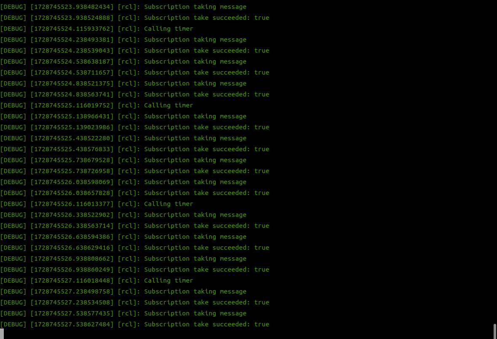

```shell
ros2 run tf2_ros tf2_echo map base_link
```
针对性的观察map和base_link之间的tf连接是否正确
发现不存在两者的连接
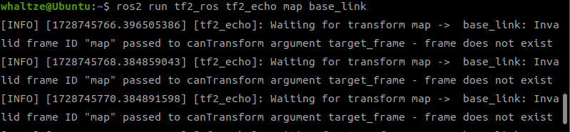

```shell
ros2 run tf2_tools view_frames
```
建立tf树,发现确实到base_link就断开连接了
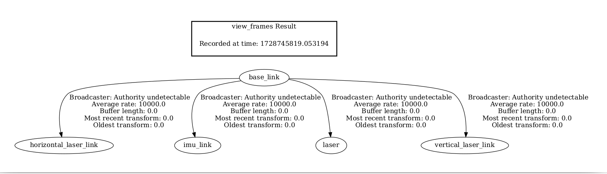

> 再次陷入僵局,调试许久未果,开始反复看turtlebot3成功的文件程序和tf连接,进行各种尝试

忽然发现之前查看tf树hide了好多信息,左上角那些选项可以勾选,对最新的图片进行比对,发现一些不同,进而更改

顺便介绍一下之前hide的参数
| 概念名称       | 解释                                                                                       |
| -------------- | ------------------------------------------------------------------------------------------ |
| Dead Sinks     | 订阅了某个主题的节点，但是没有其他节点正在发布该主题的消息。换句话说，这些节点正在等待永远不会到来的消息。 |
| Leaf Topics    | 这些是没有任何节点订阅的主题。换句话说，尽管有节点在发布这些主题的消息，但是没有节点在接收这些消息。   |
| Debug          | 这个选项通常用于启用或禁用额外的调试信息。在rqt_graph中，启用调试可能会显示更多的细节，例如消息的数据类型和频率。 |
| TF             | TF（Transform Framework）是ROS中用于维护不同坐标系之间变换的一个系统。在rqt_graph中，TF相关的条目显示了发布和订阅TF变换的节点。 |
| Unreachable    | 这通常指的是由于网络问题或其他原因，某些节点无法与其他节点通信。这可能导致节点或主题在计算图中显示为不可达。 |
| Params         | 参数（Parameters）是ROS中用于配置节点和整个系统的键值对。在rqt_graph中，参数可能显示为节点的一部分，但通常不会显示参数之间的连接。 |


> turtlebot3的TF树
> 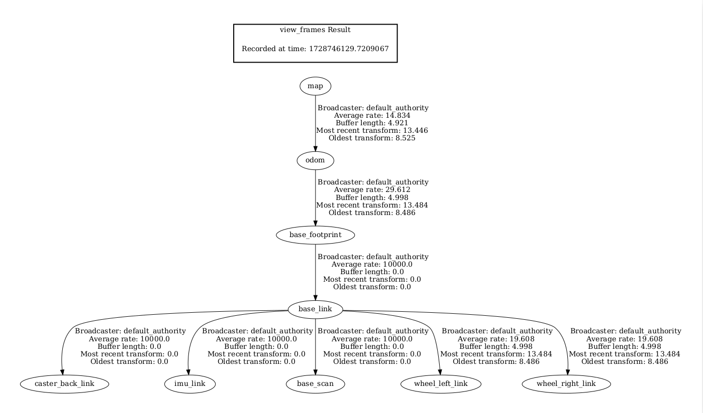

> turtlebot3的graph
> 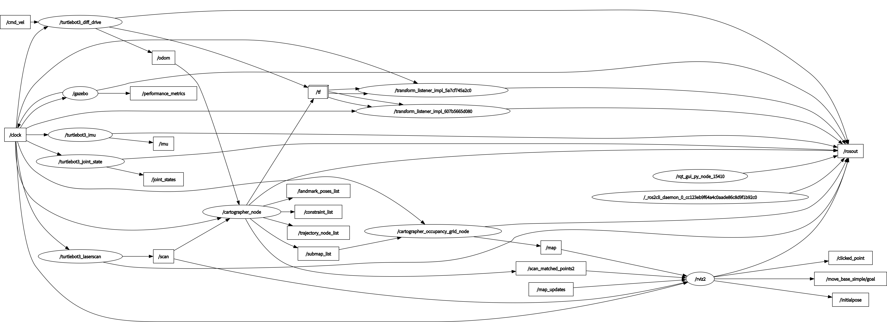

> 目前自己调试的graph
> 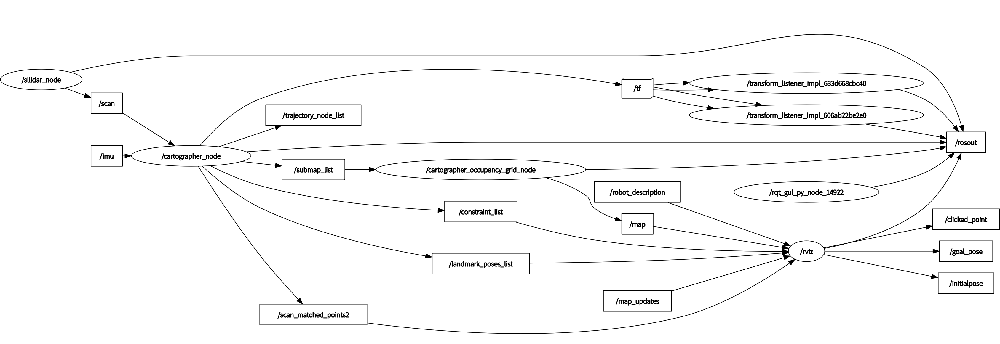


反复观察,我又增加了一些rosgraph,忽然发现了应该很可笑但非常严重的问题,话题消息似乎都传到了rviz上,注意是rviz,不是**rviz2**!!!,下面显示两张明显错误图片

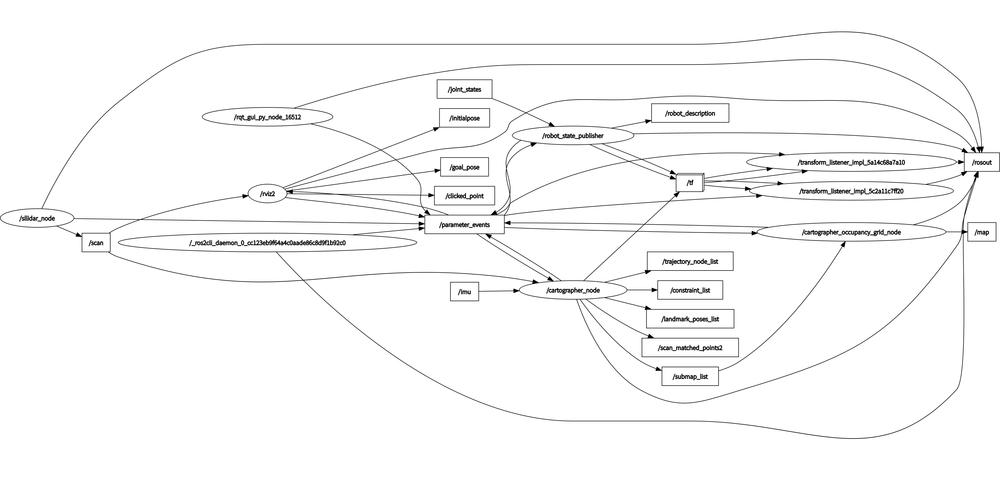

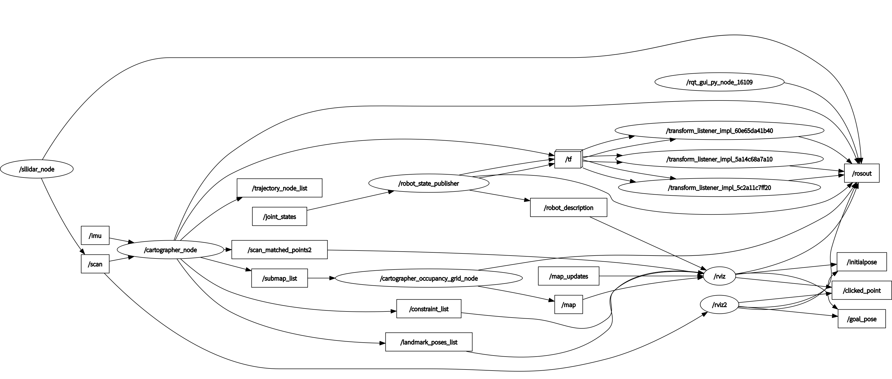

我们发现除了scan话题信息,几乎所有message都走了rviz,而不是rviz2,要知道,我们现在使用的是ros2版本对应是rviz2,破案了!!!

立马修改先前配置!!!!
一顿操作猛如虎,没有任何效果,依旧收不到,而且发现有时候rqt_graph的图形显示有些rviz2的数据也传到了rosout去了
怀疑可能不是这个原因,退回最初状态,这时候就体现副本的重要性质了hhh

~~rviz2修改未果,我又开始了胡乱调试~~
> 漏了说,还是有做了些许更改

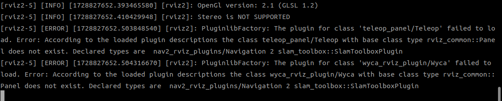

对这个报错,进入.rviz相关文件,删除这几个class即可

继续调试

加入了launch中的tf静态变换,确保map和base_link连接
```py
static_transform_publisher = Node(
    package='tf2_ros',
    executable='static_transform_publisher',
    arguments=['0', '0', '0', '0', '0', '0', 'map', 'base_link'],
)
```
记得末尾还需要添加node,

tf树显示连接上了,map的message还是连接不上

> map与base_link是实时连接的,静态发布不太行,脑子也是糊涂了

迎来转机!!!!

这天吃饭突发奇想map和base_link中间是不是还有节点,lua文件可能还是没有配置好,
决定直接禁用imu看看效果
```lua
-- Copyright 2016 The Cartographer Authors
--
-- Licensed under the Apache License, Version 2.0 (the "License");
-- you may not use this file except in compliance with the License.
-- You may obtain a copy of the License at
--
--      http://www.apache.org/licenses/LICENSE-2.0
--
-- Unless required by applicable law or agreed to in writing, software
-- distributed under the License is distributed on an "AS IS" BASIS,
-- WITHOUT WARRANTIES OR CONDITIONS OF ANY KIND, either express or implied.
-- See the License for the specific language governing permissions and
-- limitations under the License.

include "map_builder.lua"
include "trajectory_builder.lua"

options = {
  map_builder = MAP_BUILDER,
  trajectory_builder = TRAJECTORY_BUILDER,
  map_frame = "map",
  tracking_frame = "base_link",  
  published_frame = "base_link", 
--  scan_topic = "scan", 
--  tracking_frame = "horizontal_laser_link",  --如果有imu填imu,没有imu则用base_link
--  published_frame = "horizontal_laser_link",   --有odom一般用odom，没有odom一般用base_link
  odom_frame = "odom",
  provide_odom_frame = true,  --底盘提供了里程计，这里不使用算法提供的里程计；如果没有底盘提供，则可以用cartographer提供的里程计，这里摄制成true
  publish_frame_projected_to_2d = false,
  use_pose_extrapolator = true,
  use_odometry = false,
  use_nav_sat = false,
  use_landmarks = false,
  num_laser_scans = 1,
  num_multi_echo_laser_scans = 0,
  num_subdivisions_per_laser_scan = 1,
  num_point_clouds = 0,
  lookup_transform_timeout_sec = 0.2,
  submap_publish_period_sec = 0.3,
  pose_publish_period_sec = 5e-3,
  trajectory_publish_period_sec = 30e-3,
  rangefinder_sampling_ratio = 1.,
  odometry_sampling_ratio = 1.,
  fixed_frame_pose_sampling_ratio = 1.,
  imu_sampling_ratio = 0.,  -- 设置为0,禁用imu
  landmarks_sampling_ratio = 1.,
}
--TRAJECTORY_BUILDER_2D = {
--    laser_frame = "laser",
--    use_imu_data = false,
--  }
MAP_BUILDER.use_trajectory_builder_2d = true
TRAJECTORY_BUILDER_2D.num_accumulated_range_data = 10
TRAJECTORY_BUILDER_2D.use_online_correlative_scan_matching = true
TRAJECTORY_BUILDER_2D.num_accumulated_range_data = 1
TRAJECTORY_BUILDER_2D.use_imu_data = false  -- 禁用IMU数据
return options
```

```lua
imu_sampling_ratio = 0.,  -- 设置为0,禁用imu
TRAJECTORY_BUILDER_2D.use_imu_data = false  -- 禁用IMU数据
```
禁用之后imu_sampling_ratio不修改也没事哈哈哈

非常amazing啊,再次运行那两个launch文件,建图成功了,但是没有imu数据的支持
效果也是非常感人

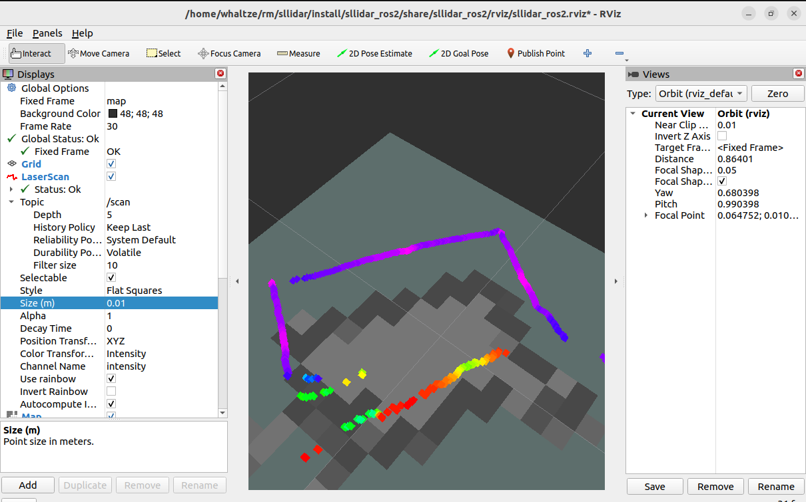

可以看到没有imu,没有里程计odom,建图效果是非常差劲的,接下来,我考虑接入imu,看看会不会好一点

## imu

报错征途的下一形态hhh

看了一些别人家的例子哈哈
[cartographer接入2D雷达laser+imu实时建图](https://blog.csdn.net/qq_39502099/article/details/125969577)

[Cartographer（3）lidar+IMU建图](https://blog.csdn.net/qq_46274948/article/details/127012313?spm=1001.2101.3001.6650.2&depth_1-utm_source=distribute.pc_relevant.none-task-blog-2%7Edefault%7EBlogCommendFromBaidu%7ECtr-2-127012313-blog-125969577.235%5Ev43%5Epc_blog_bottom_relevance_base9)


> 又调试了很久,最后发现rplidar_c1的思岚雷达压根不具备imu惯性测量单元功能,(哭)

> 也算是完结撒花了hh,后续会出一个精简版文档,这个算流水账记录了,之后用mid360会再写一个文档

