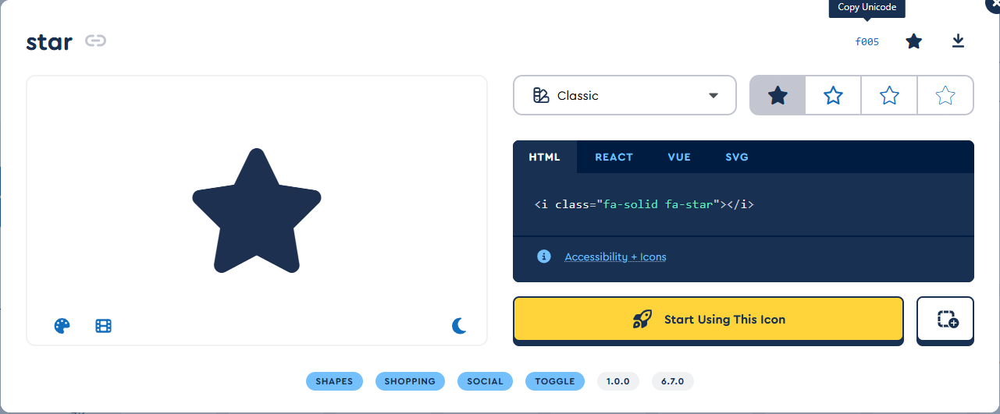
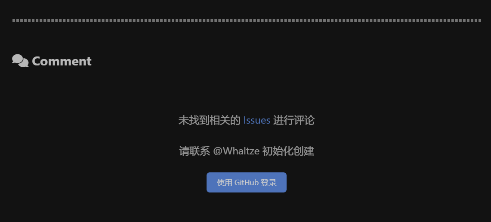
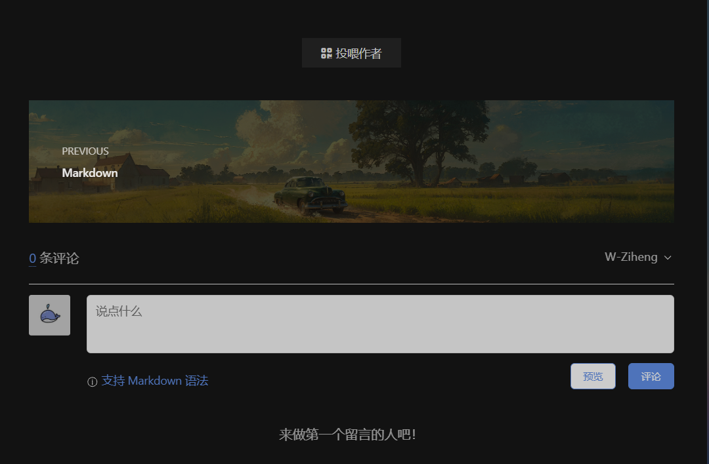

> scaffolds 修改post.md的默认模板(layout在_config.yml内默认设置为post时)

## hexo 懒人包 

可用于U盘部署 不用安装nodejs npm等  适用于windows版本
[PortableHexo-GitHub](https://github.com/BitMOE/PortableHexo)

Ubuntu Linux 的 node 另外下载解压
[nodejs下载官网](https://nodejs.org/en/download)

```shell
tar -xJf node-v18.20.2-linux-x64.tar.xz -C /media/whale/Media/BLOG/Whaltze-BLOG/blog-demo/support/
mv /media/whale/Media/BLOG/Whaltze-BLOG/blog-demo/support/node-v18.20.2-linux-x64 /media/whale/Media/BLOG/Whaltze-BLOG/blog-demo/support/nodejs
```
解压对应压缩包 并且修改名字

验证 Node.js 是否可用：

```shell
./nodejs/bin/node -v
./nodejs/bin/npm -v   
```


## 修改评论区 小剪刀分割线

> 参考 [洛语 の Blog](https://luoyuy.top/posts/5c76ad4123cd/#%E5%89%8D%E8%A8%80)


- 法一：修改 _config.butterfly.yml 文件中的 hr_icon -> icon 内容（推荐）

```yml
# The setting of divider icon (水平分隔線圖標設置)
hr_icon:
  enable: true
  icon: 'f005' # the unicode value of Font Awesome icon, such as '\3423'
  // ...
```

- 法二：修改 `themes\butterfly\source\css\_global\index.styl` 文件中的 `hr -> &:before -> content` 内容

```yml
hr
    // ...
    &:before
    // ...
    content: $hr-icon // 同样修改为如 '\3423' 形式
```

**如果想去除浮动图标，仅需将参数修改为 '' 即可，例如 `icon: ''`**

## Font Awesome icon 图标

the unicode value of Font Awesome icon 获取方法：

打开 Font Awesome 网址：[Search v5 Icons | Font Awesome](https://fontawesome.com/v5/search)

通过搜索栏选择并点击自己心仪的图标

下图中 所`Unicode`即为所需 `f005` 小星星图标



## 删除comment 水平分割线 小剪刀图标

进入 `M:\BLOG\Whaltze-BLOG\blog-demo\node_modules\hexo-theme-butterfly\scripts\events`文件夹

找到`merge_config`文件 修改 为`false`

```js
hr_icon: {
  enable: false,
  icon: null,
  'icon-top': null
},
```

成功



删除分割线 

进入`M:\BLOG\Whaltze-BLOG\blog-demo\node_modules\hexo-theme-butterfly\source\css\_global\function.styl`

找到

```js
.custom-hr
position: relative
margin: 40px auto
border: 2px dashed var(--hr-border)
```

修改 `2px` 为 `0` 即可

或者 更直接 删除Comment 图标

`M:\BLOG\Whaltze-BLOG\blog-demo\node_modules\hexo-theme-butterfly\layout\includes\third-party\comments\index.pug`

修改 

```pug
//- hr.custom-hr
#post-comment // 注释：定义一个自定义样式的水平线（hr）元素，类名为custom-hr
  .comment-head // 注释：定义一个ID为post-comment的容器，用于包含评论相关的元素
    //- .comment-headline // 注释：定义一个类名为comment-head的容器，用于包含评论头部的元素
    //-   i.fas.fa-comments.fa-fw // 注释：注释掉的代码，原本可能包含一个类名为comment-headline的容器，用于显示评论标题
    //-   span= ' ' + _p('comment') // 注释：注释掉的代码，原本可能包含一个图标元素，使用Font Awesome库的fas、fa-comments和fa-fw类，表示评论图标
```
成功



## 
