> *<b><font  face="微软雅黑">开始前，请确保已经正确配置 ***[Anaconda3](https://whaltze.github.io/2024/07/15/Deploy%20Environment%20to%20Anaconda3/)*** </font></b>*

# 配置环境

```js
conda create --name yolov5_env python=3.9 //建立新环境yolov5 搭载python3.9
conda install pytorch torchvision torchaudio cpuonly -c pytorch //安装pytorch2.3.1
git clone https://github.com/ultralytics/yolov5  # clone yolov5
cd yolov5 //转到yolov5目录下
pip install -r requirements.txt  # install 安装各种包//安装yolov5 v6.0
```
这里博主只用了cpuonly来跑，要用GPU自行搜索CUDA下载配置，后续会更新用阿里云服务器进行训练

> 配置完环境后如下图所示
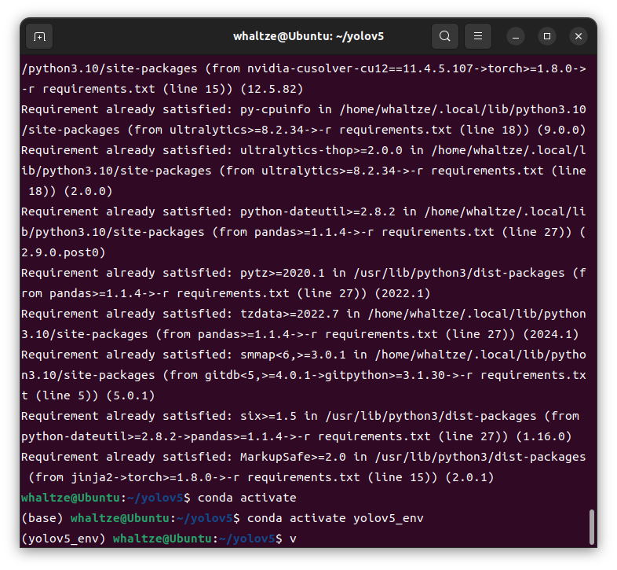

# 训练
## 准备文件
  在下载好的 yolov5 文件夹中创建一个新的文件夹 VOCData 进入后再新建两个文件夹 Annotations 和 images
```js
//在yolov5目录下打开终端
mkdir VOCData
cd VOCData
mkdir Annotations //用于存放标注后的内容（.xml）
mkdir images //用于存放要标注的图片（.jpg）
``` 
## Labelimg 标注
### Preparing
> 下载 ***[Labelimg](https://github.com/tzutalin/labelImg)*** 
> 下载后存放到yolov5同级目录下面

在Labelimg文件夹中打开终端
```js
conda activate yolov5_env //进入创建的新环境
```
执行命令
```js
conda update -n base -c defaults conda //更新conda
conda install pyqt=5 //安装pyqt
conda install -c anaconda lxml
pyrcc5 -o libs/resources.py resources.qrc //使用pyrcc5工具，将resources.qrc资源文件转换为一个名为resources.py的Python模块，并将其放置在libs目录下。在开发Qt应用程序时，这个生成的Python模块可以被主程序导入，从而使用资源文件中的资源。
```
> 如果成功显示如下
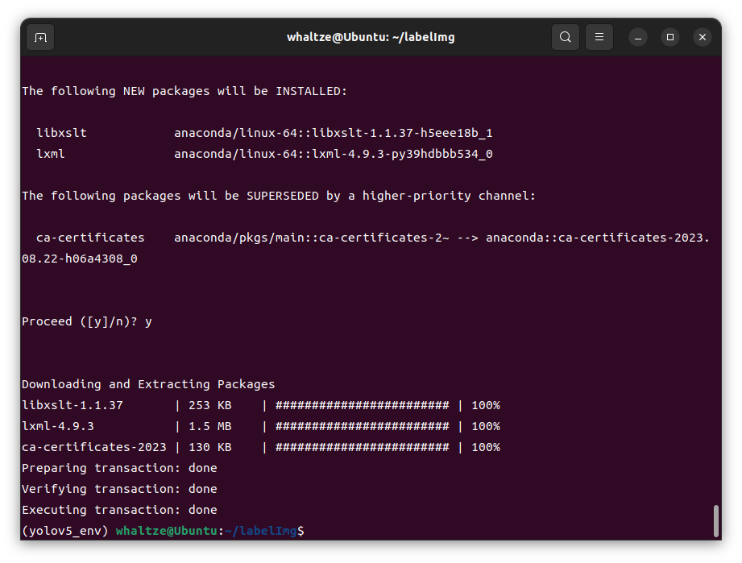
### Labelimg 的使用

为避免后续添加标签较为麻烦可提前添加标准类别，否则每次都需添加
```js
cd data
gedit predefined_classes.txt //打开文件
```
> 如图，因博主循迹识别需要，这里我只添加了one~eight 八个类
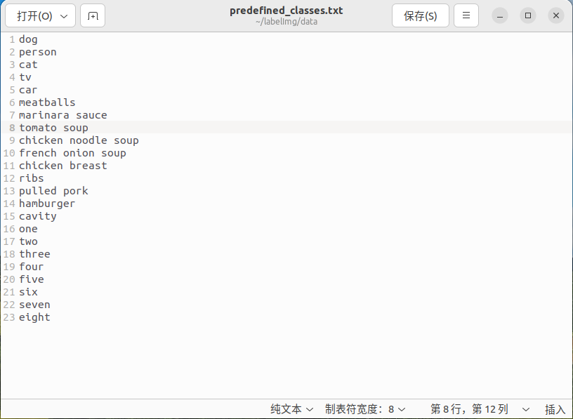

运行Labelimg
```js
python labelimg.py //这里博主是python环境，非python3
```
> 注意这里的运行环境记得切换，我ubuntu22.04 环境是python3 3.10，基于yolov5的数字识别_env当时设置的是python 3.9
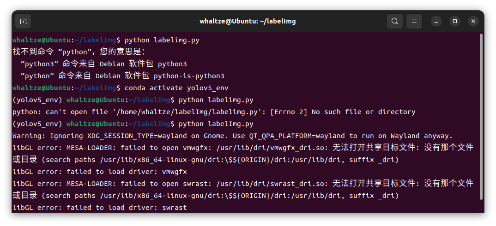

成功打开后界面如下
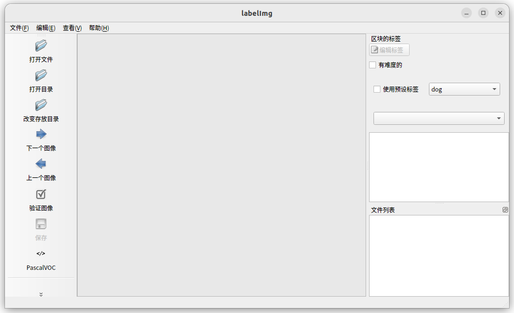

labelImg的操作比较简单，首先，左上角打开之前创建的images文件，选择第一张图片（此处默认你已经把需要训练的数据集放入/VOCData/images中），然后左边选创建区块，用矩形框圈中你要识别的对象后，选择右侧标签，最后点左侧保存，保存到Annotations中（保存为xml文件格式）（可以自动保存文件夹，选择打开文件夹，下一张下一张的框出就行，而且一张图可以进行多个矩形框的框选）

> 这里贴一个链接 ***[如何使用LabelImg标注数据集](https://blog.csdn.net/qq_42257666/article/details/122813608)***

> <b><font  color=red >标完一张图一定要记得修改右侧的类的标签，不要全部标完才发现标签都是同一个，血的教训，大家引以为戒!!!</font></b>

## 所需程序
### split_train_val.py
在 VOCData 目录下创建程序 split_train_val.py 并运行程序

```py
# coding:utf-8
 
import os
import random
import argparse
 
parser = argparse.ArgumentParser()
#xml文件的地址，根据自己的数据进行修改 xml一般存放在Annotations下
parser.add_argument('--xml_path', default='Annotations', type=str, help='input xml label path')
#数据集的划分，地址选择自己数据下的ImageSets/Main
parser.add_argument('--txt_path', default='ImageSets/Main', type=str, help='output txt label path')
opt = parser.parse_args()
 
trainval_percent = 1.0  # 训练集和验证集所占比例。 这里没有划分测试集
train_percent = 0.9     # 训练集所占比例，可自己进行调整
xmlfilepath = opt.xml_path
txtsavepath = opt.txt_path
total_xml = os.listdir(xmlfilepath)
if not os.path.exists(txtsavepath):
    os.makedirs(txtsavepath)
 
num = len(total_xml)
list_index = range(num)
tv = int(num * trainval_percent)
tr = int(tv * train_percent)
trainval = random.sample(list_index, tv)
train = random.sample(trainval, tr)
 
file_trainval = open(txtsavepath + '/trainval.txt', 'w')
file_test = open(txtsavepath + '/test.txt', 'w')
file_train = open(txtsavepath + '/train.txt', 'w')
file_val = open(txtsavepath + '/val.txt', 'w')
 
for i in list_index:
    name = total_xml[i][:-4] + '\n'
    if i in trainval:
        file_trainval.write(name)
        if i in train:
            file_train.write(name)
        else:
            file_val.write(name)
    else:
        file_test.write(name)
 
file_trainval.close()
file_train.close()
file_val.close()
file_test.close()
```
运行完后会在VOCData\ImagesSets\Main下生成 测试集、训练集、训练验证集和验证集
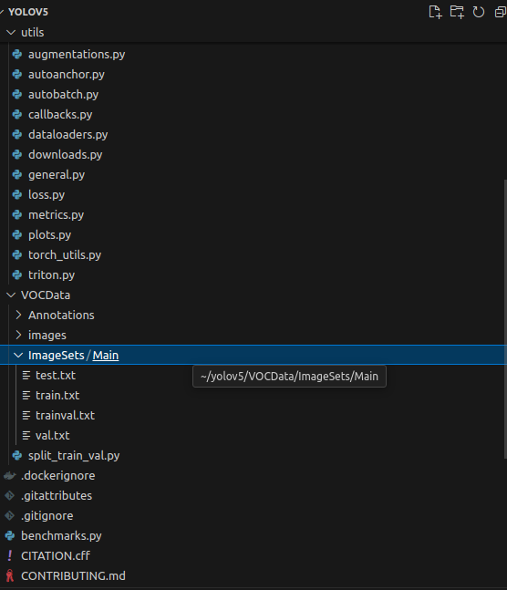


> 此时你可能会碰到一些错误
错误1
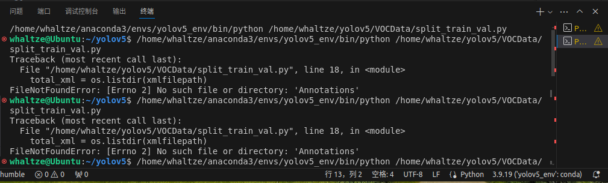

```js
//解决方法
cd VOCData //找不到Annotations是没有在VOCData中打开终端并运行
```

此时在yolov5_env环境下且位于VOCData目录再运行split_train_val.py即可成功

### 转化xml格式为yolo_txt格式

在VOCData目录下创建text_to_yolo.py并运行

```py
#开头classes改成自己的类，博主是数字
#后面路径也要改成自己的
#倒三行后缀.jpg/.png也要注意一下

# -*- coding: utf-8 -*-
import xml.etree.ElementTree as ET
import os
from os import getcwd
 
sets = ['train', 'val', 'test']
classes = ["one","two","three","four","five","six","seven","eight"]  #改成自己的类别
abs_path = os.getcwd()
print(abs_path)
 
 
def convert(size, box):
    dw = 1. / (size[0])
    dh = 1. / (size[1])
    x = (box[0] + box[1]) / 2.0 - 1
    y = (box[2] + box[3]) / 2.0 - 1
    w = box[1] - box[0]
    h = box[3] - box[2]
    x = x * dw
    w = w * dw
    y = y * dh
    h = h * dh
    return x, y, w, h
 
 
def convert_annotation(image_id):
    in_file = open('/home/whaltze/yolov5/VOCData/Annotations/%s.xml' % (image_id), encoding='UTF-8')     #改成自己的目录
    out_file = open('/home/whaltze/yolov5/VOCData/labels/%s.txt' % (image_id), 'w')    #改成自己的目录
    tree = ET.parse(in_file) 
    root = tree.getroot()
    size = root.find('size')
    w = int(size.find('width').text)
    h = int(size.find('height').text)
    for obj in root.iter('object'):
        difficult = obj.find('difficult').text
        # difficult = obj.find('Difficult').text
        cls = obj.find('name').text
        if cls not in classes or int(difficult) == 1:
            continue
        cls_id = classes.index(cls)
        xmlbox = obj.find('bndbox')
        b = (float(xmlbox.find('xmin').text), float(xmlbox.find('xmax').text), float(xmlbox.find('ymin').text),
             float(xmlbox.find('ymax').text))
        b1, b2, b3, b4 = b
        # 标注越界修正
        if b2 > w:
            b2 = w
        if b4 > h:
            b4 = h
        b = (b1, b2, b3, b4)
        bb = convert((w, h), b)
        out_file.write(str(cls_id) + " " + " ".join([str(a) for a in bb]) + '\n')
 
 
wd = getcwd()
for image_set in sets:
    if not os.path.exists('/home/whaltze/yolov5/VOCData/labels/'):    #改成自己的目录
        os.makedirs('/home/whaltze/yolov5/VOCData/labels/')     #改成自己的目录
    image_ids = open('/home/whaltze/yolov5/VOCData/ImageSets/Main/%s.txt' % (image_set)).read().strip().split()  #改成自己的目录
 
    if not os.path.exists('/home/whaltze/yolov5/VOCData/dataSet_path/'):
        os.makedirs('/home/whaltze/yolov5/VOCData/dataSet_path/')   #改成自己的目录
 
    list_file = open('dataSet_path/%s.txt' % (image_set), 'w')
    for image_id in image_ids:
        list_file.write('/home/whaltze/yolov5/VOCData/images/%s.JPG\n' % (image_id))     #改成自己的目录
        convert_annotation(image_id)
    list_file.close()
```
运行成功后会在VOCData目录下生成labels文件夹和dataSet_path文件夹

> 其中 labels 中为不同图像的标注文件。每个图像对应一个txt文件，文件每一行为一个目标的信息，包括class, x_center, y_center, width, height，这种即为 yolo_txt格式

> dataSet_path文件夹包含三个数据集的txt文件，train.txt等txt文件为划分后图像所在位置的绝对路径，如train.txt就含有所有训练集图像的绝对路径。

### myvoc.yaml配置文件

在yolov5目录下的<b><font color=red>data</font></b>文件夹下新建一个myvoc.yaml文件（可自定义命名）
```js
cd data
gedit myvoc.yaml
```
> myvoc.yaml主要包含train.txt 和 val.txt 的路径 （可以为相对路径） 
> 还有目标对象的类别数目和类别名称

```yaml
 #yaml格式的文件要求非常严格
 #禁止使用//注释
 #缩进和空格不同都有可能引起报错
 #注意：冒号后面要加空格

train: /home/whaltze/yolov5/VOCData/dataSet_path/train.txt
val: /home/whaltze/yolov5/VOCData/dataSet_path/val.txt

# number of classes
nc: 8

# class names
names: ["one","two","three","four","five","six","seven","eight"]
```

### 生成anchors文件

在VOCData目录下创建两个程序 kmeans.py 和 clauculate_anchors.py

不要运行kmeans.py
运行clauculate_anchors.py即可

```py
#kmeans.py 程序如下：这不需要运行，也不需要更改，报错则查看第十三行内容。
import numpy as np
 
 
def iou(box, clusters):
    """
    Calculates the Intersection over Union (IoU) between a box and k clusters.
    :param box: tuple or array, shifted to the origin (i. e. width and height)
    :param clusters: numpy array of shape (k, 2) where k is the number of clusters
    :return: numpy array of shape (k, 0) where k is the number of clusters
    """
    x = np.minimum(clusters[:, 0], box[0])
    y = np.minimum(clusters[:, 1], box[1])
    if np.count_nonzero(x == 0) > 0 or np.count_nonzero(y == 0) > 0:
        raise ValueError("Box has no area")  # 如果报这个错，可以把这行改成pass即可
 
    intersection = x * y
    box_area = box[0] * box[1]
    cluster_area = clusters[:, 0] * clusters[:, 1]
 
    iou_ = intersection / (box_area + cluster_area - intersection)
 
    return iou_
 
 
def avg_iou(boxes, clusters):
    """
    Calculates the average Intersection over Union (IoU) between a numpy array of boxes and k clusters.
    :param boxes: numpy array of shape (r, 2), where r is the number of rows
    :param clusters: numpy array of shape (k, 2) where k is the number of clusters
    :return: average IoU as a single float
    """
    return np.mean([np.max(iou(boxes[i], clusters)) for i in range(boxes.shape[0])])
 
 
def translate_boxes(boxes):
    """
    Translates all the boxes to the origin.
    :param boxes: numpy array of shape (r, 4)
    :return: numpy array of shape (r, 2)
    """
    new_boxes = boxes.copy()
    for row in range(new_boxes.shape[0]):
        new_boxes[row][2] = np.abs(new_boxes[row][2] - new_boxes[row][0])
        new_boxes[row][3] = np.abs(new_boxes[row][3] - new_boxes[row][1])
    return np.delete(new_boxes, [0, 1], axis=1)
 
 
def kmeans(boxes, k, dist=np.median):
    """
    Calculates k-means clustering with the Intersection over Union (IoU) metric.
    :param boxes: numpy array of shape (r, 2), where r is the number of rows
    :param k: number of clusters
    :param dist: distance function
    :return: numpy array of shape (k, 2)
    """
    rows = boxes.shape[0]
 
    distances = np.empty((rows, k))
    last_clusters = np.zeros((rows,))
 
    np.random.seed()
 
    # the Forgy method will fail if the whole array contains the same rows
    clusters = boxes[np.random.choice(rows, k, replace=False)]
 
    while True:
        for row in range(rows):
            distances[row] = 1 - iou(boxes[row], clusters)
 
        nearest_clusters = np.argmin(distances, axis=1)
 
        if (last_clusters == nearest_clusters).all():
            break
 
        for cluster in range(k):
            clusters[cluster] = dist(boxes[nearest_clusters == cluster], axis=0)
 
        last_clusters = nearest_clusters
 
    return clusters
 
 
if __name__ == '__main__':
    a = np.array([[1, 2, 3, 4], [5, 7, 6, 8]])
    print(translate_boxes(a))
```
```py
#clauculate_anchors.py
#运行clauculate_anchors.py会调用 kmeans.py 聚类生成新anchors的文件
#需要更改第 9 、13行文件路径 以及 第 16 行标注类别名称
# -*- coding: utf-8 -*-
# 根据标签文件求先验框
 
import os
import numpy as np
import xml.etree.cElementTree as et
from kmeans import kmeans, avg_iou
 
FILE_ROOT = "/home/whaltze/yolov5/VOCData/"     # 根路径
ANNOTATION_ROOT = "Annotations"   # 数据集标签文件夹路径
ANNOTATION_PATH = FILE_ROOT + ANNOTATION_ROOT
 
ANCHORS_TXT_PATH = "/home/whaltze/yolov5/VOCData/anchors.txt"   #anchors文件保存位置
 
CLUSTERS = 9
CLASS_NAMES = ['one','two','three','four','five','six','seven','eight']   #类别名称
 
def load_data(anno_dir, class_names):
    xml_names = os.listdir(anno_dir)
    boxes = []
    for xml_name in xml_names:
        xml_pth = os.path.join(anno_dir, xml_name)
        tree = et.parse(xml_pth)
 
        width = float(tree.findtext("./size/width"))
        height = float(tree.findtext("./size/height"))
 
        for obj in tree.findall("./object"):
            cls_name = obj.findtext("name")
            if cls_name in class_names:
                xmin = float(obj.findtext("bndbox/xmin")) / width
                ymin = float(obj.findtext("bndbox/ymin")) / height
                xmax = float(obj.findtext("bndbox/xmax")) / width
                ymax = float(obj.findtext("bndbox/ymax")) / height
 
                box = [xmax - xmin, ymax - ymin]
                boxes.append(box)
            else:
                continue
    return np.array(boxes)
 
if __name__ == '__main__':
 
    anchors_txt = open(ANCHORS_TXT_PATH, "w")
 
    train_boxes = load_data(ANNOTATION_PATH, CLASS_NAMES)
    count = 1
    best_accuracy = 0
    best_anchors = []
    best_ratios = []
 
    for i in range(10):      ##### 可以修改，不要太大，否则时间很长
        anchors_tmp = []
        clusters = kmeans(train_boxes, k=CLUSTERS)
        idx = clusters[:, 0].argsort()
        clusters = clusters[idx]
        # print(clusters)
 
        for j in range(CLUSTERS):
            anchor = [round(clusters[j][0] * 640, 2), round(clusters[j][1] * 640, 2)]
            anchors_tmp.append(anchor)
            print(f"Anchors:{anchor}")
 
        temp_accuracy = avg_iou(train_boxes, clusters) * 100
        print("Train_Accuracy:{:.2f}%".format(temp_accuracy))
 
        ratios = np.around(clusters[:, 0] / clusters[:, 1], decimals=2).tolist()
        ratios.sort()
        print("Ratios:{}".format(ratios))
        print(20 * "*" + " {} ".format(count) + 20 * "*")
 
        count += 1
 
        if temp_accuracy > best_accuracy:
            best_accuracy = temp_accuracy
            best_anchors = anchors_tmp
            best_ratios = ratios
 
    anchors_txt.write("Best Accuracy = " + str(round(best_accuracy, 2)) + '%' + "\r\n")
    anchors_txt.write("Best Anchors = " + str(best_anchors) + "\r\n")
    anchors_txt.write("Best Ratios = " + str(best_ratios))
    anchors_txt.close()
```
运行后会生成anchors文件。如果生成文件为空，重新运行即可
anchors文件如下
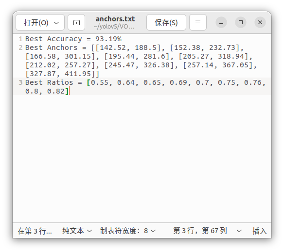

第二行 Best Anchors 后面需要用到（这就是手动获取到的anchors的值）

### 修改模型配置文件yolov5s.yaml
在yolov5目录下的model文件夹下是模型的配置文件，有n、s、m、l、x版本，逐渐增大（随着架构的增大，训练时间也是逐渐增大）
我们选s版本的，主要改两个参数：
1.把 nc：后面改成自己的标注类别数
2.修改anchors，根据 anchors.txt 中的 Best Anchors 修改，需要取整（四舍五入、向上、向下都可以）
3.保持yaml中的anchors格式不变，按顺序一对一即可，六个对应anchors的第一行6个（18个都要改），改完后如图所示

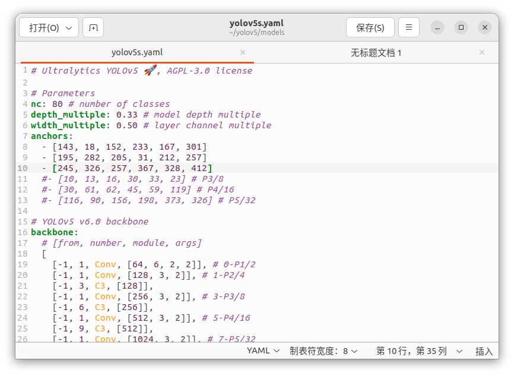

## 开始训练
进入yolo5_env环境输入如下命令
```js
python train.py --weights weights/yolov5s.pt  --cfg models/yolov5s.yaml  --data data/myvoc.yaml --epoch 200 --batch-size 8 --img 640   --device cpu
```
这里我没有用CUDA，device选cpu，有GPU的可以选0/1/2···根据自身情况确定

> 解释一下这串命令
> python train.py //运行train
> –weights weights/yolov5s.pt //获取权重，将yolov5.pt文件放在weights里面，若不这样需要更改路径
> –epoch 200 //训练次数为200次
> –batch-size 8 //训练8张图片后进行权重更新
> –device cpu //使用CPU训练,这里device 0为gpu训练

正常情况应该训练成功
> 如图所示
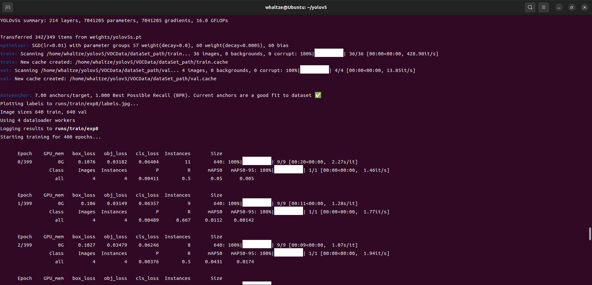

不过大概率你会遇到一些问题
> 错误1 RuntimeError: PytorchStreamReader failed reading zip archive: failed finding central directory
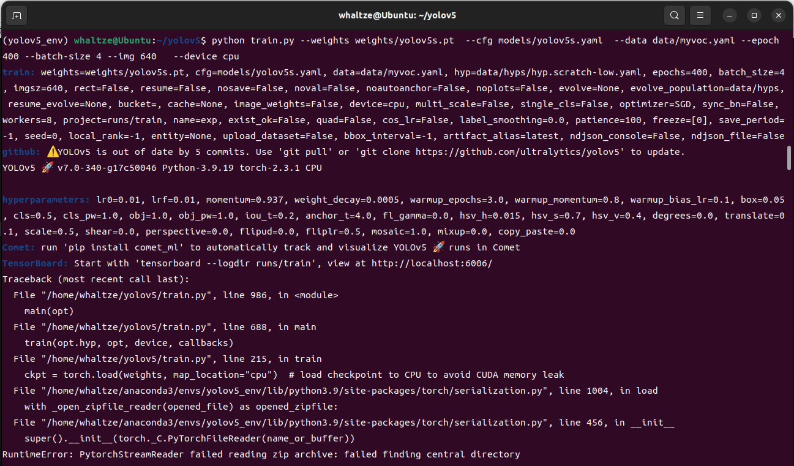
这主要是weights文件内的yolov5.pt文件丢失或者损坏，可以重新下载 *[yolov5.py](https://github.com/ultralytics/yolov5)* 放入weights文件夹中，无需解压,也可在终端直接'git clone https://github.com/ultralytics/yolov5'

再次输入训练指令
> 错误2 AssertionError: train: No labels found in /home/whaltze/yolov5/VOCData/dataSet_path/train.cache, can not start training
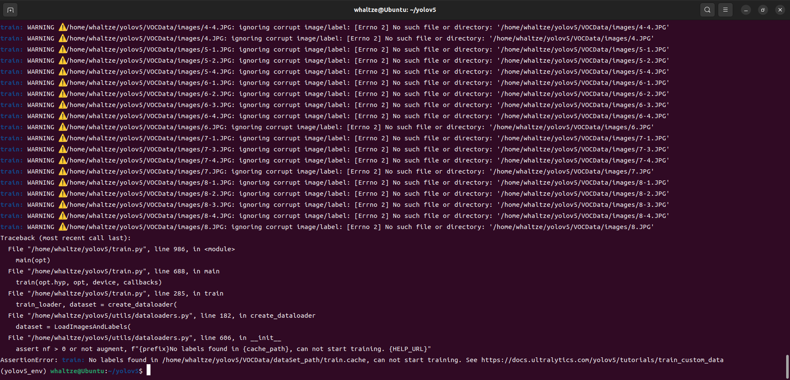
这主要是找不到对应的文件，博主后面发现是text_to_yolo_.py的第66行为JPG，而我图像文件格式为jpg（小写）导致的错误，修改后记得重新运行（或者手动把train.txt,val.txt里面的路径也改了，不然还是会报错。最后删除train.cache文件，重新运行训练命令。

## 训练过程

训练时间可能会有点长，博主没用GPU，大概花了60分钟，
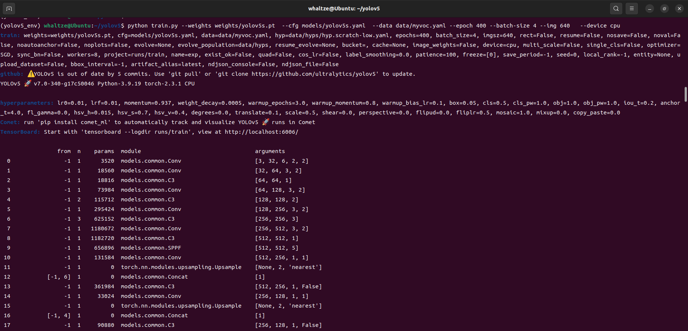
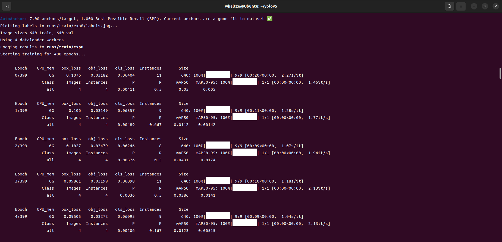

等待即可

## 训练结束
训练好的模型会保存在/yolov5/runs/train/weights/exp8 下
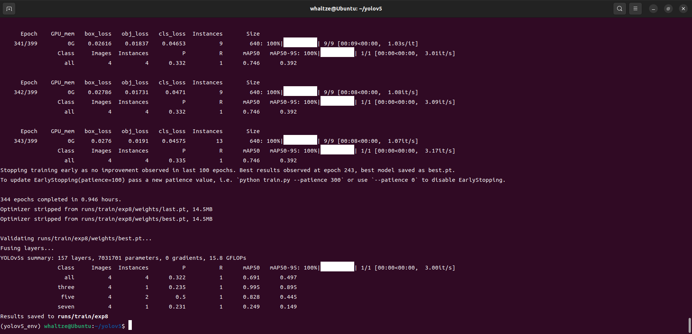

# 测试

在yolov5的主目录下找到detect.py文件，修改weights和source两处，我这里以外接摄像头为例子
```js
//加载训练器
//原代码_362行
parser.add_argument("--weights", nargs="+", type=str, default=ROOT / "yolov5s.pt", help="model path or triton URL")
//修改为
parser.add_argument("--weights", nargs="+", type=str, default='runs/train/exp8/weights/best.pt', help='model.pt path(s)')
```

```js
//摄像头识别
//原代码_363行
parser.add_argument("--source", type=str, default=ROOT / "data/images", help="file/dir/URL/glob/screen/0(webcam)")
//修改为
parser.add_argument("--source", type=str, default=1, help='source')
```
> 这里default为你摄像头的位置
博主是1就是等于1，默认0为笔记本自带的摄像头
如果要测试图片则修改default='/home/···/test.jpg'

运行detect.py

> 以下是博主的训练效果
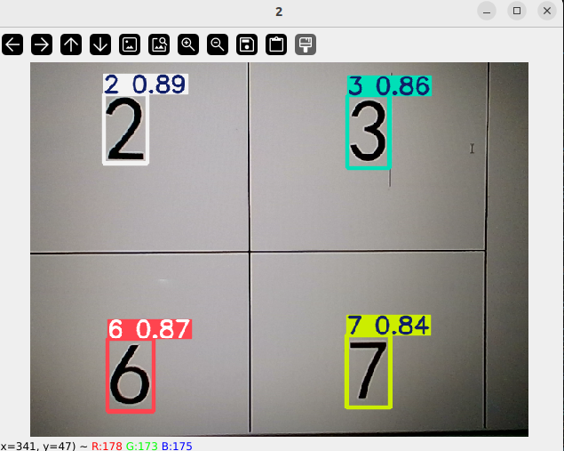
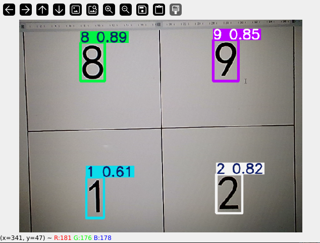
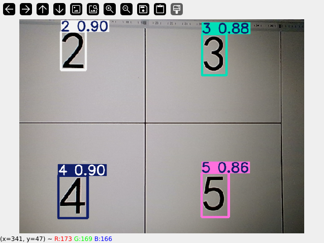

简单试了一下，大家可以再增加一些，可能效果会更好！

# 进阶学习

> [YOLOv5源码逐行超详细注释与解读--阿里云](https://www.aliyun.com/search?k=YOLOv5%E6%BA%90%E7%A0%81%E9%80%90%E8%A1%8C%E8%B6%85%E8%AF%A6%E7%BB%86%E6%B3%A8%E9%87%8A%E4%B8%8E%E8%A7%A3%E8%AF%BB&scene=community&page=1)


至此便是基于yolov5的数字识别的全部内容，有什么问题欢迎找我！希望能一起学习进步！


