> 本文为2024年福州大学robomatser浮舟湿地战队视觉组培训文档,如有错误请联系**2260274457(QQ)**

# 算法组第一次培训

> 本次培训主要会带大家初识一下linux系统的一些简单配置操作,体验一下ros2的一些自带包,会有小作业,相对来说比较轻松:sunny::sunny:

## 课前预习

> 确保ubuntu正确配置且版本为22.04 , ROS2版本为humble

打开终端(Ctrl+Alt+T),输入以下指令

```shell
cat /etc/os-release && echo $ROS_DISTRO
```
查看输出版本是否为22.04和humble
```shell
VERSION="22.04.5 LTS (Jammy Jellyfish)"
humble
```
<!-- cat是concatenate的缩写,此处用于显示目录文件的内容 -->

## Basic Skills

> **非必须却必须掌握的小技能**

- Github注册    

- Markdown

- python  

- c++      
 
## linux 

why ubuntu ?

### 终端常用命令
```shell
ls # list的缩写
pwd # 显示当前路径
cd # 切换目录
mkdir #新建文件夹
touch <file> #新建文件
rm <file>
rm -r <file>
sudo rm -rf <file> # 谨慎用
cp <file1> <file2_aim>
cp -r <file1> <file2_aim>
mv <old_name> <new_name>
cat <file> # 连接显示文件内容
history
```

### 终端常用技巧

```shell
Ctrl+shift+C/V # 复制粘贴
tab # 自动补全
!! #重复上次命令,常用sudo!!
ctrl+r #补全历史命令
ctrl+c #终止程序
ctrl+z #暂停程序,挂载在后台
```

<!-- ```shell ps aux # 显示当前运行进程``` -->


## Hello World.cpp

安装vscode
```shell
sudo apt update
sudo apt install code
```

也可通过小鱼的一键安装进行配置
```shell
wget http://fishros.com/install -O fishros && . fishros
```

安装g++
```shell
sudo apt install g++
```

```shell
code . #打开vscode
```

> 一些常见好用的插件
c/c++


```cpp
#include <iostream>

int main(){
    std::cout <<"hello world!"<<std::endl;
    return 0;
}
```

编译
```shell
g++ hello.cpp -o hello
```

运行
```shell
./hello
```

## Hello World.py

```shell
touch hello.py
code hello.py
```
输入以下内容
```py
print("Hello World!")
```

运行
```shell
python3 hello.py
```

> python 编译型语言，执行速度快、效率高；依靠编译器、跨平台性差些。
> C++ 解释型语言，执行速度慢、效率低；依靠解释器、跨平台性好。

## Terminate

> Terminator 是linux中一个非常实用且开源的终端仿真器

```shell
sudo apt install terminator
```
以后打开终端便会自动是用terminator

> 常见的指令

```shell
Ctrl+Shift+O     #水平分割终端
Ctrl+Shift+E     #垂直分割终端
```

## ros2的一些自带包

> Talker and Listener

倾听者
```shell
ros2 run demo_nodes_py listener
```

说话者
```shell
ros2 run demo_nodes_cpp talker
```

> 海龟

启动海龟节点

```shell
ros2 run turtlesim turtlesim_node
```

启动海龟控制节点

```shell
ros2 run turtlesim turtle_teleop_key
```

接下来就可以控制海龟啦!

## 作业

- 用md语法对今天讲到的一些命令行知识等做总结注释笔记(根据自己情况写,也可添加其余知识)

- 用mkdir等终端命令创建CLASS_1文件夹,在此目录下分别用python 和 c++ 编写两个程序输出 Welcome to RM ! (**需提供histroy终端命令,以及程序源码**)

以压缩包形式发送至邮箱 2260274457@qq.com 压缩包命名为 **视觉组第一次作业+学号+姓名的方式**

:warning: **鼓励用github上传自己的源码,并提供readme的git方式**


# 算法组第二次培训

> 第二节课将带领大家了解ROS2中的基础通信机制,具体包括话题(Topic)节点(node)通信的使用、如何构建ROS2节点，CMake构建工具的使用等内容。通过实践，我们将编写两个C++程序：一个Publisher（发布者）和一个Listener（订阅者）,并附带讲解GitHub的一些使用,帮助大家快速游走开源社区!

## Introduce -- CMake

在上节课,我们学习使用了g++编译程序,可能同学们初学觉得用g++编译简单快捷,但实际上,在较大工程项目的编写过程往往需要引入许多库,包括连接静态库,动态库等,用g++编译经常会出现`No such file or directory` 找不到库的情况,小的项目可能只有几个includes路径,无伤大雅,但是大项目下,成百上千的引用显然是不切实际的,因此CMake make 孕育而生


### 以 Hello RM 为例子展示

#### 新建工作空间 
```shell
mkdir -p ./CLASS_2/Task1/src/
mkdir -p ./CLASS_2/Task1/includes/
mkdir -p ./CLASS_2/Task1/tools/
cd ./CLASS_2/Task1/src/
```

#### 没有CMake时候

```
.
├── includes
│   └── hello.hpp
├── src
│   └── cmake.cpp
└── tools
    └── hello.cpp
```
 
- hello.hpp

```cpp
#ifndef HELLO_HPP
// 如果HELLO_HPP没有被定义，则编译以下代码
// 这是一种防止头文件被多次包含的常见技术，称为包含保护
#define HELLO_HPP   
// 定义HELLO_HPP
class Hello 
{ 
    // 定义一个名为Hello的类
private:
    // 私有成员变量和成员函数的声明区域
    /* data */
    // 这里可以放置私有数据成员，但目前为空
public:
    // 公有成员函数的声明区域
    void hello_rm(/* args */);
    // 声明一个公有成员函数hello_rm，函数参数列表为空，返回类型为void
    // 具体实现将在类的定义体外部进行
}; 

#endif 
```

- hello.cpp

```cpp
#include <iostream>
// #include "../includes/hello.hpp"
#include "hello.hpp"

void Hello::hello_rm() { // 定义Hello类的成员函数hello_rm
    std::cout << "Hello, RM !" << std::endl; // 输出字符串"Hello, RM !"到标准输出流
}

```

- cmake.cpp
```cpp
#include <iostream> // 包含标准输入输出库
#include "hello.hpp" // 包含自定义的头文件hello.hpp

int main() {     // 主函数入口
    Hello hello; // 创建Hello类的实例
    hello.hello_rm(); // 调用Hello类的hello_rm方法
    return 0;    // 返回0，表示程序正常结束
}
```

一般情况,用g++编写需要指明include

```shell
g++ ./src/cmake.cpp ./tools/hello.cpp -I ./includes/ -o cmake_exe
# 执行
./cmake_exe
```
输出 hello RM!

因为此时include还很少,我们可以手动添加,当路径较多时候,我们就需要加一长串文件,为简化操作,我们用cmake 和 make

#### CMake and make 操作

<!--  -->


<!-- 
 -->


> CMake通过调用CMakeLists.txt直接生成Makefile !

所以我们就只需要学习编写CMakeLists.txt即可


> 安装 CMake make

```shell
sudo apt install make cmake
```

在VScode安装CMake插件

```
.
├── cmake_exe
├── CMakeLists.txt
├── includes
│   └── hello.hpp
├── src
│   └── cmake.cpp
└── tools
    └── hello.cpp
```

- CMakeLists.txt

```s
# 指定CMake的最低版本要求
cmake_minimum_required(VERSION 3.11)

# 定义项目名称
project(CLASS_2)

# 添加头文件目录
include_directories(./includes)

# 添加可执行文件，并指定源文件
add_executable(cmake_exe src/cmake.cpp tools/hello.cpp)

```

运行cmake

```shell
cmake -B build 
make -C build # cd build && make
./build/cmake_exe
```

- 通过cmake运行CMakeLists.txt, -B参数 指定生成build文件夹
- make进入build,运行makefile, -C参数 进入build文件夹
- 最后运行可执行文件

可以直接复制如下到终端,一键实现

```shell
mkdir build 
cd build 
cmake .. && make -j
./cmake_exe
```

### 快速获取源文件

在CMakeLists.txt文件中,有些时候源文件非常的多,这时我们可以用 `aux_source_directory` 函数一键获取某一路径下的所有源文件

- CMakeLists.txt
```s
cmake_minimum_required(VERSION 3.11)

project(Task_2)

include_directories(./includes)

aux_source_directory(./tools TOOLS)
# 保存至TOOLS变量

add_executable(cmake_exe src/cmake.cpp ${TOOLS} )

#查看一下变量里面有什么
message(${TOOLS})

```

运行 
```shell
cmake -B build
```

输出 `./tools/hello.cpp` 源文件的目录

## ROS2节点与话题通信

在这篇博客中，我们将学习如何在ROS2中进行节点通信，特别是话题（Topic）通信。ROS2采用了发布-订阅模式，使得多个节点可以通过话题（Topic）进行数据交换。我们将动手编写两个简单的节点，一个发布消息，另一个订阅消息。通过这个实践，大家将能够更好地理解ROS2的通信机制。

### ROS2架构与通信模型

ROS2采用了“发布-订阅”模式，基本组件包括：

- **节点（Node）**：ROS2中每个独立的程序模块称为节点。每个节点可以发布和订阅消息，执行特定任务。
- **话题（Topic）**：话题是一个通信媒介，节点可以将消息发布到话题，其他节点可以从该话题订阅消息。
- **服务（Service）**：服务是一种基于请求-响应的通信模式，通常用于客户端和服务器之间的交互。
- **动作（Action）**：动作是一种长期运行任务的通信模式，可以中断任务并返回结果。

ROS2中三种主要的通信模式：

- **发布/订阅（Publish/Subscribe）**：通过话题实现，适用于一对多的通信。
- **服务/客户端（Service/Client）**：通过请求/响应方式实现，适用于一对一的通信。
- **动作（Action）**：适用于长期任务处理，需要反馈和中断的场景。

---

### 创建ROS2工作空间

在开始编码之前，我们需要创建一个ROS2工作空间。假设你的ROS2已经安装好并且工作正常，我们可以通过以下步骤来创建工作空间。

打开终端，执行以下命令：

```bash
mkdir -p ~/CLASS_2/Task2/src/
cd ~/CLASS_2/Task2/src/
# colcon build
```


### 编写Publisher和Listener节点 (C++)

进入src目录并创建包

在`src`目录下创建一个基于C++的ROS2包，执行以下命令：

```bash
cd ~/CLASS_2/Task2/src/
ros2 pkg create --build-type ament_cmake Publisher2Listener
```

这将创建一个名为`Publisher2Listener`的ROS2包。

#### 编写Publisher节点

在`src`目录下创建`publisher.cpp`文件，内容如下：

```cpp
#include <rclcpp/rclcpp.hpp>
#include <std_msgs/msg/string.hpp>

using namespace std::chrono_literals;

class PublisherNode : public rclcpp::Node
{
public:
    PublisherNode() : Node("publisher_node")
    {
        publisher_ = this->create_publisher<std_msgs::msg::String>("welcome_topic", 10);
        timer_ = this->create_wall_timer(
            1s, std::bind(&PublisherNode::timer_callback, this));  // 每秒发布一次消息
    }

private:
    void timer_callback()
    {
        auto message = std_msgs::msg::String();
        message.data = "Welcome to RM!";  // 发布的消息
        publisher_->publish(message);
        RCLCPP_INFO(this->get_logger(), "Publishing: '%s'", message.data.c_str());
    }

    rclcpp::Publisher<std_msgs::msg::String>::SharedPtr publisher_;
    rclcpp::TimerBase::SharedPtr timer_;
};

int main(int argc, char **argv)
{
    rclcpp::init(argc, argv);
    rclcpp::spin(std::make_shared<PublisherNode>());
    rclcpp::shutdown();
    return 0;
}
```

#### 编写Listener节点

同样，在`src`目录下创建`listener.cpp`文件，内容如下：

```cpp
#include <rclcpp/rclcpp.hpp>
#include <std_msgs/msg/string.hpp>

class ListenerNode : public rclcpp::Node
{
public:
    ListenerNode() : Node("listener_node")
    {
        subscription_ = this->create_subscription<std_msgs::msg::String>(
            "welcome_topic", 10, std::bind(&ListenerNode::listener_callback, this, std::placeholders::_1));
    }

private:
    void listener_callback(const std_msgs::msg::String::SharedPtr msg) const
    {
        RCLCPP_INFO(this->get_logger(), "Received: '%s'", msg->data.c_str());
    }

    rclcpp::Subscription<std_msgs::msg::String>::SharedPtr subscription_;
};

int main(int argc, char **argv)
{
    rclcpp::init(argc, argv);
    rclcpp::spin(std::make_shared<ListenerNode>());
    rclcpp::shutdown();
    return 0;
}
```

#### 配置CMake

ROS2使用CMake来构建项目。接下来，我们需要配置`CMakeLists.txt`文件，以便正确编译和链接我们的C++代码。

打开`Publisher2Listener/CMakeLists.txt`，修改内容如下：

```cmake
cmake_minimum_required(VERSION 3.11)
project(Publisher2Listener)

# ROS2相关的CMake依赖
find_package(rclcpp REQUIRED)
find_package(std_msgs REQUIRED)

add_executable(publisher_node src/publisher.cpp)
ament_target_dependencies(publisher_node rclcpp std_msgs)

add_executable(listener_node src/listener.cpp)
ament_target_dependencies(listener_node rclcpp std_msgs)

install(TARGETS
  publisher_node
  listener_node
  DESTINATION lib/${PROJECT_NAME})

ament_package()
```

> 说明：
- `find_package(rclcpp REQUIRED)`和`find_package(std_msgs REQUIRED)`：用于查找ROS2的核心包和标准消息包。
- `add_executable(publisher_node src/publisher.cpp)`：将C++源文件编译成可执行文件。
- `ament_target_dependencies(publisher_node rclcpp std_msgs)`：指定构建时的依赖项。

---


> 删除 ROS2 的包 (直接rm -rf即可)

```shell
rm -rf Publisher2Listener
```

### 编写Publisher和Listener节点 (Python)

进入src目录并创建包

在`src`目录下创建一个基于C++的ROS2包，执行以下命令：

```bash
cd ~/CLASS_2/Task2/src/
ros2 pkg create --build-type ament_python Publisher2Listener
```

这将创建一个名为`Publisher2Listener`的ROS2包。


#### Publisher节点

我们将创建一个Publisher节点，发布字符串消息 `Welcome to RM!`到一个话题`/welcome_topic`。创建一个Python文件`publisher.py`，在`Publisher2Listener`包的`Publisher2Listener`文件夹下：

```python
# publisher.py
import rclpy
from rclpy.node import Node
from std_msgs.msg import String

class PublisherNode(Node):
    def __init__(self):
        super().__init__('publisher_node')
        self.publisher_ = self.create_publisher(String, 'welcome_topic', 10)
        self.timer = self.create_timer(1.0, self.timer_callback)  # 每秒发布一次消息
        self.get_logger().info("Publisher node has started.")

    def timer_callback(self):
        msg = String()
        msg.data = "Welcome to RM!"  # 发布的消息
        self.publisher_.publish(msg)
        self.get_logger().info(f"Publishing: '{msg.data}'")

def main(args=None):
    rclpy.init(args=args)
    publisher_node = PublisherNode()
    rclpy.spin(publisher_node)
    rclpy.shutdown()

if __name__ == '__main__':
    main()
```

- `create_publisher`方法用于创建一个发布器，这里我们选择了`String`类型的消息，话题名为`/welcome_topic`，队列大小为10。
- `create_timer`方法用于定时调用`timer_callback`方法，每秒发布一次消息。

#### Listener节点

接下来我们编写Listener节点，订阅`/welcome_topic`话题并打印接收到的消息。创建一个Python文件`listener.py`，在`Publisher2Listener`包的`Publisher2Listener`文件夹下：

```python
# listener.py
import rclpy
from rclpy.node import Node
from std_msgs.msg import String

class ListenerNode(Node):
    def __init__(self):
        super().__init__('listener_node')
        self.subscription = self.create_subscription(
            String,
            'welcome_topic',
            self.listener_callback,
            10)
        self.get_logger().info("Listener node has started.")

    def listener_callback(self, msg):
        self.get_logger().info(f"Received: '{msg.data}'")

def main(args=None):
    rclpy.init(args=args)
    listener_node = ListenerNode()
    rclpy.spin(listener_node)
    rclpy.shutdown()

if __name__ == '__main__':
    main()
```

- `create_subscription`方法用于创建一个订阅器，订阅`/welcome_topic`话题。接收到消息时，调用`listener_callback`方法处理数据。

#### setup.py and package.xml

> 编辑`setup.py`

在`Publisher2Listener`目录下找到并编辑`setup.py`文件，确保添加了`Publisher2Listener`包的依赖：

```python
from setuptools import setup

package_name = 'Publisher2Listener'

setup(
    name=package_name,
    version='0.0.0',
    packages=[package_name],
    data_files=[
        ('share/ament_index/resource_index/packages',
            ['resource/' + package_name]),
        ('share/' + package_name, ['package.xml']),
    ],
    install_requires=['setuptools', 'rclpy', 'std_msgs'],
    zip_safe=True,
    maintainer='Whaltze',
    maintainer_email='2260274457@qq.com',
    description='ROS2 Publisher and Listener Example',
    license='Apache License 2.0',
    tests_require=['pytest'],
    entry_points={
        'console_scripts': [
            'publisher = Publisher2Listener.publisher:main',
            'listener = Publisher2Listener.listener:main',
        ],
    },
)
```

> 编辑`package.xml`

确保在`package.xml`中添加了所需的依赖项：

```xml
<exec_depend>rclpy</exec_depend>
<exec_depend>std_msgs</exec_depend>
```

### 编译和运行

在工作空间根目录下运行以下命令：

```bash
cd ./src
colcon build 
source install/setup.bash
```

分别打开两个终端，启动Publisher和Listener：

> 首先一定要记得 source 一下环境

```shell
source install/setup.bash
```

1. 启动Publisher节点：

```bash
ros2 run Publisher2Listener publisher
```

2. 启动Listener节点：

```bash
ros2 run Publisher2Listener listener
```

你将看到Listener节点在接收到Publisher节点发送的消息“Welcome to RM！”后，输出如下日志：

```shell
Received: 'Welcome to RM!'
```

### 报错 No executable found

- source install/setup.bash
- 检查 CMakeLists.txt 文件是否配置正确
- 使用命令 `ros2 pkg executables Publisher2Listener` 查看确保输入正确


> 总结

通过这次练习，我们成功地创建了ROS2节点，一个作为Publisher，另一个作为Listener。学习如何创建节点、话题以及如何通过ROS2的发布-订阅模型进行数据传递。这是ROS2中非常常见的通信方式之一，未来你将会用到更多类似的通信机制来构建更复杂的系统。

希望大家在接下来的学习中能够掌握这些基本概念，深入理解ROS2的通信架构。如果有任何问题，欢迎随时向我提问！

## 作业

1. 阐述ros架构以及话题节点服务等之间的通信关系
2. 动手编写一个listener和publisher，发布信息为welcome to RM！
3. 提供rqt截图
4. 写一个readme，告诉我如何运行你的节点（命令行）
5. 作业上传至CLASS仓库,且需符合提交规范


# 算法组第三次培训

> 本节课主要讲解 `OpenCV` 的使用 方面同学们快速入门 搭建环境(众所周知,好的环境是成功的一半) 为校赛准备(校赛允许能力强的同学上 `YOLO`, 可自行学习 本结课将略带而过 为后期大作业作铺垫)

---

## What is OpenCV

`OpenCV` 全称 `Open Source Computer Vision Library` 是世界上著名的开源计算机视觉软件库。在图像处理和计算机视觉以及机器学习等方面发挥着重要作用, OpenCV主要由C函数和少量C++类构成，但同时提供Python、Java和MATLAB等多种语言的接口, 广泛被大众使用 

> 在 RoboMaster 竞技中 主要通过 OpenCV 亦或是 YOLO 实现对 装甲板的识别 实现自瞄

## 环境搭建

### 一键安装

```shell
sudo apt install libopencv-dev
```

怕麻烦的可以一键安装 自动获取OpenCV4所需的库文件 大概2个小时 

### 源码下载

#### 下载压缩包

进入 [opencv官网](https://opencv.org/releases/)，下载Sources压缩包


#### 安装依赖项

```shell
sudo apt-get install build-essential libgtk2.0-dev libjpeg-dev  libtiff5-dev libopenexr-dev libtbb-dev
sudo apt-get install libavcodec-dev libavformat-dev libswscale-dev libgtk-3-dev libgstreamer1.0-dev libgstreamer-plugins-base1.0-dev pkg-config
```

其实依赖还有很多, 对目前比赛项目来说 这些足够


#### cmake && make

将源代码解压到home目录下，创建build文件夹，用cmake检查依赖项是否安装

```shell
cd opencv-4.5.4/  # 此处为自己安装的版本
mkdir build
cd build
```

```shell
cmake .. -D CMAKE_BUILD_TYPE=Release -D CMAKE_INSTALL_PREFIX=/usr/local/lib/opencv4.5.4 -D OPENCV_GENERATE_PKGCONFIG=ON
```
- `CMAKE_INSTALL_PREFIX` 是 opencv 的安装地址。为便于后续开发 opencv 多版本共存，将 opencv 不同版本安放在不同的文件夹中（编译其他版本时把 opencv4.5.4 改成相应的版本名即可），目的是分开使用 opencv 各版本

- `OPENCV_GENERATE_PKGCONFIG` 强烈建议设置为ON。
opencv4 默认不生成 .pc 文件，所以加上这句用于生成 opencv4.pc 文件，支持 `pkg-config --modversion opencv4` 命令，从而可以搜索到 opencv 版本。

cmake检查完成，就会显示配置和生成已结束 然后我们用 `make`编译

```shell
sudo make -j8
```

> -j8就是开启8线程进行编译（-j后面的参数就是使用的线程数量），加快编译速度。这个过程相对比较漫长，中间可能会出现各种warning的提示，但只要最后100%就OK 根据自己电脑情况合理选择

编译成功后运行 make install安装

```shell
sudo make install
```

#### 配置环境变量

修改 `~/.bashrc` 文件

```shell
sudo gedit ~/.bashrc 
```

在文件末尾加上：

```shell
# OpenCV 4.5.4
export PKG_CONFIG_PATH=/usr/local/lib/opencv4.5.4/lib/pkgconfig  
export LD_LIBRARY_PATH=/usr/local/lib/opencv4.5.4/lib
```

source环境

```shell
source ~/.bashrc
```

输入命令查看opencv版本信息：


```shell
pkg-config opencv4 --modversion
```

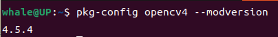


> 需要查看其他版本的 把opencv4 改成 opencv 即可

也可以试运行 例子程序 

```shell
cd ~/opencv-4.6.0/samples/cpp/example_cmake #修改为自己对应下载的版本号码
cmake .
make
./opencv_example
```

### 测试

这里也可以运行我提供的测试程序

新建 `detect.py` 写入

```python
import cv2

# 读取图像
image = cv2.imread('armor.png')

# 检查图像是否成功读取
if image is None:
    print("图像读取失败，请检查文件路径")
else:
    # 将图像转换为灰度图像
    gray_image = cv2.cvtColor(image, cv2.COLOR_BGR2GRAY)

    # 显示原始图像和灰度图像
    cv2.imshow('Original Image', image)
    cv2.imshow('Gray Image', gray_image)

    # 等待按键按下，然后关闭所有窗口
    cv2.waitKey(0)
    cv2.destroyAllWindows()

    # 保存灰度图像
    cv2.imwrite('armor_gray.png', gray_image)

```

运行 `python3 detect.py` 得到如下图片 就证明成功了!!! (撒花)

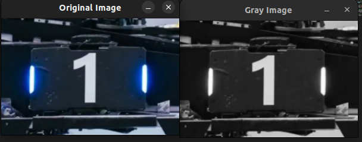

细心的同学 应该也注意到 在文件夹内多了一个新文件

```
.
├── armor_gray.jpg
├── armor.png
└── detect.py
```


至此 OpenCV 环境就算搭建完成了 后续有相关需求的同学 也可以通过 安装不同版本`cv`或者使用 Anaconda 去管理不同的python版本等不同环境,以适应不同的工作环境
但值得注意的是conda有时候面临一些和项目冲突的地方 会报错 此时需要完全退出conda环境(包括base)

---

## 图像处理知识预备

### 图像的空间表示

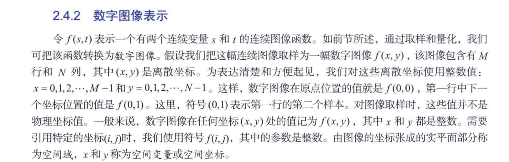

> 摘自 Rafeal C.Gonzalez(拉斐尔·C. 冈萨雷斯) Richard E.Woods(理查德·E. 伍兹) 老师的著作 Digital Image Processing,Fourth Edition(数字图像处理 第四版)

**图像在计算机中是一个二维离散信号，通常表示为矩阵形式**

$$
I(x, y) \in \mathbb{R}^{M \times N}
$$

其中 $x$ 和 $y$ 是像素坐标，$M$ 和 $N$ 是图像的高度和宽度。对于彩色图像，通常使用三通道 $RGB$：

$$
I(x, y) = [R(x, y), G(x, y), B(x, y)]
$$


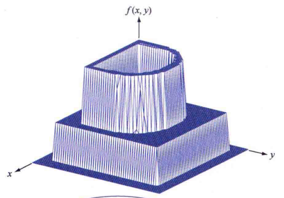

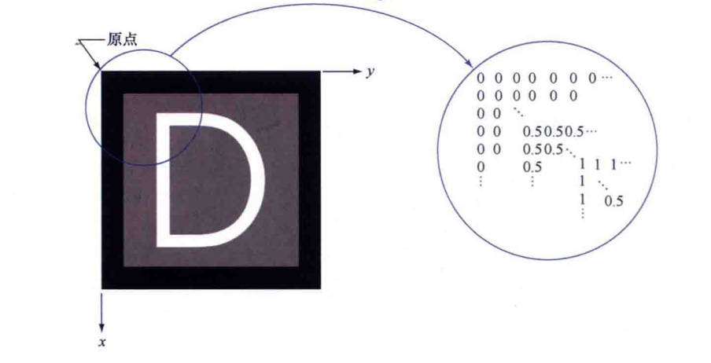

> 从这我们可以看出图像的数据不同于自然界中连续的图像色彩 而是一个个离散的像素点 意味着一个图像中 存储一个像素所用的位数(bit)越多 也就是常说的位深越高 图像就越清晰 所表达的信息就越丰富

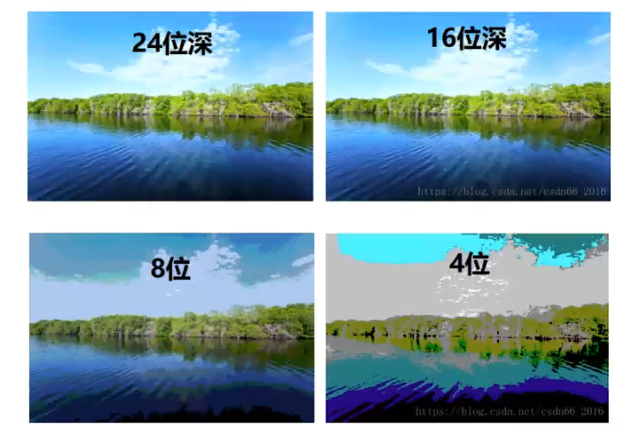

我们后期主要使用的灰度图像 是一个单通道图像 只用 一位表示 即只有0和1 表示黑和白 虽然在视觉上不如彩色图像包含信息多 但在处理上灰度图像更简单更便捷也更迅速

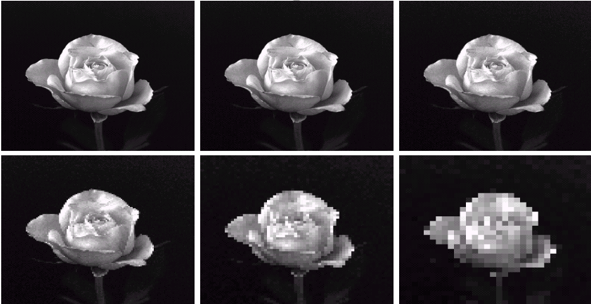

### 图像的颜色空间

#### RGB

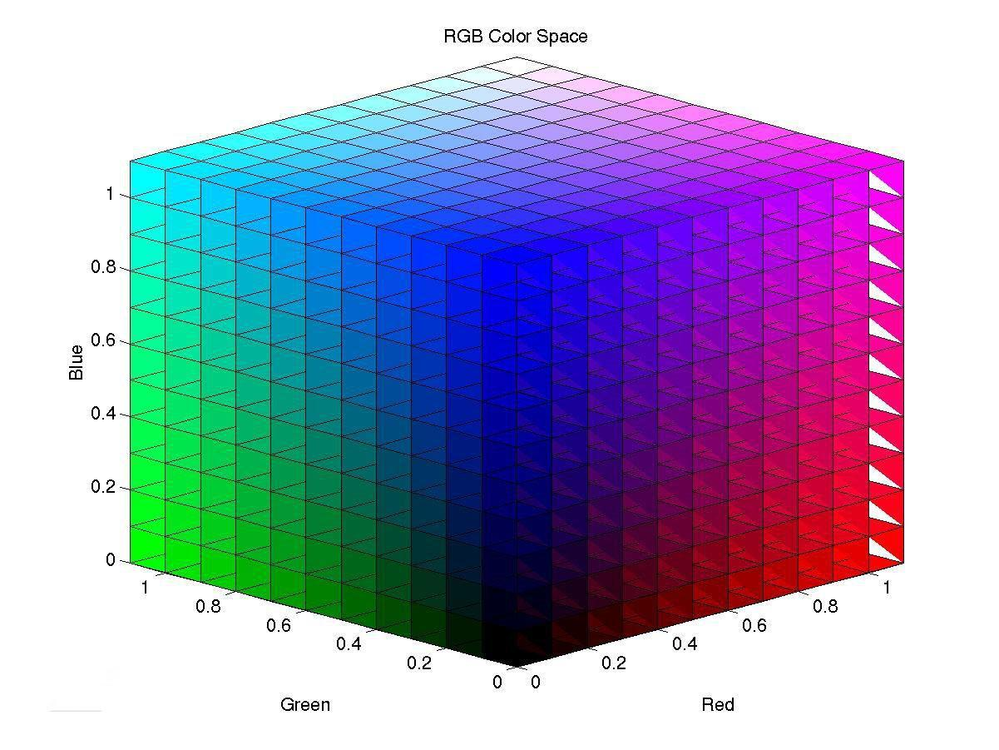

- **RGB**（Red, Green, Blue）基于加色原理,是最常用的颜色模型，
- 其中每个像素由三个通道组成，取值范围通常为 `[0, 255]`（8位图像）。

$$
\text{Image} = (R, G, B)=\left( \frac{r}{255}, \frac{g}{255}, \frac{b}{255} \right), \quad R,G,B \in [0, 255]
$$

白色 RGB(255,255,255)
黑色 RGB(0,0,0)

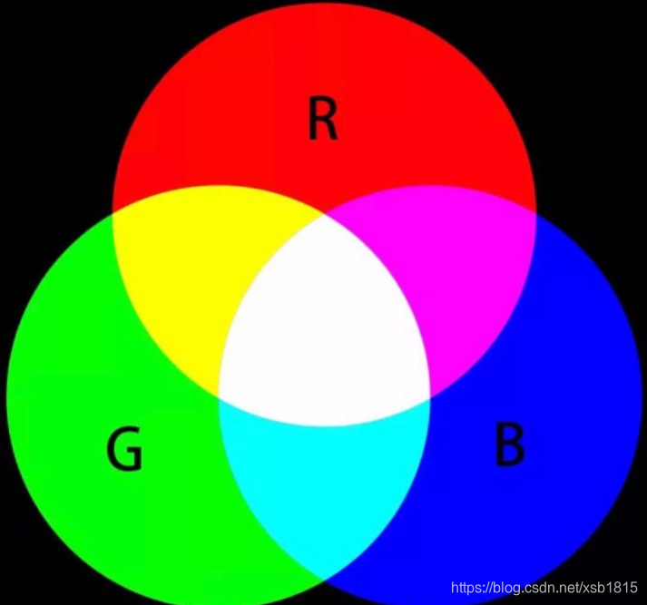

`cd Test2`

```python
import cv2
import numpy as np

# 读取图像（OpenCV默认读取为BGR格式）
img_bgr = cv2.imread("image.png")

# # 转换为RGB格式
img_rgb = cv2.cvtColor(img_bgr, cv2.COLOR_BGR2RGB)

# 分离RGB通道
r, g, b = cv2.split(img_rgb)

# 合并RGB通道
img_red = cv2.merge([r, g, b])

# 显示图像
cv2.imshow("Original Image", img_bgr)
cv2.imshow("Red Image", img_red)
cv2.waitKey(0)
cv2.destroyAllWindows()
```

蓝色和红色发生调换


#### HSV/HSL颜色空间

- **HSV**（Hue, Saturation, Value）和 **HSL**（Hue, Saturation, Lightness）是面向视觉感知的颜色模型,也会是我们以后经常使用的颜色空间。

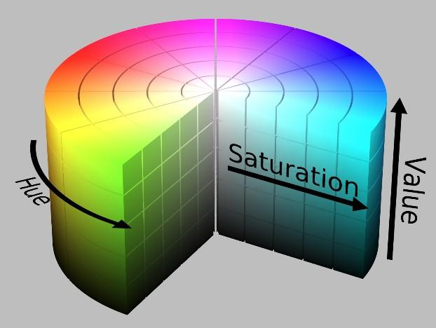

- **Hue（色相）**：颜色类型，角度范围 `[0°, 360°)`，在OpenCV中映射为 `[0, 179]`（8位图像）。
- **Saturation（饱和度）**：颜色纯度，范围 `[0, 1]`（OpenCV中映射为 `[0, 255]`）。
- **Value(明度)** 或 **Lightness(亮度)** ：颜色明暗程度，范围 `[0, 1]`（OpenCV中映射为 `[0, 255]`）。

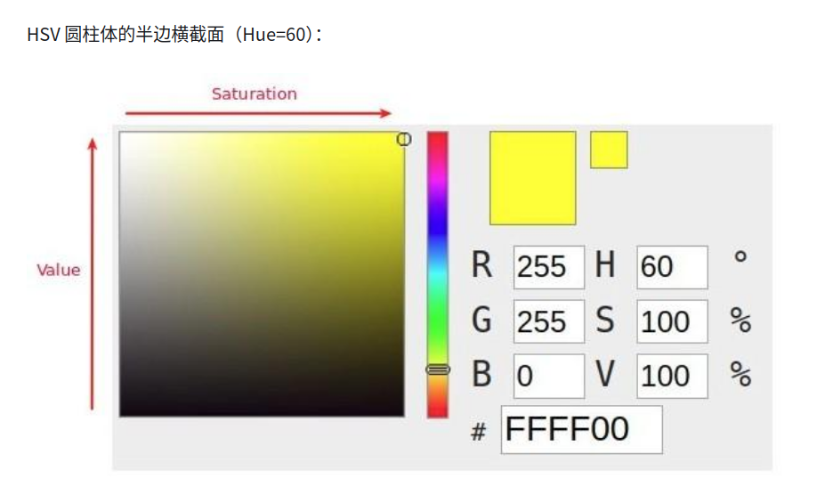

> 白色 HSV(0,0,1)
> 黑色 HSV(0,0,0)

**RGB到HSV的转换公式**（标准化到 [0,1]）：
1. 计算最大值 $ C_{\text{max}} = \max(R, G, B) $ 和最小值 $ C_{\text{min}} = \min(R, G, B) $。
2. 计算差值 $ \Delta = C_{\text{max}} - C_{\text{min}} $。
3. **Hue**：

   <span> 
   $$
   H = 
   \begin{cases}
   0^\circ & \text{if } \Delta = 0 \\
   60^\circ \times \left( \frac{G - B}{\Delta} +0 \right) & \text{if } C_{\text{max}} = R \\
   60^\circ \times \left( \frac{B - R}{\Delta} + 2 \right) & \text{if } C_{\text{max}} = G \\
   60^\circ \times \left( \frac{R - G}{\Delta} + 4 \right) & \text{if } C_{\text{max}} = B
   \end{cases}
   $$
   </span>

 **Saturation**：

   <span> 
   $$
   S = 
   \begin{cases}
   0 & \text{if } C_{\text{max}} = 0 \\
   \frac{\Delta}{C_{\text{max}}} & \text{else}
   \end{cases}
   $$
 **Value**：
   $$
   V = C_{\text{max}}
   $$
   </span>


`cd Test3`

```python
import cv2
import numpy as np

# 读取图像
img_bgr = cv2.imread('image.png')

# 转换为HSV颜色空间（注意OpenCV中H范围为[0,179]，S/V为[0,255]）
img_hsv = cv2.cvtColor(img_bgr, cv2.COLOR_BGR2HSV)

# 分离HSV通道
h, s, v = cv2.split(img_hsv)

# 示例：提取红色区域（H≈0或H≈180附近）
lower_red1 = np.array([0, 50, 50])
upper_red1 = np.array([10, 255, 255])
lower_red2 = np.array([170, 50, 50])
upper_red2 = np.array([180, 255, 255])
mask_red = cv2.inRange(img_hsv, lower_red1, upper_red1) | cv2.inRange(img_hsv, lower_red2, upper_red2)

# 显示原始图像和红色掩膜
cv2.imshow('Original Image', img_bgr)
cv2.imshow('Red Mask', mask_red)

# 等待按键，然后关闭所有窗口
cv2.waitKey(0)
cv2.destroyAllWindows()

```

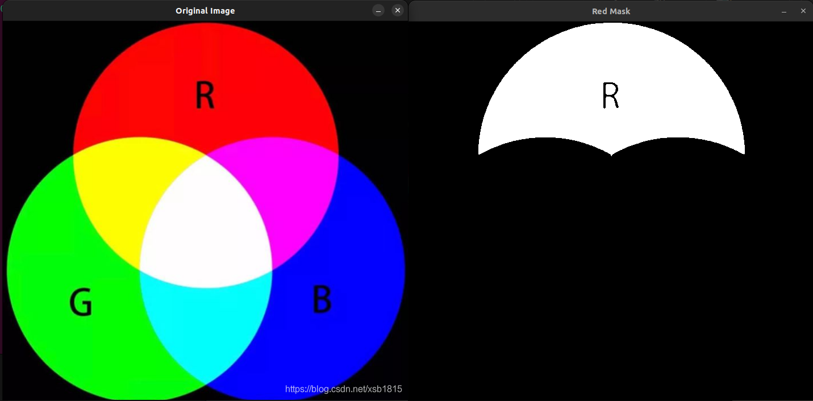

**总结**

| 颜色空间 | 通道含义               | 主要应用                  |
|--------------|----------------------------|-------------------------------|
| RGB/BGR      | 红、绿、蓝                 | 图像显示与存储                |
| HSV/HSL      | 色相、饱和度、明度/亮度    | 颜色分割、滤镜                |


**OpenCV颜色空间通用转换函数**

```python
# 格式：cv2.cvtColor(src, code)
# 示例：BGR转灰度图
img_gray = cv2.cvtColor(img_bgr, cv2.COLOR_BGR2GRAY)

# 支持的转换代码包括：
# COLOR_BGR2RGB, COLOR_BGR2HSV, COLOR_BGR2LAB, COLOR_BGR2YUV等
```

```shell
cd Test4
```

```python
import cv2
import matplotlib.pyplot as plt

# 读取图像
img_bgr = cv2.imread("image.png")
img_rgb = cv2.cvtColor(img_bgr, cv2.COLOR_BGR2RGB)

# 转换为不同颜色空间
img_hsv = cv2.cvtColor(img_bgr, cv2.COLOR_BGR2HSV)
img_lab = cv2.cvtColor(img_bgr, cv2.COLOR_BGR2LAB)
img_ycrcb = cv2.cvtColor(img_bgr, cv2.COLOR_BGR2YCrCb)

# 可视化
plt.figure(figsize=(15,10))
plt.subplot(2,2,1), plt.imshow(img_rgb), plt.title("RGB")
plt.subplot(2,2,2), plt.imshow(img_hsv), plt.title("HSV")
plt.subplot(2,2,3), plt.imshow(img_lab), plt.title("LAB")
plt.subplot(2,2,4), plt.imshow(img_ycrcb), plt.title("YCbCr")
plt.show()
```

**注意事项**

1. **通道范围**：OpenCV中不同颜色空间的通道范围可能不同（如HSV的H通道为 `[0,179]`）。
2. **数据类型**：颜色空间转换前需确保图像为 `float32` 或 `uint8` 类型。
3. **颜色失真**：多次颜色空间转换可能导致精度损失。

### 图像形态学特征操作

#### 膨胀与腐蚀

对图像形态学特征 最基础的就是 **膨胀**（Dilation）和 **腐蚀**（Erosion）。

- **膨胀**（Dilation）：
  $$
  A \oplus B = \{ z | (\hat{B})_z \cap A \neq \emptyset \}
  $$
- **腐蚀**（Erosion）：
  $$
  A \ominus B = \{ z | (B)_z \subseteq A \}
  $$
其中 $B$ 是结构元素。

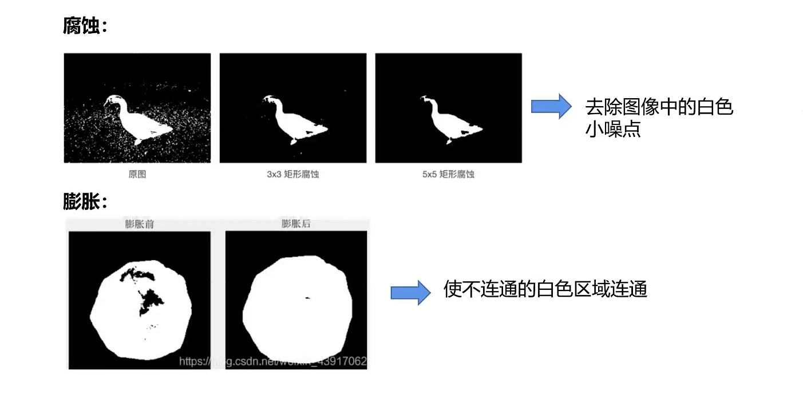


**OpenCV实现**：
```python
kernel = np.ones((3,3), np.uint8)
dilated = cv2.dilate(img, kernel)
eroded = cv2.erode(img, kernel)
```

**开运算与闭运算**
- 开运算：先腐蚀后膨胀（去除小物体）。
- 闭运算：先膨胀后腐蚀（填充小孔）。

一次膨胀一次腐蚀 保持体积不变

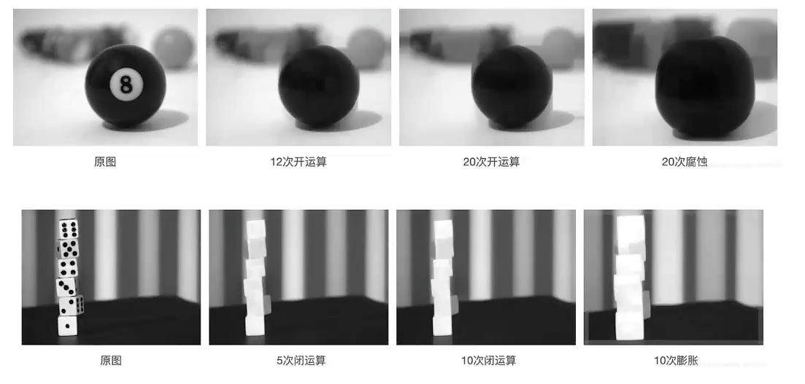

#### 滤波卷积

图像滤波的核心是卷积运算。给定图像 $I(x, y)$ 和卷积核 $K(i, j)$，卷积公式为：
$$
(I * K)(x, y) = \sum_{i=-a}^{a} \sum_{j=-b}^{b} I(x-i, y-j) \cdot K(i, j)
$$
其中 $K$ 的大小为 $(2a+1) \times (2b+1)$。

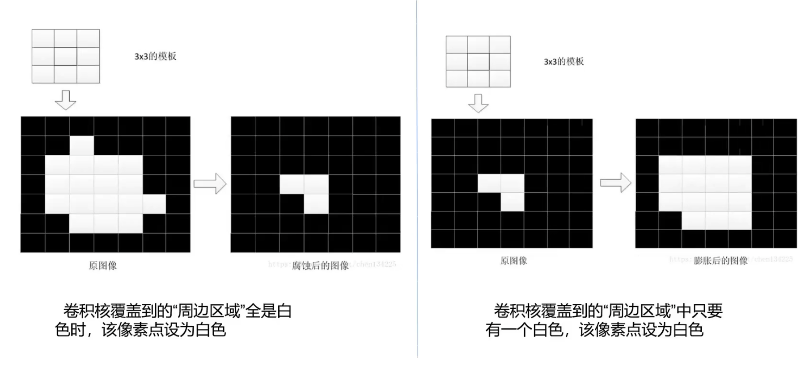

**OpenCV实现**：
```python
import cv2
import numpy as np

kernel = np.array([[0, -1, 0], [-1, 5, -1], [0, -1, 0]])  # 锐化卷积核
filtered = cv2.filter2D(img, -1, kernel)
```

### 高斯滤波

高斯核的数学公式（标准差为 $\sigma$：
$$
K(i, j) = \frac{1}{2\pi\sigma^2} e^{-\frac{i^2 + j^2}{2\sigma^2}}
$$
离散化后，生成高斯核矩阵。

**OpenCV实现**：
```python
blur = cv2.GaussianBlur(img, (5,5), sigmaX=1.5)
```


### Sobel算子边缘检测

Sobel算子的水平和垂直卷积核：

<span>
$$
K_x = \begin{bmatrix}
-1 & 0 & 1 \\
-2 & 0 & 2 \\
-1 & 0 & 1
\end{bmatrix}, \quad
K_y = \begin{bmatrix}
-1 & -2 & -1 \\
0 & 0 & 0 \\
1 & 2 & 1
\end{bmatrix}
$$
梯度幅值计算：
$$
G = \sqrt{G_x^2 + G_y^2}
$$
</span>

**OpenCV实现**：
```python
grad_x = cv2.Sobel(img, cv2.CV_64F, 1, 0, ksize=3)
grad_y = cv2.Sobel(img, cv2.CV_64F, 0, 1, ksize=3)
grad = np.sqrt(grad_x**2 + grad_y**2)
```


### 图像插值
在缩放或旋转时，像素位置可能非整数，需插值。常用方法：

- **双线性插值**：

  $$
  I(x, y) = (1 - \alpha)(1 - \beta) I_{00} + \alpha(1 - \beta) I_{10} + (1 - \alpha)\beta I_{01} + \alpha\beta I_{11}
  $$

  其中 $$\alpha = x - \lfloor x \rfloor$$  $$\beta = y - \lfloor y \rfloor$$


**OpenCV实现**：
```python
resized = cv2.resize(img, None, fx=2, fy=2, interpolation=cv2.INTER_LINEAR)
```

## armor_detect

这是Roboaster比赛中常见的装甲板图形


flowchart TB
    A[Robomaster装甲板识别] --> B[图像预处理];
    B --> B1[选取颜色通道阈值区间];
    B --> B2[二值化];
    B --> B3[形态学操作];
    B --> B4[边缘检测];
    B --> B5[...];

    B1 --> C[筛选矩形];
    B2 --> C;
    B3 --> C;
    B4 --> C;
    B5 --> C;

    C --> C1[查找轮廓];
    C1 --> C2[筛选除去部分矩形];
    C2 --> D[判断是否为装甲板];

    D --> E[遍历矩形，两两组合判断];
    E --> F[识别装甲板];
    F --> F1[装甲板中心相对画面中心坐标];


观察图形可以看到

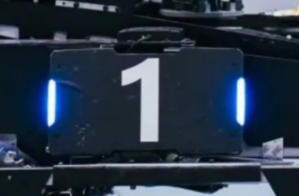

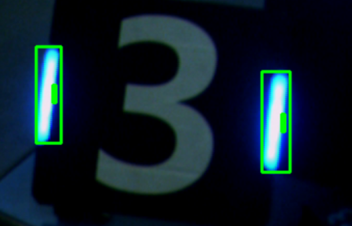

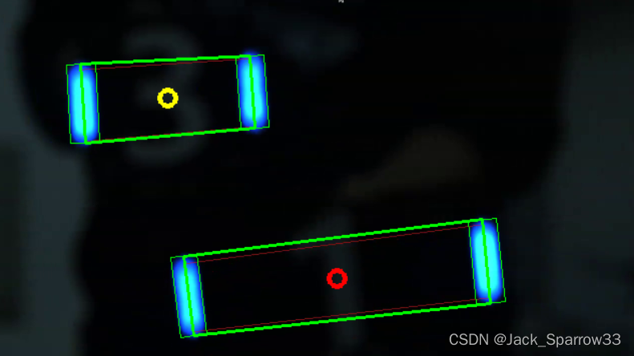

## OpenCV !


```shell
sudo apt install libopencv-dev
```

确保环境已经搭建 本节课基于用 OpenCV 在屏幕右上角绘制矩形为案例 带大家了解基本的操作思路

> 演示摄像头搭载 USB 全域部摄像头 进行扫描 有条件的同学可以购买类似USB驱动摄像头 使用电脑自带摄像头也是没问题的

### 安装 usb_cam摄像头驱动

```shell
sudo apt install ros-humble-usb_cam 
```

cheese 茄子

```shell
sudo apt install cheese 
cheese  # 运行茄子
```

运行 `red_circle_detect.py`

```python
import cv2
import numpy as np

# 初始化摄像头
cap = cv2.VideoCapture(2) # 数字根据自己摄像头确定编号

while True:
    # 读取视频帧
    ret, frame = cap.read()
    if not ret:
        print("无法获取视频帧")
        break

    # 将图像转换为HSV颜色空间（更好的颜色分离）
    hsv = cv2.cvtColor(frame, cv2.COLOR_BGR2HSV)
    
    # 定义红色的HSV范围（需要根据实际情况调整）
    lower_red1 = np.array([0, 100, 100])
    upper_red1 = np.array([10, 255, 255])
    lower_red2 = np.array([160, 100, 100])
    upper_red2 = np.array([180, 255, 255])
    
    # 创建红色掩膜
    mask1 = cv2.inRange(hsv, lower_red1, upper_red1)
    mask2 = cv2.inRange(hsv, lower_red2, upper_red2)
    mask = cv2.bitwise_or(mask1, mask2)

    # 图像预处理
    mask = cv2.erode(mask, None, iterations=2)
    mask = cv2.dilate(mask, None, iterations=2)
    mask = cv2.GaussianBlur(mask, (9, 9), 2)

    # 霍夫圆检测
    circles = cv2.HoughCircles(mask, cv2.HOUGH_GRADIENT, dp=1.2, minDist=100,
                              param1=50, param2=30, minRadius=20, maxRadius=200)

    # 如果检测到圆形
    if circles is not None:
        circles = np.round(circles[0, :]).astype("int")
        
        # 遍历所有检测到的圆
        for (x, y, r) in circles:
            # 绘制圆形和中心点
            cv2.circle(frame, (x, y), r, (0, 255, 0), 4)
            cv2.circle(frame, (x, y), 2, (0, 0, 255), 3)
            # 显示圆心坐标
            cv2.putText(frame, f"({x}, {y})", (x-50, y-20),
                       cv2.FONT_HERSHEY_SIMPLEX, 0.5, (255, 255, 255), 2)

    # 显示结果
    cv2.imshow("Frame", frame)
    cv2.imshow("Mask", mask)

    # 按q退出
    if cv2.waitKey(1) & 0xFF == ord('q'):
        break

# 释放资源
cap.release()
cv2.destroyAllWindows()
```

随手画一张图检验一下

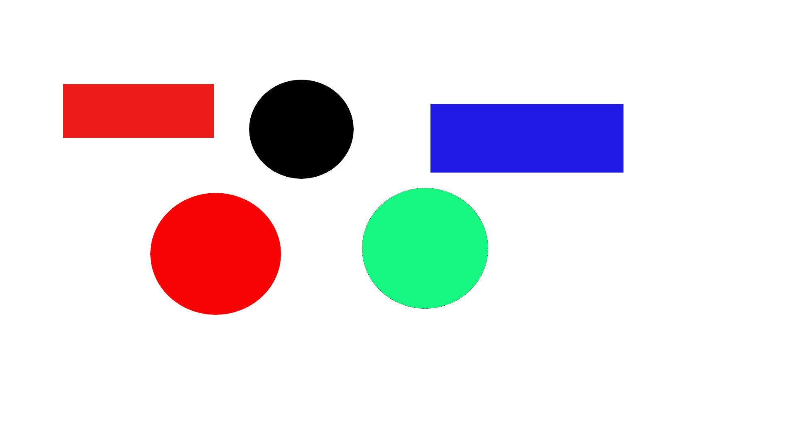


可以看到图片上存在不同颜色的干扰 以及形态的干扰 两者都需要考虑

看看检测结果

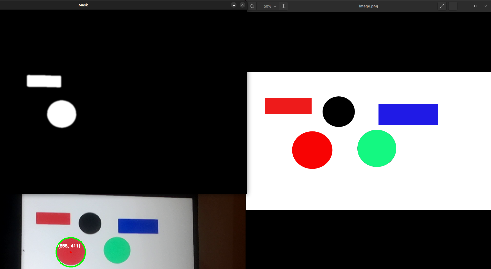

正确分离出了红色部分

而且图形判断正确 没有误判矩形

> 但在实际比赛中 可能受到光照等因素影响 以及小球颜色多样 可能没有如此鲜明特征等等 这都会影响我们识别的结果 这里提供一个简单的样例思路 还有很多地方可以优化


## 作业

- 基于OpenCV编写识别程序 识别绿色三角形 (识别环境自己绘图,越能适应复杂环境,作业评分越高)

- ROS与OpenCV的转换
    - 以ROS功能包的形式编写节点实时订阅摄像头发布的图像话题消息并将ROS图像消息转换为OpenCV图像
    - 在图像右上角绘制矩形，再将OpenCV图像转换回ROS图像消息重新发布到一个新的话题
    - 用rviz或者rqt_image_view显示图像消息

作业均要求提供 源程序和实例图像 README讲解运行过程 (可引用图片展示) 截止于 **2025年3月29日晚24点**

**样例**

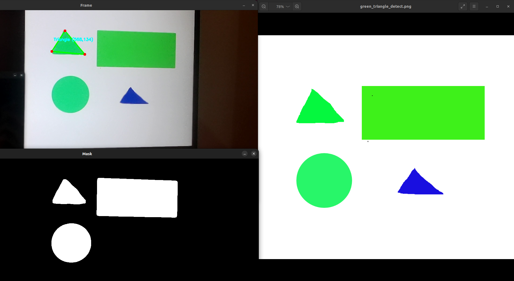

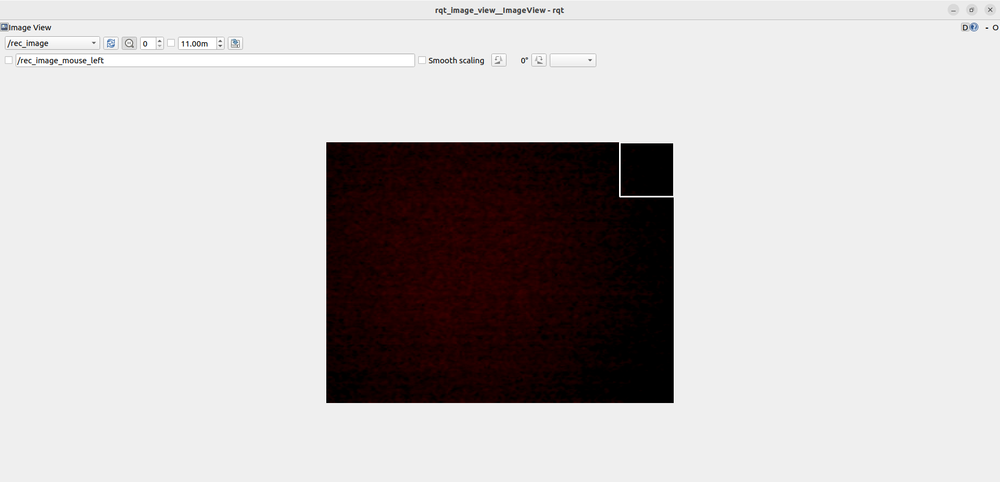


<!-- 

第四节课会给大家提供相关导航仿真资料和装甲板识别资料，大家可以二选一进行学习slam建图或装甲板识别（这部分自学为主）

最后带大家完成一个比较大的项目，在自己电脑上部署一个yolov5进行一些简单的识别 -->