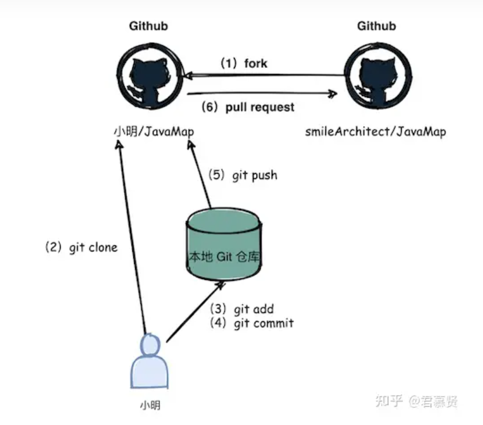

# Ubuntu
> Linux系统-Ubuntu22.04
## 安装Git
```shell
apt-get install git # 安装Git

git --version # 安装成功后显示版本 git version 2.34.1

git config --global user.name "name" # 配置用户名

git config --global user.email "email" # 配置用户邮箱

git config --list # 查看全局配置

ssh-keygen -t rsa -C email # 生成ssh-key 目录root/.ssh/id_rsa.pub
```
将id_rsa.pub里面的内容复制到github账户中
##  测试链接
```shell
ssh -T git@github.com # 测试链接

```
> 出现以下内容即表示成功
> You've successfully authenticated, but GitHub does not provide shell access. # 成功

PS 如果上面配置账户不成功，你也可以手动添加账户，进入config 写入用户信息
# windows

> 开始前先下载 Git 插件，因博主配置博客时已经接触git，这里不再演示，下面给出官方下载地址和教程，供自行学习查阅
> [Git 官方下载地址](https://git-scm.com/)
> [详细下载教程](https://blog.csdn.net/m0_71102932/article/details/141326014)

进入要上传项目的本地文件夹，在文件夹内鼠标右键，看到 ***Open Git Bash here*** 和 ***Open Git GUI here*** 两个选项说明前面下载git成功

点击Open Git Bash here，在命令行对话框中输入如下指令，创建初始文件夹
```shell
git init
```
这里要注意，他是隐身的，要打开勾选隐藏的项目才能看到

然后依次输入以下指令
```shell
git add . 
git commit -m "commit"  
git remote add origin https://自己的仓库url地址 
git push -u origin master
``` 
> 第一条指令是将项目上所有文件添加到该库中，如果要添加特定的文件，把 **。** 改成这个特定的文件即可

> 第二个指令表示你对这次提交的注释，引号内容可修改

> 将本地的仓库关联到github上，根据个人不同进行修改

> 将代码上传至github，正常情况输入完成账号密码即可

具体上传情况可能会有点延迟，稍等片刻即可

# PR

[如何参与开源项目 - 细说 GitHub 上的 PR 全过程](https://www.cnblogs.com/daniel-hutao/p/open-a-pr-in-github.html)
# 注意事项

建立本地分支最好单独在一个空目录下，在此目录下执行完git remote add origin git@github.com:name/repo.git后再执行后面的指令不会出错，此后不管是push、pull、rm都在这个目录进行，这里name/repo为自己账户名字和库名字，如Whaltze/Robot

# 小技巧

> 查看提交历史记录
> ```shell
> git log
> ```

> 删除上传的文件
> ```shell
> git rm --cached xxx //xxx为文件名,这里不能为目录
> git commit -m "xxx" //xxx为注释
> git push origin
> ```

> 同步本地分支和github分支
> ```shell
> git pull origin master
> ```

> 克隆分支库
> ```shell
> git clone -b 分支名称 https://gitee.com/项目(仓库地址).git
> ```
